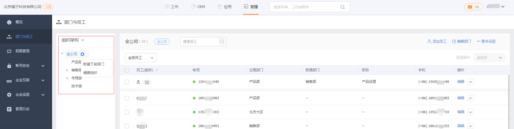
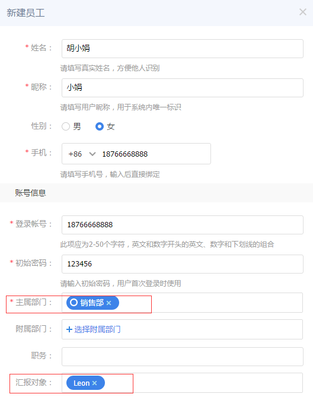
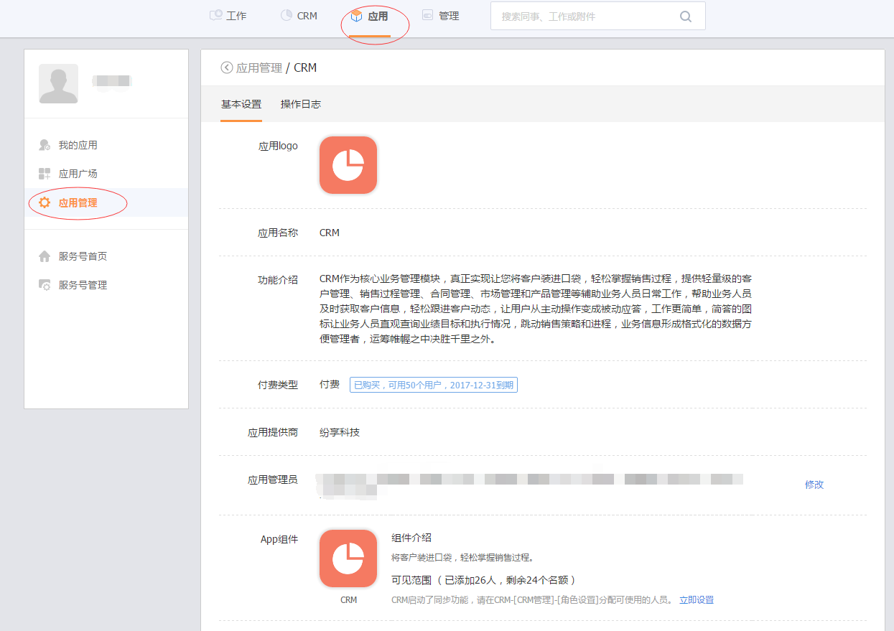

#  拥有纷享CRM账号

---

纷享CRM是纷享销客中的一个核心应用，如果您想拥有纷享CRM账号，需要先注册纷享销客的企业账号，然后再添加“CRM”应用即可。

### 第一步 注册纷享销售账号
- 请登录纷享销客官网注册企业号。 [注册新企业](https://www.fxiaoke.com/XV/User/Login?tab=reg)
- 如果您企业已注册纷享账号或是您已有纷享账号，直接登录即可。[登录纷享销客](https://www.fxiaoke.com/XV/User/Login)

### 第二步 配置组织架构
为了有效管理员工，需在“管理-部门与员工”下维护组织架构。
- 全公司：即组织架构顶级结点，代表公司所有部门。默认为“全公司”，可以修改名称。
- 部门：您可以在“全公司”下新建部门。为了更好的在纷享CRM中管理各部门下属员工及查看员工数据，请重点关注“上级部门”和“部门负责人”：
    - **上级部门**：每个部门都有上级部门。在纷享CRM中上级部门的部门负责人可以看到下级部门的所有数据。在【CRM-CRM管理-规则设置-基础设置】中可配置“上级可见数据范围”为直属下级数据或是所有下级数据。
        - 所有下级数据：即可以下钻到下级所有的部门数据。
        - 直属下级数据：只有直属下级这一级部门数据。
    - **部门负责人**：请配置部门负责人，以便在审批流或是业务流程管理中配置负责人上级审批，此处的上级是指所属部门的部门负责人。

### 第三步 添加纷享账号
在“管理-部门与员工”下添加并维护员工。
- 新建员工。在填写员工信息是请关注以下两个信息：
    - **主属部门**：即当前用户所属的主属部门，只能有一个，在审批流程或是业务流程中审批时可选择用户的主属部门负责人审批。  
    - **汇报对象**：默认为主属部门的部门负责人，可修改。目前纷享CRM数据权限中上级是指的汇报对象。比如客户中“我下属负责的客户”是指客户负责人的汇报对象为当前用户的客户记录。

### 第四步 添加CRM应用和CRM账号
纷享CRM是纷享产品中的核心应用，需付费使用，当您企业已经购买CRM应用后即可进行以下操作。
1. 系统管理员在“应用管理”中添加“CRM”应用；
2. 在CRM应用中添加CRM管理员，
3. 由CRM管理员在“CRM-CRM管理-功能权限管理”中为需要添加CRM应用的员工分配角色。拥有CRM相关角色的用户即为CRM用户，同时拥有顶部“CRM”标签。
4. 备注：是否可添加“CRM”应用及添加CRM员工的数量是根据您企业购买情况决定。

