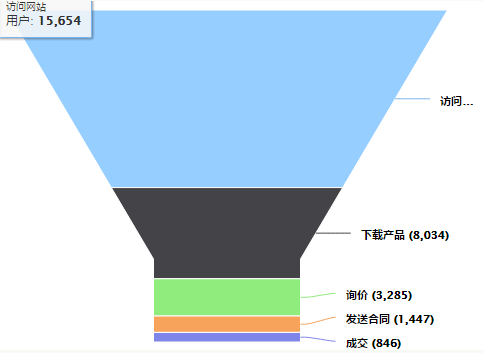

# 如何利用销售流程促进商机赢单

---

## 业务背景
企业在获得商机后，销售人员需要评估商机并组织相关人员推进并最终促进商机赢单。

- **制定销售流程**
	- 每个企业在长年累月的进行这项活动后都积累了一定的经验，结合行业规律，逐渐形成了适合自己企业文化和产品的销售方法和赢单路径。
将这套已被验证的销售方法固化到企业的销售流程中无疑会大大缩短销售周期、提高销售效率、降低销售成本。
企业的销售管理也从面向是否输赢单的结果管理转变为面向如何输赢单的过程管理，对销售人员的管理也从依靠个人能力和经验的销售方式转变为依靠固化流程的规范化销售方式。

- **商机跟进**
	- 商机可能由销售线索转化而来，也可能来自于熟人介绍、客户主动联系等非线索转化来的途径，无论哪种来源的商机，都应该在系统里建立数据产生最终结果。
	- 商机的跟进本质上是推进销售流程，并完成相应流程下的任务和填写反馈，一步步推进商机到赢单阶段。
	- 商机跟进的主要任务包括但不限于
		- 组建销售团队；
		- 对商机进行可行性判断和ROI分析；
		- 对商机的真实有效性和自身资质进行初步评估，以避免资源浪费；
		- 了解商机基本的信息，比如预期收入、预期完成时间等；
		- 了解不同时期商机的赢单概率；
		- 团队协作前进
		
- **分析商机**
	- 在商机跟进过程中，管理人员基于已制定的销售阶段的数据，从以下几个方面微观上了解并诊断商机，针对问题商机迅速解决问题，宏观上了解组织问题，改进组织效率，提升赢单率。
		- 分析销售障碍。处于各阶段的商机数据实时的反映了商机的销售情况，分析商机的阶段转化率、赢率、阶段停留时间等可以了解商机的问题和原因，进而解决问题，推进促成赢单。
		- 制定销售目标、达成销售计划。根据商机各阶段的数据，预计成交时间和成交金额，可以推算出某一时间段能够达成的销售业绩，进而能够正确的制定相应的销售目标。
		- 评估销售组织能力。销售流程产生的销售漏斗真实的反映了组织或部门在一段时期内的销售能力，根据销售漏斗展示的数据，可以了解到组织销售过程中薄弱的环节。后期可以制定改进计划，调整资源投入，持续改进，宏观上促进赢单。

## 业务角色分析
- **销售人员**：这个商机怎么促进赢单？公司的流程是什么，每一阶段需要干那些事情？我销售团队的同事们跟进情况怎么样？
- **销售经理**：下属商机跟进的情况如何？有些商机这个月销售业绩如何？我们因为什么输单？
- **企业管理人员**：下一阶段企业的销售目标如何制定？我的企业为什么总是无法赢单，到底哪个环节出现了问题？

## 解决方案及具体业务操作

- **制定销售流程**
	- 入口：编辑销售流程
	- 按照公司销售类别和管理规范划分适用的销售流程，这是销售流程的名称。常见划分方式如下：
		- 组织结构分：总部、分公司、销售团队和员工等
		- 客户类型分：企业客户、政府部门、事业单位等
		- 行业分：房地产、快消等
		- 商品类别分：硬件类、软件服务类等
	- 将销售流程里的每个里程碑分解为销售阶段，比如赢得客户认可阶段可、引导立项阶段、商务谈判阶段等等。然后在此基础上定义每个阶段的工作任务：如在客户认可阶段，可以包括提交方案、会见高层、参观客户等，并将每个阶段下需要完成的子任务设置为阶段反馈。
	- 确定好每个阶段的赢率。假设确认客户意向阶段有10个项目，最终落单的是2个，这个阶段的成功率就是20%。
	- 确定项目的平均销售周期，比如S系列的挖掘机平均每单销售周期是45天，提前多少天提醒商机负责人。
	- 将制定好的销售流程指定给对应的销售部门。

- **商机跟进**
	- 入口：商机销售流程
	- 销售人员按照固定流程来跟进商机，随时可以知道每个阶段应该做什么，下一阶段应该提前准备什么。
		- 由销售线索转化而来的商机自动进入销售流程第一阶段。自建商机通过新建时选择适用的销售流程在新建成功后也自动进入到第一阶段。
		- 如果该阶段的销售流程需要必填反馈时，比如必须填写联系人信息、必填客户地址等，需完成阶段反馈才可以进入下一阶段。
		- 进入下一阶段后，跟进设置，可能需要直属上级的审批，这阶段是否符合进入下一阶段的要求，如符合，则直接进入下一阶段，如不符合，则停留在当前阶段，销售人员继续改进后重新提交进入下一阶段。如此往复，直至商机赢单。
		- 在跟进过程中的任一阶段，都有可能会被淘汰输单，或识别出不应进一步跟进这个商机进而认定其为无效。
		
- **分析商机**
	- 入口：销售漏斗
	- 根据销售目标、评估销售计划。
		- 假设该组织的销售阶段有五个，每一阶段的销售成功概率分别是10%、40%、60%、80%、90%，每个阶段的正在运作的商机数分别是：65、34、27、15、6个，每个商机预计成交金额均为50万，销售周期是一个季度。那么某一个季度，已有的潜在客户最终的签单额预测就是：65（个）×50万×10%+34（个）×50万×40%+27（个）×50万×60%+15×50万×80%+6（个）×50万×90%=2685万。销售主管可以根据这个预测金额评估这一季度的销售目标是否能够达成。如果无法达成目标，根据下面的方法也可以评估销售障碍在什么地方，有针对性投入资源解决问题，提高销售业绩。另外，这个预测金额也为评估下一阶段销售目标提供有力的数据支撑。
	- 分析销售障碍。
		- 基于处于各阶段商机金额和个数的分析，了解到销售空洞，需要加强该阶段资源的投入。如下图销售漏斗所示，在第二季度处于访问网站这个环节积累的客户数量过少，可以预期对其下一个季度的销售工作会有很大的影响，需要加大资源投入在开发商机上。
		- 		- 
		- 基于各阶段转化率，了解到每个阶段的总体转化情况，具体到哪个阶段客户流失率较高，需要优化和改进这个阶段的销售工作，提高转化率。比如其他阶段转化率均在30%，但制作解决方案到商务谈判过程转化率仅为18%，则意味着企业在制作解决方案的能力比较薄弱，导致和对手竞争时客户流失比较大。
	- 评估销售组织能力。
		- 正常的销售漏斗，无论在各个时期，都应该呈现，随着由第一阶段往后赢单走，漏斗的高度逐渐变矮的趋势。趋势本身反映了组织的销售能力，高度变矮的趋势小，组织销售能力相对较强；相反的，高度变矮的趋势大，组织整体销售能力相对较弱，企业如果希望提高赢单率，必须提高整体销售能力。
		如下图，图2组织的销售能力明显强于图1组织的销售能力。
		- 图1  
   		- 图2  

