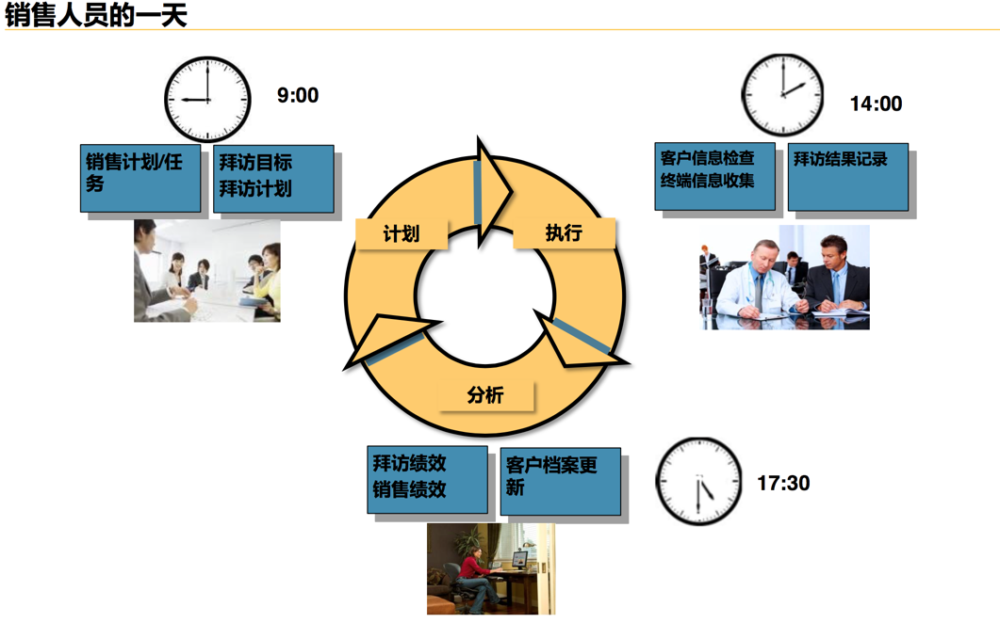
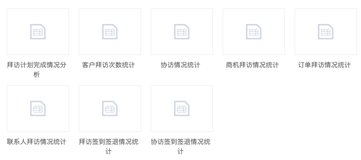
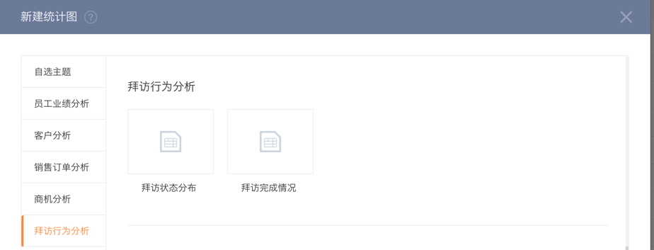

# 如何利用高效的拜访提升客户价值

---

## 业务背景

企业在获得客户之后，如何维护客户的忠诚、进一步提升客户的价值是企业稳定发展的重要条件。因此需要通过不断的与客户进行交流、互动，去运营与客户之间的关系，进而达成成交或二次成交，提升客户价值。而这种客户运营最重要的手段之一就是拜访。
  
## 业务过程分析

- 客户拜访从业务场景上主要分为如下场景。
    - 维护客户关系，促进成交；
    - 收集业务数据，更好的服务和管理客户，比如收集库存、销量及价格等；
    - 市场活动执行，搜集执行情况，判断执行效果及费用落地；
    - 巡查督导：监督客户是否符合企业要求；监督业务员是否有效执行销售业务；
    - 等等。
- 拜访的过程分为：计划-》执行-》反馈、评估-》优化
   
    - 计划拜访：
        - 有计划的筛选要拜访的目标客户，比如根据客户类型、级别、区域分布、参与活动等属性筛选客户；
        - 规划合理的拜访路线；
        - 预设规定的拜访需要收集的客户信息；
        - 制定协访计划；
        - 重用拜访路线等等。
    - 执行拜访：
        - 按计划、按路线拜访客户；
        - 执行签到/签退；
        - 填写拜访需要收集的材料；
        - 上级或同事执行协访等。
    - 反馈、评估：
        - 评估员工绩效 
        - 分析拜访总量、执行效率及分布；
        - 分析拜访客户覆盖；
        - 分析拜访执行效果，如拜访一定时间内成交状况；
        - 分析收集的客户数据、市场活动执行情况等。
    - 优化：
        - 调整销售覆盖客户范围，优化拜访路线，提高效率；
        - 制定合理的拜访客户数量，保障拜访质量；
        - 优化拜访执行过程，标准化拜访行为；
        - 优化拜访收集的业务数据模板，获得最有效的客户信息；
        - 分析最有效的拜访或市场活动（投入产出比），选择更优的销售方式，将有限的资源投入到更有效的客户或区域等。

## 业务角色分析
 
以上是从拜访业务本身角度分析拜访的过程、价值和意义，而对于公司管理者、销售/市场部门负责人、中层销售经理及普通销售人员，他们对拜访的诉求又是什么？

- 公司管理者：公司的客户战略是否得到有效的执行？公司的客户是否得到了满意的服务？公司对客户的运营管理是否有效支持营收增长？是否销售的投入成本创造了足够的价值？如何获得客户的数据并分析？
- 销售/渠道部门负责人：销售的过程是否有效执行？销售行为是否能够带回有效的业绩增长？客户是否符合协议既定的要求或期望？部门及员工的目标和绩效是否达成？如何获得客户的数据并分析？
- 市场部门负责人：市场活动是否有效执行？投入产出比如何？产品的市场策略是否在客户/终端有效体现？市场活动最终的效果如何？如何获得客户的数据并分析？
- 中层销售经理：销售人员的日常工作是否充实有效？销售员的绩效指标是否达成？客户覆盖率是否达标？如何有计划的安排下属工作？如何获得客户的数据并分析？
- 销售人员：如何更有效的触达和管理客户，提升客户关系，促进成交？如何更有计划进行销售的日常工作，完成绩效指标？如何更方便快捷的收集企业规定的客户数据？
    - 

## 解决方案及具体业务操作

纷享CRM提供一套完整的客户拜访解决方案，在这里您可以有效管理拜访的全过程。包括：计划拜访，规范拜访行为；执行拜访，记录拜访过程；分析拜访，总结评估拜访效果；优化拜访，提升拜访行为有效性。

### 拜访计划制定
包括拜访规则的制定、行为或者客户数据收集模板的制定，可视化的拜访计划及路线。

- 设置拜访签到签退的规则；
    - CRM管理-》拜访管理-》签到及签退设置
        - 设置是否启用签到签退，是否必填；
        - 设置拜访的允差范围。
- 设置拜访过程需要收集的业务数据，拜访动作/盘点动作 （快消版）；
    - 【快消版】CRM管理-》拜访管理-》拜访动作/盘点动作设置
        - 设置不同的拜访/盘点动作，设置需要收集的字段信息；比如：巡店拍照、产品盘点、活动上报等等；
        - 设置必填的信息；
        - 给不同的部门设置不同的可用动作。
- 制定拜访/协访计划，智能规划拜访路线，重用拜访路线。
    - 在日历视图下，批量新建拜访，规划拜访路线，重用某天的拜访路线。

### 拜访执行
包括按计划执行拜访及临时性的拜访；记录拜访的过程，例如签到签退的位置时间、拜访时长，路线等；记录拜访收集到的数据；

- 按计划执行拜访：
    - 拜访-》日历视图-》今天的拜访计划-》选择执行拜访；
    - 签到、签退，记录时间的拜访时长；
    - 快消版：完成拜访动作及盘点动作，收集要求的客户数据；
    - 实时发布销售记录，分享拜访行为到企业内部交流互动。
- 执行协访：
    - 协访签到签退；
    - 填写协访反馈/评价。
        - CRM-》拜访-》单个拜访完成协访。
- 临时客户拜访：未指定明确的计划，根据所处的位置，临时安排拜访：
    - 移动端-》附近的客户-》创建临时拜访-》执行拜访。
    
### 拜访分析
统计拜访的执行情况、客户的覆盖率，查看业务员日常销售行为分布：

- 统计一定时间段内拜访计划数、覆盖客户数及完成情况；
    - CRM-》拜访-》统计视图-》客户统计，查看计划拜访数、客户数、完成数及完成率。
    - CRM-》[报表](6数据分析.md) 
        - 统计报表
        - 统计图
- 观察一定时间内销售人员的地理分布：
    - CRM-》拜访-》统计视图-》签到/签退统计，查看有效的签到签退的地理分布。
- 分析收集到的客户数据。
    - 【电脑端、快消版】CRM-》拜访-》切换动作视图，支持拜访动作数据整体导出分析，后续会支持自定义报表分析。

### 优化拜访行为
有了以上拜访的执行过程、客户数据的记录及分析，企业可以制定更高效的销售行为管理标准及策略，更有效的服务和运营客户，降低客户运营成本。

- 根据销售人员拜访的完成情况分析，设定更合理的单日拜访客户数量，设置更合理的拜访路线；
- 根据客户的投入产出比，合理的分配销售资源，给不同贡献层级的客户制定不同的拜访规则，比如A级客户每月拜访3次，B级每月拜访1次；
- 根据拜访收集的市场活动执行情况，分析投入产出比，调整市场活动策略，包括覆盖客户、资源分配等；
- 根据实际收集回来客户数据的有效性，调整数据收集的模板，提高数据收集的质量，同时提高销售人员拜访效率。

**通过有计划的管控拜访行为，促进销售人员行为的标准化，提升客户运营效率，更好的服务客户，并用客户最真实的数据支撑企业的经营决策。让拜访行为变成企业现金流最重要的增长动力之一。**

