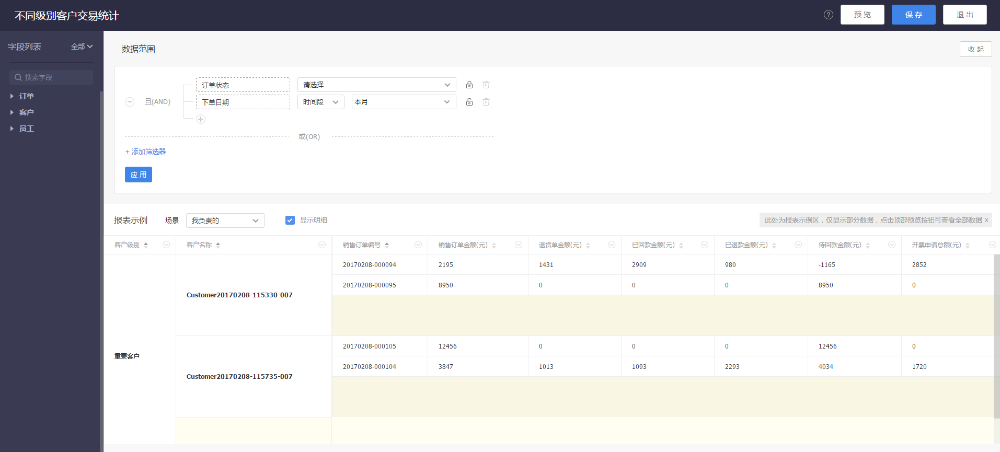

# 如何有效管理销售订单并快速回款

---

## 业务背景
销售订单管理是与客户进行订单签约，完成销售行为，体现企业销售业绩的过程。当销售与客户确认成交意向后，可为客户下单，选择产品并调整折扣，经过一系列的订单审核以确认订单，并进入后续的发货、收货确认、回款、及开票。这是一个常见的从下单到收款的完整订单管理过程，那么通过纷享CRM的订单和收款管理是如何实现完整的过程管理并快速回款？

 
## 业务过程分析
- **下单**：
    - 在下单过程中市场环境和策略不同，不同的客户会有不同的折扣和优惠，如何有效管理这些折扣和优惠，以保证客户的实惠，同时保证企业的利润呢？
    - 当客户有多次下单时，如何快速创建订单？
    - 当下游企业需要采购时，如何方便快捷的下单？
- **订单审核**：
    - 订单过程涉及企业内部多个业务部门，如何有效配置审批流程以保证订单有效性？
    - 订单审批过程中，审批进展如何？销售人员需及时了解订单相关情况，以便即时反馈客户。
- 订单确认后**发货、收货**
    - 订单确认后，由谁发货？是否已发货？是否已收货？整个过程如何及时通知业务人员？通知相关业务部门？
- 回款
    - 当财务收到回款后，如何在第一时间通知相关业务部门以备后续的业务工作执行？ 
    - 每笔订单金额是多少，待回款是多少？下一笔回款是什么时间？是否延期？
- 开票
    - 当企业收回账款后，需要给客户开具发票，那么这笔账款是否已开票？已开票的金额是多少？ 

## 业务角色分析

- **销售管理者**
    - 销售订单直接承载企业的销售业绩，那么销售管理员如何及时了解每个月、每个季度的回款情况？是否已达标？或是待回款是多少？
    - 每个部门的销售业绩完成情况如何？每个员工的业绩完成情况如何？
- **销售人员**
    - 如何及时了解订单进展情况以便反馈给客户？
    - 自己负责跟进的订单是否已回款？待回款是多少？
    - 如何快速查看自己当月的销售目标是否已达成？还差多少？
- **财务人员**
    - 当收到一笔回款时，如何便捷了解这笔回款是针对哪个订单？回款金额是否有效？待回款还有多少？
    - 当收到回款后，如何及时通过业务人员？

## 解决方案及具体业务操作
订单和收款作为销售过程中最后的核心环节，纷享CRM提供了完整的解决方案，帮助销售和管理人员方便快捷的从下单到收款的全过程管理，同时结合数据分析，及时了解自己的业绩情况，以保证企业利润收益。

### 下单
- **手工新建订单**：在新建订单时，可选择采购的产品，同时支持调整单个产品的折扣，并且支持再调整整单折扣，或是销售订单金额。
- **通过订货通由客户自己下单**：在供应链中如果下游企业需要向上游企业订货时，可以直接关注微信公众号，并在微信中下单即可。详见【[订货通](7-6-1订货通.md)】

### 订单审批
- 为了规范企业业务审批流程，我们提供了“审批流程管理”，您可以在这里配置订单审批流程，在订单创建成功后可直接触发审批流程，系统会根据审批流程配置给相关任务处理人发送待办。比如请订单管理员审批订单，请财务确认订单，请仓库管理人员确认订单产品情况等。
- 订单审批通过后，可以自定义通知，及时通知相关业务人员以便同步订单情况，以提高工作效率。
- 订单审批详见【[审批流程管理](7-4-3审批流程管理.md)】

### 发货和收货
- 在纷享CRM中系统预置了“发货人员”角色，同时配置了“确认发货”的操作权限，因此只需管理员为此角色分配人员即可。当订单审核通过后，系统会自动发送待办通知发货人员确认发货。发货人员可在“CRM提醒-待发货的订单”中查看并处理。
- 当客户已确认收货时，发货人员可以在线上确认收货。
- 详见【[销售订单-确认发货/确认收货](5-1销售订单.md)】

### 回款确认
- 当客户已回款时，可由销售新建回款，并发财务确认。
- 在新建回款时，选择订单后，系统会回显销售订单金额、待回款金额、待确认回款等信息。
- 回款保存后，系统会自动给财务发送回款确认。只有当财务确认后，系统才会确认回款信息。详见【[回款](5-4回款.md)】

### 财务开票
当财务收到回款后，需为客户开具发票。新建发票申请时，系统会根据销售订单回显销售订单金额、待开票金额和待确认开票金额。同时可选择发票抬头和寄送地址等信息。详见【[开票申请](5-6开票申请.md)】

### 报表分析
纷享CRM中预置为销售订单预置了很多报表和统计图。您可以根据自己的需求定制新的报表。

- 查看订单回款情况，及时了解待回款金额。

- 查看员工业绩统计：按员工、客户统计已确认的销售订单总金额及相关的退货单金额、已回款金额、已退款金额、待回款金额和开票申请金额。 
- 

- 客户交易统计：按客户级别、客户名称统计本月已确认的销售订单笔数、总金额及相关金额。 
- 