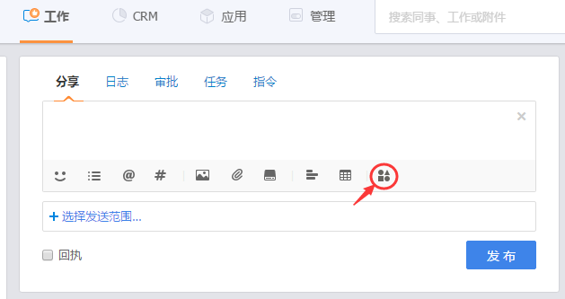

# 销售记录

---

销售记录是您与客户跟进服务过程中的活动记录，它可以是线索验证中与客户一次交谈的内容备注，可以是拜访客户时客户反馈记录，可以是商机跟进过程中遇到的问题记录，可以是销售订单发货时的物流备注信息等，销售记录的内容非常灵活，你可以在每一个业务对象中添加，并选择抄送范围以便更多的相关人员参与讨论。

销售记录是“工作”中“分享”的一种，是纷享销客产品中一个重要的产品特性，以社交形态将企业所有相关活动组织在一起，根据权限配置，企业所有人员都有机会查看并参与讨论，可以消除企业信息不对称，提高信息透明度，促进企业协同工作，以解决企业沟通交流的问题。另一方面，可以沉淀业务数据，避免由于员工变动而带来的业务往来数据丢失，进而影响后续业务部门的工作。

## 销售记录业务说明
- **添加销售记录**：在纷享CRM中每一个业务对象都可以添加销售记录，入口在业务记录的详情页中。另外快速新建中可以快速新建与客户关联的销售记录。
- **销售记录可见权限**：销售记录关联的业务对象记录的负责人、负责人上级、相关团队成员、以及销售记录中@和抄送人员
- **销售记录查看**
    - 在“工作”中可以看到所有的CRM销售记录，以便企业管理者或是公司同事可以及时了解销售活动，并参与讨论、互动或是给出建议。
    - 在“CRM-CRM信息”中可以按场景查看客户、联系人、商机中所有的销售记录，以便快速了解相关的业务活动。
    - 在每一个业务记录的详情页下可以查看与并业务相关的所有销售记录。
- **关联项**：在协同办公的分享、日志、审批、任务、指令、日程中发送活动记录时关联CRM业务对象，在业务对象记录详情页中的销售记录中可以统一查看。
- 
- **操作项**
    - 回复：即回复销售记录。 
    - 点赞
    - 任务：将销售记录转为任务，可在“工作”中查看分配的任务。
    - 提醒：将销售记录内容加转为提醒
    - 转发：将销售记录转发至企信中讨论。
    - 收藏：收藏的记录可统一在“工作”中的左菜单“更多”中查看。
    - 关注：关注销售记录，当有新的回复产生时，会在企业中提醒。可在“工作”中左菜单“更多”中查看。

## 服务记录
主要用于服务人员服务客户过程中的服务问题记录。比如购买咨询、培训讲解或是客户投诉等。

- **操作入口**：

  - 【工单】下，选择一条工单在工单详情页摘要下，新建服务记录。
  - 【服务管理】下查找到某一位客户后，在服务管理页下，添加服务记录。

