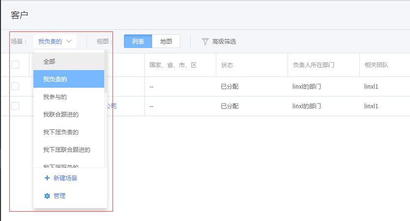

# 列表视图

---

纷享CRM中所有列表都是采用统一的交互和样式，以保证用户体验一致性。

## 1、快捷搜索

   按搜索框中提示文字输入关键词，例如：您想搜商机名称中包含“沃尔玛”的商机，则在搜索框中输入“沃尔玛”，您要找的内容就在眼前啦。

## 2、场景管理

- 场景：即筛选条件的集合，您可以把常用的一个或一组筛选条件设置为预置场景，方便您一键搜索常用数据。每个模块都有系统预置的筛选场景，同时您也可以自定义场景，比如查看进行中的重点商机，你可以在商机模块中添加场景，选择筛选条件“*金额大于10000，且状态等于进行中*”；

## 3、场景查看
点击指定场景即按场景中组合的筛选条件查询数据。

- 

## 4、高级筛选
组合多种筛选条件查询数据，如果为常用筛选，您也可以保存为场景，以便以后快捷查询。

## 5、过滤
可按列表中每个字段进行过滤，找出符合条件的数据。

## 6、批量操作
在列表中支持选择多条数据进行批量操作，比如“更换负责人”、“添加团队成员”、“作废”、“删除”等。
- 支持翻页选择记录
- 最多支持选择200条记录作批量处理。

## 7、排序
列表页每个字段名右侧都有向上和向下的箭头，可以按照字段进行升序、降序排列。

## 8、表头列选择
为了在列表上直观查看自己重点关注的内容，可以调整列表展示的字段，同时调整各列的顺序。

