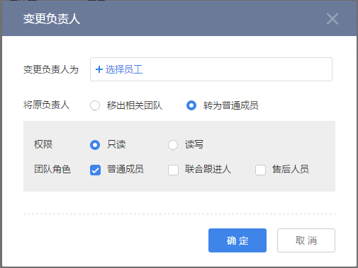
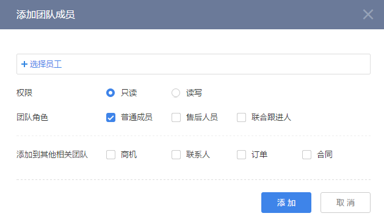
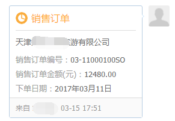
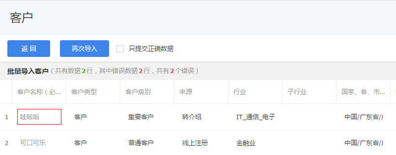

# 常用业务操作

---

在纷享CRM中有很多各个业务对象通用的业务操作，在这里统一介绍。

>备注：这些业务操作都可以在“CRM管理-功能权限管理”中配置操作权限，如果您看不到相关业务操作点，请联系管理员查看您所属角色及角色的功能权限点配置。 

常用业务操作包括：

- [编辑](2-7常用业务操作.md#编辑)

- [更换负责人](2-7常用业务操作.md#更换负责人)

- [添加相关团队](2-7常用业务操作.md#添加相关团队)

- [作废](2-7常用业务操作.md#作废)

- [恢复](2-7常用业务操作.md#恢复)

- [删除](2-7常用业务操作.md#删除)

- [转发](2-7常用业务操作.md#转发)

- [日程](2-7常用业务操作.md#日程)

- [打印](2-7常用业务操作.md#打印)

- [提醒](2-7常用业务操作.md#提醒)

- [打电话](2-7常用业务操作.md#打电话)

- [邮件](2-7常用业务操作.md#邮件)

- [导入](2-7常用业务操作.md#导入)

- [导出](2-7常用业务操作.md#导出)

## 编辑

- **业务场景**：编辑业务记录。

- **操作入口**：业务对象详情页中。

- **业务对象操作权限补充**

| 对象名  | 操作条件                             | 操作权限                                     |
| ---- | -------------------------------- | ---------------------------------------- |
| 客户   | 状态为“已分配”或“报备中”，同时审批状态不等于“进行中”    | 负责人、或负责人上级、或为数据被共享方且配置“读写”权限、或为相关团队成员且配置“读写”权限以及相关团队成员的上级 |
| 联系人  | 状态为“正常”                          | 负责人、或负责人上级、或为数据被共享方且配置“读写”权限、或为相关团队成员且配置“读写”权限以及相关团队成员的上级 |
| 销售线索 | 状态为“未分配”、“待处理”、“跟进中”或“无效”        | 负责人、或负责人上级、或为数据被共享方且配置“读写”权限、或为相关团队成员且配置“读写”权限以及相关团队成员的上级 |
| 商机   | 状态为“进行中”、“赢单”、“输单”或“无效”          | 负责人、或负责人上级、或为数据被共享方且配置“读写”权限、或为相关团队成员且配置“读写”权限以及相关团队成员的上级 |
| 拜访   | 状态为“未完成”                         | 负责人、或负责人上级、或为数据被共享方且配置“读写”权限、或为相关团队成员且配置“读写”权限以及相关团队成员的上级 |
| 销售订单 | 状态为“确认中”且“第一确认人还未确认”、“已驳回”、“已撤回” | 负责人、或负责人上级、或为数据被共享方且配置“读写”权限、或为相关团队成员且配置“读写”权限以及相关团队成员的上级、订单管理员、订单财务 |
| 销售订单 | 状态为“确认中”                         | 当前节点确认人、订单管理员、订单财务                       |
| 销售订单 | 状态为“已确认”、“已发货”、“已收货”             | 订单管理员、订单财务                               |
| 退货单  | 状态为“确认中”且“第一确认人还未确认”、“已驳回”、“已撤回” | 负责人、或负责人上级、或为数据被共享方且配置“读写”权限、或为相关团队成员且配置“读写”权限以及相关团队成员的上级、订单管理员、订单财务 |
| 退货单  | 状态为“确认中”                         | 当前节点确认人、订单管理员、订单财务                       |
| 退货单  | 状态为“已确认”、“已发货”、“已收货”             | 订单管理员、订单财务                               |
| 回款   | 状态为“未回款”、“已驳回”                   | 负责人、或负责人上级、或为数据被共享方且配置“读写”权限、或为相关团队成员且配置“读写”权限以及相关团队成员的上级、回款财务 |
| 回款   | 状态为“已回款”                         | 回款财务                                     |
| 退款   | 状态为“未退款”、“已驳回”                   | 负责人、或负责人上级、或为数据被共享方且配置“读写”权限、或为相关团队成员且配置“读写”权限以及相关团队成员的上级、退款财务 |
| 退款   | 状态为“已退款”                         | 退款财务                                     |
| 产品   | 状态为“已上架”或“已下架”                   | 负责人、或负责人上级、或为数据被共享方且配置“读写”权限、或为相关团队成员且配置“读写”权限以及相关团队成员的上级 |
| 合同   | 状态为“正常”                          | 负责人、或负责人上级、或为数据被共享方且配置“读写”权限、或为相关团队成员且配置“读写”权限以及相关团队成员的上级 |
| 开票申请 | 状态为“未开票”、“已驳回”                   | 负责人、或负责人上级、或为数据被共享方且配置“读写”权限、或为相关团队成员且配置“读写”权限以及相关团队成员的上级 |
| 开票申请 | 状态为“已开票”                         | 开票财务                                     |
| 市场活动 | 状态为“已计划”、“进行中”、“已结束”或“终止”        | 负责人、或负责人上级、或为数据被共享方且配置“读写”权限、或为相关团队成员且配置“读写”权限以及相关团队成员的上级 |

## 更换负责人

- **业务场景**：负责人是各模块业务对象记录的所有人，当负责人业务调整或是不再跟进当前记录时，可将记录更换负责人。

- **业务操作说明**：

    - 变更负责人为：选择新的负责人。只能选择一人

    - 移出相关团队：即原负责人不再查看此记录。

    - 转为普通成员：即加入相关团队中。

        - 权限：可为团队成员配置数据权限，“只读”：即此成员只能查看该记录。“读写”即可编辑和操作该记录

        - 团队角色：为团队成员配置所属角色。可在“CRM管理-功能权限管理”中配置角色的操作权限。

    （备注：各模块对象可配置的团队角色不一样）

- **操作入口**：业务对象列表页、详情页中。

- **业务对象操作权限补充**

| 对象名  | 操作条件                                   | 操作权限                                     |
| ---- | -------------------------------------- | ---------------------------------------- |
| 客户   | 非公海客户，且状态为“未生效”、“报备中”、“未分配”或“已分配”      | 负责人、或负责人上级、或为数据被共享方且配置“读写”权限             |
| 联系人  | 状态为“正常”                                | 负责人、或负责人上级、或为数据被共享方且配置“读写”权限             |
| 销售线索 | 状态为“待处理”、“跟进中”或“无效”                    | 负责人、或负责人上级、或为数据被共享方且配置“读写”权限             |
| 商机   | 状态为“进行中”、“赢单”、“输单”或“无效”                | 负责人、或负责人上级、或为数据被共享方且配置“读写”权限             |
| 销售订单 | 状态为“确认中”、“已驳回”、“已撤回”、“已确认”、“已发货”或“已收货” | 负责人、或负责人上级、或为数据被共享方且配置“读写”权限、或订单管理员、或订单财务 |
| 退货单  | 状态为“确认中”、“已驳回”、“已撤回”或“已确认”             | 负责人、或负责人上级、或为数据被共享方且配置“读写”权限、或订单管理员      |
| 回款   | 状态为“未回款”、“已驳回”或“已回款”                   | 负责人、或负责人上级、或为数据被共享方且配置“读写”权限、或回款财务       |
| 退款   | 状态为“未退款”、“已驳回”或“已退款”                   | 负责人、或负责人上级、或为数据被共享方且配置“读写”权限、或退款财务       |
| 产品   | 状态为“已上架”或“已下架”                         | 负责人、或负责人上级、或为数据被共享方且配置“读写”权限             |
| 开票申请 | 状态为“未开票”、“已驳回”或“已开票”                   | 负责人、或负责人上级、或为数据被共享方且配置“读写”权限、或开票财务       |
| 市场活动 | 状态为“已计划”、“进行中”、“已结束”或“终止”              | 负责人、或负责人上级、或为数据被共享方且配置“读写”权限             |

*补充：其中“销售订单”中的“订单财务”、“回款”中的“回款财务”以及“退款”中的“退款财务”是系统预置的角色，同时系统默认配置相关对象下的“更换负责人”操作权限，如果将这些预置角色的操作权限取消，将失去更换负责人的权限。*

## 添加相关团队

- **业务场景**：添加与业务记录相关联的团队成员，比如跟进一个客户，会涉及销售人员、销售助理、售前方案设计人员等，您可以把这些人员添加到客户的相关团队中，以便这些成员也能及时了解或处理客户相关任务。同时可为每一个团队成员单独配置数据权限和角色，以便更安全合理的管理团队成员。比如“客户”的相关团队中有售后人员或联合跟进人，分别负责客户的售后服务和查看关联对象数据。

- **业务操作说明**：

    - 权限：可为团队成员配置数据权限，“只读”：即此成员只能查看该记录。“读写”即可编辑和操作该记录

    - 团队角色：为团队成员配置所属角色。可在“CRM管理-功能权限管理”中配置角色的操作权限。

    - 添加到其他相关团队：对象“客户”和“商机”在添加团队成员时可选择是否将成员添加为指定对象的团队成员。

- **操作入口**：业务对象列表页、详情页中“相关团队”标签下。

- **业务对象操作权限补充**

| 对象名  | 操作条件                                   | 操作权限                                     |
| ---- | -------------------------------------- | ---------------------------------------- |
| 客户   | 状态为“未生效”、“报备中”或“已分配”                   | 负责人、或负责人上级、或为数据被共享方且配置“读写”权限、或为相关团队成员且配置“读写”权限以及相关团队成员的上级 |
| 联系人  | 状态为“正常”                                | 负责人、或负责人上级、或为数据被共享方且配置“读写”权限、或为相关团队成员且配置“读写”权限以及相关团队成员的上级 |
| 销售线索 | 状态为“待处理”、“跟进中”或“无效”                    | 负责人、或负责人上级、或为数据被共享方且配置“读写”权限、或为相关团队成员且配置“读写”权限以及相关团队成员的上级 |
| 商机   | 状态为“进行中”、“赢单”、“输单”或“无效”                | 负责人、或负责人上级、或为数据被共享方且配置“读写”权限、或为相关团队成员且配置“读写”权限以及相关团队成员的上级 |
| 销售订单 | 状态为“确认中”、“已驳回”、“已撤回”、“已确认”、“已发货”或“已收货” | 负责人、或负责人上级、或为数据被共享方且配置“读写”权限、或为相关团队成员且配置“读写”权限以及相关团队成员的上级 |
| 退货单  | 状态为“确认中”、“已驳回”、“已撤回”或“已确认”             | 负责人、或负责人上级、或为数据被共享方且配置“读写”权限、或为相关团队成员且配置“读写”权限以及相关团队成员的上级 |
| 回款   | 状态为“未回款”、“已驳回”或“已回款”                   | 负责人、或负责人上级、或为数据被共享方且配置“读写”权限、或为相关团队成员且配置“读写”权限以及相关团队成员的上级 |
| 退款   | 状态为“未退款”、“已驳回”或“已退款”                   | 负责人、或负责人上级、或为数据被共享方且配置“读写”权限、或为相关团队成员且配置“读写”权限以及相关团队成员的上级 |
| 产品   | 状态为“已上架”或“已下架”                         | 负责人、或负责人上级、或为数据被共享方且配置“读写”权限、或为相关团队成员且配置“读写”权限以及相关团队成员的上级 |
| 开票申请 | 状态为“未开票”、“已驳回”或“已开票”                   | 负责人、或负责人上级、或为数据被共享方且配置“读写”权限、或为相关团队成员且配置“读写”权限以及相关团队成员的上级 |
| 市场活动 | 状态为“已计划”、“进行中”、“已结束”或“终止”              | 负责人、或负责人上级、或为数据被共享方且配置“读写”权限、或为相关团队成员且配置“读写”权限以及相关团队成员的上级 |

## 作废

- **业务场景**：对象记录无效后，可以将其作废，作废后只有CRM管理员可见，同时CRM管理员可将作废记录恢复或是删除。

    - 所有已作废的数据将进入“CRM管理-回收站”中。可由CRM管理员“恢复”或“删除”。

    - 已作废的数据，对于非CRM管理员不计入统计，但是对于CRM管理员包含已作废数据。

- **操作入口**：业务对象列表页、详情页中。

- **业务对象操作权限补充**

| 对象名  | 操作条件                       | 操作权限                                     |
| ---- | -------------------------- | ---------------------------------------- |
| 客户   | 状态为“未生效”、“报备中”、“未分配”或“已分配” | 负责人、或负责人上级                               |
| 联系人  | 状态为“正常”                    | 负责人、或负责人上级、或为数据被共享方且配置“读写”权限、或为相关团队成员且配置“读写”权限以及相关团队成员的上级 |
| 销售线索 | 状态为“待处理”、“跟进中”或“无效”        | 负责人、或负责人上级、或为数据被共享方且配置“读写”权限、或为相关团队成员且配置“读写”权限以及相关团队成员的上级 |
| 商机   | 状态为“进行中”、“赢单”、“输单”或“无效”    | 负责人、或负责人上级、或为数据被共享方且配置“读写”权限、或为相关团队成员且配置“读写”权限以及相关团队成员的上级 |
| 拜访   | 状态为“未完成”或“已完成”             | 负责人、或负责人上级、或为数据被共享方且配置“读写”权限、或为相关团队成员且配置“读写”权限以及相关团队成员的上级 |
| 销售订单 | 状态为“已驳回”或“已撤回”             | 负责人、或负责人上级、或为数据被共享方且配置“读写”权限、或为相关团队成员且配置“读写”权限以及相关团队成员的上级、或订单管理员、或订单财务 |
| 销售订单 | 状态为“已确认”、“已发货”或“已收货”       | 为数据被共享方且配置“读写”权限、或订单管理员、或订单财务            |
| 退货单  | 状态为“已驳回”或“已撤回”             | 负责人、或负责人上级、或为数据被共享方且配置“读写”权限、或为相关团队成员且配置“读写”权限以及相关团队成员的上级、或订单管理员、或订单财务 |
| 退货单  | 状态为“已确认”                   | 为数据被共享方且配置“读写”权限、或订单管理员、或订单财务            |
| 回款   | 状态为“未回款”、“已驳回”             | 负责人、或负责人上级、或为数据被共享方且配置“读写”权限、或为相关团队成员且配置“读写”权限以及相关团队成员的上级、或回款财务 |
| 回款   | 状态为“已回款”                   | 为数据被共享方且配置“读写”权限、或回款财务                   |
| 退款   | 状态为“未退款”、“已驳回”             | 负责人、或负责人上级、或为数据被共享方且配置“读写”权限、或为相关团队成员且配置“读写”权限以及相关团队成员的上级、退款财务 |
| 退款   | 状态为“已退款”                   | 为数据被共享方且配置“读写”权限、退款财务                    |
| 产品   | 状态为“已下架”                   | 负责人、或负责人上级、或为数据被共享方且配置“读写”权限、或为相关团队成员且配置“读写”权限以及相关团队成员的上级 |
| 开票申请 | 状态为“未开票”、“已驳回”             | 负责人、或负责人上级、或为数据被共享方且配置“读写”权限、或为相关团队成员且配置“读写”权限以及相关团队成员的上级、或开票财务 |
| 开票申请 | 状态为“已开票”                   | 为数据被共享方且配置“读写”权限、或开票财务                   |
| 市场活动 | 状态为“已计划”、“进行中”、“已结束”或“终止”  | 负责人、或负责人上级、或为数据被共享方且配置“读写”权限、或为相关团队成员且配置“读写”权限以及相关团队成员的上级 |
| 竞争对手 | 状态为“正常”                    | 负责人、或负责人上级、或为数据被共享方且配置“读写”权限             |

## 恢复

- **业务场景**：将作废的数据恢复，并恢复为作废前的状态，像销售订单、回款等金额恢复计算，同时也会恢复相关报表统计。只有CRM管理员可操作。

- **操作入口**：业务对象详情页中、CRM管理-回收站

- **特殊说明**

    - 恢复作废的回款、退款、开票申请、退货单时，会验证关联的销售订单是否作废或删除，如果销售订单状态为已作废或已删除，则不可恢复当前数据。

## 删除

- **业务场景**：将作废的数据删除，只有CRM管事员可操作，数据删除后不可恢复。

- **操作入口**：业务对象详情页中、CRM管理-回收站

## 转发

- **业务场景**：可针对某一条业务对象的记录发送到企信中讨论。比如针对某一条销售订单中客户反馈的关于产品的问题一起讨论解决方案。

- **权限说明**：企信讨论群中的成员是否可见被转发的记录是依据CRM中的数据权限。如果某成员对被转发记录是不可见，则不能打开记录详情，只可见企信中的卡片消息。

- **操作入口**：业务对象详情页中。

- **查看**：业务记录转发后，会根据转发时选择的人员或群组在企信的聊天窗口中以卡片的形式展示。 

## 日程

- **业务场景**：针对某一业务记录的相关待办事项创建一个日程，以便即时提醒相关参与人员。日程创建后可在纷享办公产品中“日程”中体现，另外也可以在“CRM信息”中、业务对象的“销售记录”中查看到。比如针对商机记录创建一条日程“下周一跟客户确认报价方案”。

- **权限说明**：日程中的参与人是否可见关联记录是依据CRM中的数据权限。

- **操作入口**：业务对象详情页中。 

## 打印

- **业务场景**：根据业务需要打印业务记录，打印时可以选择打印模板。您可以在后台为对象配置打印模板。详见[打印模板](7-2-3模板管理.md)

- **操作入口**：业务对象详情页中。

## 提醒

- **业务场景**：为某一项业务添加提醒，设置提醒时间点和提醒相关人员。比如针对某一销售订单，提醒自己或是指定人员打电话回访。

- **操作入口**：业务对象详情页中。

## 打电话

- **业务场景**：此功能只支持移动端，如果对象中有电话字段，或是添加了类型为“电话”的自定义字段，可以直接一键呼出，与相关人员联系。

- **操作入口**：业务对象详情页中。

- 备注：当用户通过某对象的电话字段直接拨打电话的时候，系统自动发送销售记录并关联该对象

## 邮件

- **业务场景**：此功能只支持移动端，如果对象中有邮件字段，或是添加了类型为“邮件”的自定义字段，则可以在对象下发邮件。
- **操作入口**：
    - Web端：销售线索、客户、联系人对象列表页及详情页。
    - 移动端：业务对象详情页。
- **批量发邮件**：销售线索、客户、联系人对象列表页可选用模板批量发邮件。
    - 单次发送上限：单次发送收件人最多不可超过50个。
    - 可在确认收件人页面预览和编辑择邮件接收人。
    - 选用模板批量发送时，在写邮件页面模板中的变量将以参数形式展现，邮件发送时自动实例化成具体数据。
      ![image_1bqfcpcov1001e0rvli15cf1hlq9.png-67.9kB][1]

- 备注：使用发邮件功能需先绑定邮箱。

## 导入

- **业务场景**：通过excel批量添加对象记录。比如通过一次市场活动获得大量线索，可以通过excel的方式批量添加。目前我们支持两种导入方式，一种是快捷导入，导入数据量上限为1000条，文件大小为2M。另一种方式是通过导入工具导入，可以支持数据导入上限为300000条，因导入数据量大，执行导入时，是系统后台执行，导入完成后会通知相关人员导入结果。

    - 快捷导入
        - 第一步：下载模板，建议不要修改模板表头，因模板是根据对象的字段配置自动生成，已为您配置好了表头，调整需导入的数据即可。
        - 第二步：上传导入文档
        - 第三步：导入。在导入过程中如果发现数据有重复或是数据格式有错误时，系统会给出提示，此时您直接修改有问题的数据项即可，同时也可以只提交正常的数据。

    - 导入工具

    详见[导入工具](2-8小工具.md#导入工具)

## 导出

- **业务场景**：以excel的方式导出业务数据，导出的数据源是当前列表指定场景或是通过筛选条件展示的数据。另外业务对象“客户”还支持导出销售记录 

- **操作入口**：业务对象列表页中。

[1]: ./images/image_1bqfcpcov1001e0rvli15cf1hlq9.png

