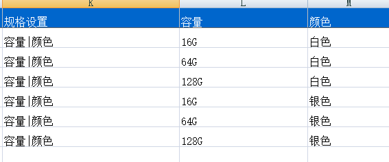

# 小工具

---

目前纷享CRM提供的小工具有：

- [查重工具](2-8小工具.md#查重工具)
- [清洗工具](2-8小工具.md#清洗工具)
- [导入工具](2-8小工具.md#导入工具)

## 查重工具

查重工具即查找重复数据的工具。线索，客户及联系人作为CRM的主数据信息载体，在不同行业的唯一辨识往往是多维的，要排除人为操作出现的重复信息，就需要量身定制的复杂规则支撑。

比如客户名称为“北京纷扬科技有限公司”，有的用户可能会录入“北京纷扬”或是“纷扬科技”，或者有的用户直接录入客户的产品如“纷享销客”，这样就会导致同一客户被录入了多条。为了保证数据的正确性和有效唯一性，用户在录入新的数据或查找相关数据时可以通过查重工具查找相关数据，并领取或是通过企信联系重复记录的负责人或系统管理员。

查重工具作为企业信息的“治理人”，从信息上通过事前查重，进行中查重，事后清洗等方式彻底杜绝不同销售人员跟进同一客户资源的情况，帮助企业管理者更好的管理客户资源，分配销售资源。

- **查重规则设置**：如何判定用户查询数据为系统内已有数据即重复数据，可在后台配置查重规则 ，查重规则设置详见“[查重设置](7-3-4查重设置.md)”
- **查重范围**：所有数据，包括已作废数据。
- **三种查重方式**：
    - 新建查重：即在新建保存对象时按照自定义查重规则进行查重。
    - 查重工具：通过输入关键词查重。
    - 联合查重：在新建或者查重工具中线索可联合查重客户和联系人，客户可联合查重线索，联系人可联合查重线索。
- **查重工具操作入口**：CRM工作台-首页。目前支持查重的业务对象有：客户、联系人有线索。如果这三个对象都没有配置开启查重工具，则查重工具入口被隐藏
- **权限**
    - 功能权限：由角色功能权限配置
    - 数据权限：查重范围为系统所有数据，包含已作废数据
- **查到重复数据后可进行的操作**：
    - 客户：
        - **领取**：若查出的重复客户属于某公海，没有被领取且当前用户有领取权限，则可直接领取该客户
        - **查看详情**：若当前用户有此重复客户的数据权限和查看权限，则可查看客户详情
        - **企信联系负责人**：若当前用户没有此重复客户的数据权限或查看权限，则可企信联系该客户负责人
        - **企信联系管理员**：若当前客户没有负责人且为非公海客户，或者已作废，当前用户可企信联系管理员
    - 联系人：
        - **查看详情**：当前用户在重复联系人记录的销售团队中，则可查看详情
        - **企信联系**：当前用户不在重复联系人记录的销售团队中，且该联系人有负责人，则可企信联系负责人，若没有负责人或已作废，则可企信联系管理员
    - 销售线索：
        - **查看详情**：当前用户在重复线索记录的销售团队中，则可查看详情
        - **企信联系**：当前用户不在重复线索记录的销售团队中，且线索有负责人，则可企信联系负责人；若没有负责人且不在线索池或已作废，则可企信联系管理员
        - **领取**：重复线索记录没有负责人且在线索池，若当前用户有领取权限则可领取
- 备注：
     - 查重客户出现企信联系管理员时，将所有CRM管理员列出，用户可选择联系谁。
    - 查重结果页“企信联系负责人”按钮增加判断，如查重结果显示字段添加了“负责人”字段，则显示“企信联系负责人”按钮，不添加则不显示。

## 清洗工具
线索、客户和联系人是CRM系统中重要而基础的数据，为保证系统能正确有效的使用，可通过清洗工具将判定为重复的数据合并。目前系统支持客户、联系人和线索按照系统预置的查重规则自动进行批量查重，分组显示相似记录，用户可根据查重结果进行合并操作。

- **查重范围**：所有数据，包括已作废数据。
- **预置清洗扫描规则**：
    - 客户清洗规则：（客户名称 AND 电话）OR （客户名称 AND 地址）OR （网址 AND 电话）OR （网址 AND 地址）
    - 联系人清洗规则：（姓名 AND 客户名称 AND 电话）OR （姓名 AND 客户名称 AND 手机）
    - 线索清洗规则：（姓名 AND 电话 AND 公司名称）OR （姓名 AND 手机 AND 公司名称）
- **清洗扫描后处理操作**：
    - 清洗完成后，当前用户会收到CRM通知提醒
    - 清洗出的重复结果数据，分组展示，可对重复数据进行合并 
- **数据合并**:
    - 支持合并对象：客户、联系人
    - 操作步骤：
        - 勾选需要合并的客户
        - 选择目标客户，指合并后保留的客户
        - 字段值不同的需要选择要保留值的字段，字段值相同的不需要选择；当字段的值为多值时，可多选，如：联系人电话、备注等
        - 选择是否将合并客户的相关对象记录合并到目标客户
        - 确认合并，将作废被合并客户
    - **数据合并规则补充**：公海客户不能与非公海客户合并，只能与同一公海客户合并；一次最多合并3条；

- ## 导入工具

  - 当用户数据导入量特别大时，即一次导入数据量在1000以上时，可以用“导入工具”，以提高工作效率。
  - 新建导入其支持数据导入上限为300000条，因导入数据量大，执行导入时，是系统后台执行，导入完成后会通知相关人员导入结果。
  - 更新导入支持最大数据上限为1000条，且会触发"更新触发"方式的工作流。
  - **入口**：CRM首页或是各对象列表页中的导入引导。
  - **导入操作**：
    - 第一步：选择导入的对象
    - 第二部：选择导入方式，新建或者更新
    - 第三部：下载导入模板并将组织好的导入文件上传。建议不要修改模板表头，因模板是根据对象的字段配置自动生成，已为您配置好了表头，调整需导入的数据即可。
    - 第四部：通知方式配置：因导入工具是以异步的方式导入，即文件上传后，系统在后台处理数据导入，当数据导入完成后，会以企信的方式通知指定人员，以便查看验证数据的导入情况。
  - **导入记录**
    - 统一展示所有的上传导入记录。在这里您可以查看导入进度、导入结果，如果上传过程中有导入失败的数据，可以直接下载导入结果文件，在文件中会标识导入错误的数据，以及错误原因。您根据错误提示修改记录并重新上传即可。
  - **业务补充**
    - 导入对象时，如果关联到客户，会**更新客户**最后跟进时间、最后成交时间、重新计算所属公海或者非公海收回时间  
    - 如果是更新导入，会触发"更新触发"方式的工作流。

  - **系统预设的导入查重设置**：导入时数据的查重逻辑为系统预设和自定义的唯一性查重规则。如果没有预设，则暂无查重规则。

| 业务对象    | 查重字段                                     |
| ------- | ---------------------------------------- |
| 线索      | 支持唯一性查重                                  |
| 客户      | 如果查重设置开启，则客户名称不能重复，且客户编号不能重复，如果不开启，则不查重，或支持唯一性查重 |
| 联系人     | 支持唯一性查重                                  |
| 商机      | 同一客户下   商机名称不能重复，或支持唯一性查重                |
| 销售订单    | 订单编号                                     |
| 退货单     | 合同编号                                     |
| 合同      | 合同编号                                     |
| 回款      | 回款编号                                     |
| 退款      | 退款编号                                     |
| 开票申请    | 开票编号                                     |
| 拜访      | 组合客户名称、负责人及计划日期 查重                       |
| 市场活动    | 市场活动名称                                   |
| *自定义对象* | 自定义对象主属性为文本且主属性设为唯一时，按主属性查重。             |

- 【产品】导入特殊说明
    - 如果是导入**有规格的产品**，则在“规格设置”列添加规则项，用英文态的“|”区分。比如导入的产品是手机，规格有“容量”、“颜色”，则在导入时，需在“规格设置”列录入“容量|颜色”，同时增加两列，分别为“容量”、“颜色”，同时补充相关内容。
        - 如果同一产品有多个规格，请保持“产品名称”、“分类”、“单位”、“产品线”、“状态”、“备注”、“规格设置”相同，但规格设置中的规格值不能重复。

        
    - 如果是导入无规格的产品，则产品名称不能重复。

