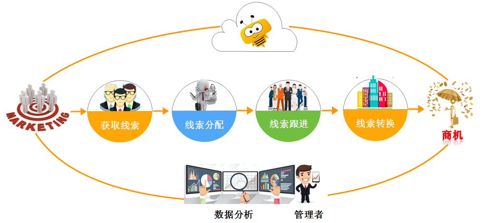
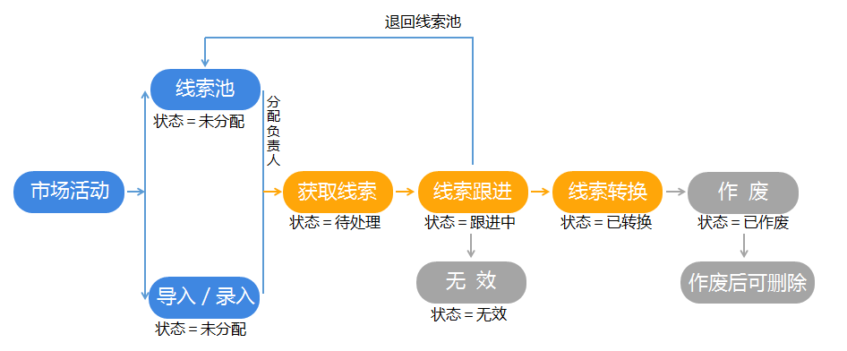


# 销售线索

---

销售线索是与客户初次接触获得的原始信息，可以是从展会中获得的名片，通过推广活动获得的电话号码，或是会议、广告、外部购买等渠道获得的客户简单信息，然后通过管理和跟进可以转化为客户。同时可以根据不同线索来源分析渠道的转化率，从而优化市场活动的资源投放，以达到利润最大化。
将这些公共线索按区域、行业等分类放到线索池，如上海区线索池、北京区线索池、教育行业线索池、金融行业线索池等 。线索池可以设置管理员和成员，并配置推送或拉取的方式分配线索给销售人员跟进。以达到合理化规范化管理线索。

## 业务过程中的销售线索

### 销售线索的业务过程

- **获取线索**： 企业通过举办市场活动或是外部购买等众多渠道获取大量的潜在客户信息，他们可以是一个电话号码、一个企业名称或是姓名、或是其它的社交联系方式。为了有效管理销售线索，可以按客户行业或是地区等维度创建线索池，以便销售人员按自己专长或是按就近原则领取跟进，以提高线索转换率和工作效率。另一方面销售人员跟进线索时，如果电话打不通或是联系不上时，可以将线索退回线索池，以便后续再择机跟进或是由其它销售人员跟进，以提高销售线索的利用率和转化率。在纷享CRM中有多种方式录入销售线索，详见本章[新建销售线索](3-1销售线索.md#新建销售线索)

- **线索分配**：将线索池中的线索合理分配给销售。为了保证销售线索能合理有效的分配给销售人员，纷享CRM中提供了多种线索分配方式：

     - 默认分配：在线索池中指定属于此线索池的线索默认分配给指定销售人员，以便快速分配线索。详见本章节[线索池-分配](3-1销售线索.md#分配) 

    - 线索池管理员分配：由线索池管理员在前端线索池中批量分配销售线索，适用于将敏感或是重要的销售线索指派给能力强的销售人员跟进，以保证线索的最大转化率。详见本章节[线索池-分配](3-1销售线索.md#分配) 

    - 销售人员主动领取：如果线索池配置为员工可领取，则销售人员可以直接领取销售线索。通过主动领取的方式，提高销售人员的工作积极性。详见本章节[线索池-领取](3-1销售线索.md#领取) 

- **线索跟进**： 销售人员分配到线索后，可通过各种方式，如打电话或是上门拜访等与潜在客户取得联系，并沟通了解客户的意向和需求，然后将获取的信息录入系统中，以便后续问题跟进和分析总结。详见本章节[线索处理](3-1销售线索.md#线索处理) 

- **线索转换**： 销售人员对销售线索进一步验证筛选后，将有价值的线索，或是有明确购买意向的线索转化为客户、联系人或是商机，以便后续采取进一步的跟进措施或是销售流程跟进。详见本章节[线索处理](3-1销售线索.md#线索转换) 

- **数据分析**：在整个转化过程中，通过销售线索来源分析线索转化率，得出最优渠道，找到最优销售模式；也可以统计分析员工线索转换率，了解销售人员的工作能力或是擅长的领域，以便合理分配线索。详见[报表](6-1报表.md)、[统计图](6-2统计图.md)

### 销售线索完整生命周期过程

 

在纷享CRM中通过线索状态标识销售线索在生命周期中的每一个转换过程。

- 未分配：即通过市场活动、录入/导入的方式加入线索池中的销售线索初始时均为未分配状态，或是在跟进过程中退回线索池的销售线索也会转化为未分配状态。

- 待处理：当销售线索分配负责人后即为待处理状态。由销售人员自己挖掘创建的销售线索默认负责人为当前用户，即待处理状态。

- 跟进中：当销售人员添加“处理结果”或是“销售记录”后，状态转换为“跟进中”。

- 无效：即线索在跟进时，联系不上客户时，可将线索暂时标记为“无效”，以便以后再择机跟进。

- 已转换：将线索转换为客户、联系人或是商机后，线索状态变为已转换。

- 已作废：即销售线索验证后确认为垃圾数据，可以将其作废。作废后只有CRM管理员可以将其恢复。

## 业务使用场景举例

企业通过举办展会获得大量的名片，可直接扫名片并创建线索，名片上的信息直接填充入线索中，并将线索的来源选为“展会”，另一方面，为了方便管理线索，可根据线索信息的地区或是不同行业划入不同的线索池，如“华北区线索池”、“金融行业线索池”等。

## 销售线索的业务操作

### 销售线索预设场景

- **全部销售线索**：

    - 负责人是当前用户或当前用户的下属

    - 或者相关团队成员中包含当前用户或是当前用户的下属

    - 或者在“数据权限管理”中配置销售线索的“数据共享”规则为记录负责人或是负责人所属部门的数据共享给当前员工或是当前员工所在部门或是当前员工所在用户组。

    - 或是“我负责部门的”数据。

- **我的超时销售线索**：负责人为当前用户，且【是否超时】为“已超时”的销售线索。

    - 备注：如果是非线索池线索或是线索池没有配置超时时长，则状态保持为“未超时”

- **待我跟进的销售线索**：负责人为当前用户，且状态为“未处理”、“跟进中”

- **我下属的销售线索**：负责人为当前用户的下属

- **我参与的**：负责人为当前用户或者相关团队中包含当前用户

- **我下属参与的**：负责人为当前用户的下属或是相关团队成员为当前用户的下属

- **共享给我的**：在“数据权限管理”中配置销售线索的“数据共享”规则为记录负责人或是负责人所属部门的数据共享给当前员工或是当前员工所在部门或是当前员工所在用户组。

- **我负责部门的**：

    - 当前用户为所在主部门的部门负责人
    - 同时记录中相关团队成员的主部门为该部门。
    - *备注：负责部门是否包含所有下级数据，由“CRM管理-规则设置-基础设置-上级可见数据范围”决定*。

> 备注：

> - “CRM管理员”可以查看所有数据。

> - 所有状态为“作废”的记录只有“CRM管理员”可见，其他人员均不可见。

### 新建销售线索

- 有多种方式创建线索。

    - 手工创建入口：

        - 在【销售线索】的主列表下新建销售线索。

        - 在前端【线索池】的主列表下新建销售线索

        - 在关联对象【市场活动】下创建销售线索。

    - 通过手机端“扫名片”的方式创建销售线索
        - 入口1：移动端首页右上角“扫一扫”。
        - 入口2：移动端“销售线索”列表页，点击“+”，选择“扫名片”。
    - 通过导入的方式创建销售线索

### 线索处理

- **业务说明**：销售线索负责人需要对自己负责的线索跟进处理，验证线索的有效性，有价值的线索转换为客户/联系人或是商机，没有价值的线索设置为无效线索。

- **业务操作条件**：【状态】为“待处理”、“跟进中”、“无效”

- **可执行此操作的员工或角色有**：负责人、负责人上级、相关团队成员且配置“读写”权限以及相关团队成员的上级、数据被共享方且配置“读写”权限、所在线索池的管理员。

- **业务操作入口**：销售线索详情页中【更多】操作下选择【处理】、前端【线索池】下线索详情页中【更多】操作下选择【处理】

- **相关操作**

    - **跟进中**：当线索在跟进验证过程中，可添加跟进记录，并填写“处理结果”。这个操作结果会更新线索状态为“跟进中”。

    - **转换线索**：如果确认当前线索为有价值的线索，可以将其转换为客户、联系人或是商机，以便后续跟进，并沉淀业务数据。

    - **无效**：如果跟进中确认当前线索是一个没价值的线索，可以设置为“无效”。此操作可逆，即后期因为某个契机而变得有价值，仍可继续跟进并转化。

- **业务补充**：

    - **“作废”与“无效”**：作废类似于删除操作。而“无效”是销售线索跟进中电话打不通，或客户对公司产品无意愿而标记为无效。另一方面无效的线索过一段时间后再跟进可继续转化。

### 线索转换

- **业务说明**：如果确认当前线索为有价值的线索，可以将其转换为客户、联系人或是商机，以便后续跟进，并沉淀业务数据。

- **转换为客户**：转换为客户是必选项，即创建一个客户，如果客户已存在，则关联此客户。

    - 线索的“公司名称”会自动带入为客户名称。

    - 如果“查重规则”中开启客户“新建查重”，则系统会跟据客户名称自动查找匹配客户。即如果客户名称已存在，则会自动关联对应的客户记录。 

    - 如果没有开启客户“新建查重”,则不匹配已有客户，而是新建一个客户。

- **转换为联系人**：转换为联系人时为可选项。即同时创建一个联系人。

    - 线索的“姓名”会自动带入为“联系人”的姓名。

    - 如果“查重规则”中开启联系人“新建查重”，则系统会跟据规则自动查找匹配联系人。即如果联系人已存在，则转换失败。

    - 如果没有开启联系人“新建查重”,则不匹配已有联系人，而是新建一个联系人。

- **转换为商机**：转换为商机时为可选项。

    - 选中后须填写商机相关信息。

    - 如果“查重规则”中开启商机“禁止在同一客户下创建重复商机名称”，则新建时会按此规则查重，如果重复，则转换失败。

- **线索的销售记录自动带入客户**：选中后，待转换线索产生的销售记录自动带入客户中。

### 退回 

- **业务说明**：当线索负责人跟进一段时间后没有效果，或是认为当前线索不是自己负责的业务范围内或是放弃跟进等原因，可将线索退回线索池，由其他成员继续跟进。

- **业务操作条件**：【状态】为“待处理”、“跟进中”、“无效”

- **可执行此操作的员工或角色有**：负责人、负责人上级、相关团队成员且配置“读写”权限以及相关团队成员的上级、数据被共享方且配置“读写”权限

- **业务操作入口**：【销售线索】列表页、【销售线索】详情页中的【更多】操作、前端【线索池】列表页、前端【线索池】下线索详情页中的【更多】操作。

- **备注**：

    - 如果当前线索已是线索池线索，则直接退回，如果是非线索池线索，可选择当前用户所属线索池退回。
    - “退回”与“收回”：“退回”可由线索负责人主动退回线索池，“收回”则由线索池管理员被动收回。

- **退回原因**

    - **业务说明** ：负责人将线索退回线索池时，需选择退回原因。
    - **业务操作条件** ：“销售线索”对象下“销售人员退回原因”字段为启用，可增删退回原因。

### 邮件

- **业务说明**：用于沉淀当前员工与客户对象下邮件地址的往来邮件。
- **业务操作入口**：【客户】详情页中的“邮件”。
- **邮件追踪**：发出的邮件可追踪用户是否已读，如果客户已读在邮件沉淀中将显示已读图标：![image_1bqfe9evc1e57ol51ctjh0c1v859.png-0.5kB][1]，未读图标：![image_1bqfeab02m0n1c41v0n4mvdvmm.png-0.5kB][2]
- **相关操作**：
    - 筛选：可按我收到的、我发出的和全部邮件筛选。
    - 发邮件  

## 线索池业务操作

- 如果当前用户是某一线索池的成员，且成员可见，则可见前端【线索池】

- 线索池成员在前端【线索池】中的业务操作主要包括领取、分配、转移、收回、退回等操作。

### 领取 

- **业务说明**：企业根据自身业务场景将收集的线索划入线索池统一管理，线索池成员可从线索池中根据自身条件，如地域远近、擅长领域等因素合理领取，并跟进处理。一方面可以保证员工工作的主动性和积极性，另一方面可以有效保证线索的转换率。

- **业务条件**：属于线索池线索、状态为“未分配”、线索池类型为“员工可见可领取，管理员可分配”。

- **可执行此操作的员工或角色有**：线索池成员

- **业务操作入口**：前端【线索池】列表中、前端【线索池】中线索详情页中的【更多】操作。

### 分配 

- **业务说明**：对于敏感或是重要的销售线索，可由线索池管理员分配给指定销售人员跟进，以保证线索的最大转化率。

- **业务条件**：属于线索池线索、状态为“未分配”、“待处理”、“跟进中”、“无效"。

- **可执行此操作的员工或角色有**：线索池管理员

- **业务操作入口**：前端【线索池】列表中、前端【线索池】中线索详情页中的【更多】操作。

- **业务补充**：在纷享CRM中，还提供了另外一种快速的线索分配方式，即线索池默认分配。在“CRM管理-线索池管理”中为指定线索池配置属性“线索默认分配给”，选择一位员工。当有新的销售线索加入此线索池时，将会自动分配给此员工。 

### 转移 

- **业务说明**：可将线索池内的多条线索转移至指定线索池，或是将整个线索池转移至指定线索池。

- **业务条件**：属于线索池的销售线索

- **可执行此操作的员工或角色有**：线索池管理员

- **业务操作入口**：

    - 转移指定一条或多条线索： 前端【线索池】列表中、前端【线索池】中线索详情页中的【更多】操作。
    - 线索池线索整体转移：【CRM管理】-【线索池管理】--线索池详情页-【转移】。

### 收回 

- **业务说明**：由线索池管理员收回线索。收回后线索负责人为空。

- **业务条件**：属于线索池线索、状态为“待处理”、“跟进中”、“无效"。

- **可执行此操作的员工或角色有**：线索池管理员

- **业务操作入口**：前端【线索池】列表中、前端【线索池】中线索详情页中的【更多】操作。

## 销售线索常用操作

- 列表页常用操作详见[列表页常用操作](2-5列表视图.md)

- 添加销售记录，详见[销售记录](2-2销售记录服务记录.md);

- 常用业务操作，包括更换负责人、添加相关团队成员、打印、导入、导出、编辑、作废、删除等，详见[常用业务操作](2-7常用业务操作.md)

- 与协同办公结合的业务操作，包括转发、日程、提醒、打电话、发邮件等，详见[常用业务操作](2-7常用业务操作.md)

## 相关链接 

- [线索池管理](7-3-1线索池管理.md)

- [销售线索打印模板](7-2-3模板管理.md)

- [清洗工具](2-8小工具.md#清洗工具)

- [查重工具](2-8小工具.md#查重工具) 

[1]: ./images/image_1bqfe9evc1e57ol51ctjh0c1v859.png
[2]: ./images/image_1bqfeab02m0n1c41v0n4mvdvmm.png