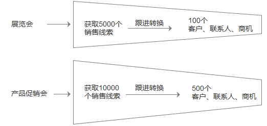


# 市场营销

---

纷享CRM市场营销版块支持对市场营销活动的计划、执行、分析等全过程管理。跟踪每个市场活动的全过程，记录活动各类信息；查询、分析及统计活动效果；可灵活定制丰富实时的数据分析报表及统计图，清晰查看各类营销活动情况。多样化的报表统计，有效追踪市场变化，及时进行活动调整，了解线索/客户/商机获取情况、获取线索的成本、投入产出比等数据，为新的市场活动及公司战略规划提供有力的数据支持。
市场人员可以将市场宣传资料、文档、客户信息等共享给其它部门和人员，与销售部门及其他业务部门保持紧密联系，促进业务协同，提高企业整体工作效率。

## 业务场景说明
企业分别举办了多场市场活动收集了大量销售线索，通过对这些销售线索分配、跟进验证，最后成功转换为客户、联系人或是商机。

通过报表“按市场活动统计线索转化过程”分析得出每个市场活动的销售线索转换情况。如展览会的线索转换为2%，产品促销会的线索转换为5%，因此可以适当多举办一个产品促销会来获取销售线索。当然分析市场活动时还应考虑实际投入成本等其它因素。

