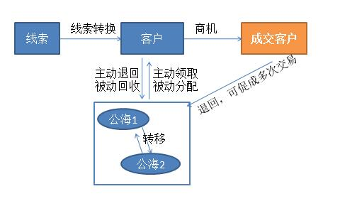

# 客户概述

---

客户是指通过购买你的产品或服务满足其某种需求、产生直接经济关系的个人、团体或企业，可以通过线索转化而来，或是销售挖掘等多种渠道获取。

为了促进销售人员的积极性，引入了压力性销售管理工具公海。公海的主要特点是：

可将公共的客户资源设置为公海客户，将公海客户分配或领取给某些销售（公海成员），每个销售只能领取一定数量的公海客户，且在期限内必须达成签约或跟进目标，否则客户就会自动回归公海中重新分配给其他销售。  

## 业务过程中的客户状态转换

- **线索-客户**：线索跟进处理中验证为有价值的客户，则转换为客户。
- **客户-公海**

    - 主动退回：客户跟进一段时间没有效果而放弃跟进，或是直接输单等原因，可将客户主动退回公海。

    - 被动回收：每个公海可配置回收规则，限定客户跟进时间，保证销售的积极性，以加速客户流转。如果客户未成交则客户会被回收。
- **公海-客户**

    - 主动领取： 销售可根据自己擅长的技能或是地区归属主动领取客户，以促进业绩。

    - 被动分配：企业可根据客户的重要级别及销售的技能优劣合理分配客户，以最大化促成交易。
- **客户-成交客户**：根据成交动作的配置，客户下商机赢单 或 新建销售订单并已被确认 或 新建了合同都会成为成交客户。
- **成交客户-公海**：企业有多种产品，或是产品可以多次购买，即使是成交客户，也可以退回公海，进行下一次的交易。
- **公海-公海**：由于客户地址变更、客户规模壮大或业务调整等各种原因可以将客户从原有公海转移至更合适的公海中。

## 业务使用场景举例

- 客户：根据您企业的业务模式，客户可以是企业，如“北京XX科技有限公司”、“上海XX金融服务有限公司”,也可是个人，像房产中介，如“王先生”、“李先生”等。

- 公海：可根据行业、区域、客户级别等创建多个公海，以便合理分配管理客户。如“金融公海”、“华北区客户”、“VIP客户”等。

- 客户与公海的配合使用：A企业是一家出售办公设备的公司，产品有打印机、投影仪等，业务遍布全国各地。通过参加展会收集到一打名片，验证后转换为客户，像“北京XX公司”、“深圳XX公司”等。B客户在销售跟进后下单，转化为成交客户，C客户因价格太高等原因而没有采购。B客户虽然达成了本次交易，但公司还在研发新的产品,可以将其退回公海，待新产品上市，再推销跟进。C客户因各种原因而输单，可将其退回公海，待其他销售再择机跟进，也许还有机会促成交易。

# 客户的详细介绍

## 客户视图

### 客户预设场景

- **全部**:

    - 负责人是当前用户或当前用户的下属

    - 或者相关团队成员中包含当前用户或是当前用户的下属

    - 或者在“数据权限管理”中配置客户的“数据共享”规则为记录负责人或是负责人所属部门的数据共享给当前员工或是当前员工所在部门或是当前员工所在用户组。

    - 或是“我负责部门的”数据。

- **我负责的客户**：负责人是当前用户

- **我联合跟进的客户**：相关团队中包含当前用户，且团队角色为“联合跟进人”

- **我服务的客户**：相关团队中包含当前用户，且团队角色为“售后人员”

- **我参与的客户**：相关团队中包含当前用户

- **我下属联合跟进的客户**：相关团队中包含当前用户的下属，且团队角色为“联合跟进人”

- **我下属负责的客户**：负责人为当前用户下属

- **我下属服务的客户**：相关团队中包含当前用户的下属，且团队角色为“售后人员”

- **共享给我的**：在“数据权限管理”中配置客户的“数据共享”规则为记录负责人或是负责人所属部门的数据共享给当前员工或是当前员工所在部门或是当前员工所在用户组。

- **我负责部门的**：

    - 当前用户为所在主部门的部门负责人

    - 同时记录中相关团队成员的主部门为该部门。

    - *备注：负责部门是否包含所有下级数据，由“CRM管理-规则设置-基础设置-上级可见数据范围”决定*。

> 备注：  

> - “CRM管理员”可以查看所有数据。

> - 所有状态为“作废”的记录只有“CRM管理员”可见，其他人员均不可见。

### 客户列表页说明

- 列表视图：即普通的客户列表视图。

- 地图视图：以地图的方式展示客户地理分配情况，信息来源于客户主地址中的“定位”字段。

### 客户详情页说明

- **汇总信息**

    - **商机总额**：当前用户有权限查看到的、与客户关联的所有商机“金额”总额

    - **订单总额**：当前用户有权限查看到的、与客户有关联的所有销售订单“销售订单金额”总额

    - **退货总额**：当前用户有权限查看到的、与客户有关联的所有退货单中的“退货金额”总额

    - **回款总额**：当前用户有权限查看到的、与客户有关联的所有回款中的回款金额总额

    - **退款总额**：当前用户有权限查看到的、与客户有关联的所有退款中的退款金额总额

    - **待回款总额**：(订单总额-退货单总额)-(回款总额-退款总额)

- **相关团队**:客户负责人，以及客户相关的售后人员和服务人员。

- **费用**：与当前客户相关的费用报销，比如客户的招待费用等。费用报销在“工作-审批-普通报销”中发起，需选择“关联客户”

- **客户系统字段补充说明**

    - **剩余保有时间**：如客户所属公海配置了自动收回规则或负责人所属部门设置了非公海收回规则，则系统会根据自动收回规则中符合条件的优先级最高的一项计算客户的剩余保存时间，当剩余保有时间小于30%时则显示剩余保有时间，否则不显示。如果没有配置自动收回规则，则剩余保存时间为空。
    - **转手次数**：即客户负责人更换的次数

    - **成交状态**：根据配置更新成交状态，详见[客户行为规则](7-3-2客户和公海管理.md)
    - **最后跟进时间**：根据配置更新最后跟进时间，详见[客户行为规则](7-3-2客户和公海管理.md)
    - **客户资料完善度**：客户已编辑字段与可编辑字段的比值。

## 客户的业务操作

### 新建客户

- 新建客户的方式：

    - **手工方式创建客户**：将各种外部渠道搜集的客户信息通过手工的方式录入。入口在【客户】列表页“新建”

    - **复制**：对已有记录“复制”，入口在待复制记录的详情页下

    - **线索转换**：当线索被验证为有价值时，可以转换为客户。操作入口在【销售线索】*列表页-详情页-更多-处理-转换线索*

    - **扫名片**：如果您已有客户名片，可以通过纷享移动端直接扫名片快速新建客户。

    - **导入**：通过市场活动或外部购买的方式获取大量客户信息，可以用导入的方式批量创建客户。详见[[导入](2-8小工具.md)]
- 新建客户业务补充

    - **工商信息回填**：创建客户填写客户名称时，系统会自动关联出在工商局注册过的相关公司，选择某一公司后，可以查看其在工商局注册的详细信息并回填至客户表单中。
    - **客户查重**:为了保证客户信息有效性和客户识别度，系统有查重校验。默认预置了“客户名称”为查重标识，另外您也可以在后台管理中配置更多的客户新建时查重规则，详见[查重设置](7-3-4查重设置.md)。

      - 如果查重设置中"新建查重"中所有条件都配置为“精确查找”，则新建时匹配到已有客户时，新建失败。

      - 如果查重设置中"新建查重"中所有条件都配置为“模糊查找”，则新建时匹配到已有客户时，系统会列出相似客户供用户查看处理，但不影响正在处理的新建客户操作，可以继续新。
    - **客户保有量上限**：为了保证客户资源合理有效分配，可以为销售人员配置客户保有量上限。如果当前用户的客户保有量已饱和，则不能新建客户。详见[[规则设置-客户保有量上限](7-3-2客户和公海管理.md)]

### 邮件

- **业务说明**：用于沉淀当前员工与客户对象下邮件地址的往来邮件。
- **业务操作入口**：【客户】详情页中的“邮件”。
- **邮件追踪**：发出的邮件可追踪用户是否已读，如果客户已读在邮件沉淀中将显示已读图标：![image_1bqfe9evc1e57ol51ctjh0c1v859.png-0.5kB][1]，未读图标：![image_1bqfeab02m0n1c41v0n4mvdvmm.png-0.5kB][2]
- **相关操作**：
    - 筛选：可按我收到的、我发出的和全部邮件筛选。
    - 发邮件  

### 财务信息

- **业务说明**：主要用于“开票申请”中的“发票信息”。

- **业务操作条件**：客户状态为“未生效”、“报备中”、“未分配”、“已分配”

- **可执行此操作的员工或角色有**：负责人、负责人上级、相关团队成员且配置“读写”权限以及相关团队成员的上级、数据被共享方且配置“读写”权限

- **业务操作入口**：【客户】详情页中的“财务信息”

- **相关操作**：

    - 设为默认：即配置默认的财务信息，在新建“开票申请”时系统默认填充“发票信息”。

    - 编辑

    - 删除

### 地址管理

- **业务说明**：可用于拜访地址，以及“销售订单”中的“收货地址”，“开票申请”中的“寄送地址”。

- **业务操作条件**：客户状态为“未生效”、“报备中”、“未分配”、“已分配”。

- **可执行此操作的员工或角色有**：负责人、负责人上级、相关团队成员且配置“读写”权限以及相关团队成员的上级、数据被共享方且配置“读写”权限

- **业务操作入口**：【客户】详情页中的“地址管理”

- **相关操作**：

    - 主地址：一般将客户的注册地址或最常用的实际办公地址设置为主地址，主地址也会用于拜访地址

    - 默认收货地址：一般将客户常用的能够收到商品的地址设为默认收货地址，默认收货地址也将会用于“销售订单”中的“收货地址”

    - 编辑：其中新建和编辑的权限均取客户的新建和编辑权限。

    - 删除

### 关联联系人

- **业务说明**：联系人是客户

- **业务操作条件**：【状态】为“未生效”、“已分配”、“报备中”、“未分配”。

- **可执行此操作的员工或角色有**：负责人、负责人上级、相关团队成员且配置“读写”权限以及相关团队成员的上级、数据被共享方且配置“读写”权限

- **备注**：此操作的权限取新建客户权限

### 客户编辑

- **业务说明**：编辑客户信息

- **业务操作条件**：【状态】为“未生效”、“报备中”、“已分配”。

- **可执行此操作的员工或角色有**：负责人、负责人上级、相关团队成员且配置“读写”权限以及相关团队成员的上级、数据被共享方且配置“读写”权限

- **特殊限制**：

    - 编辑客户时如果需要修改客户名称，需要管理员在后台开启“负责人可以修改客户名称”的配置，否则将不能修改客户名称。 

### 客户报备 

- *“审批流程管理”已正式启用，请在此配置客户的报备审批流程，同时关闭客户报备。我们将对5.6发版后注册的新租户及原本没有开启客户报备功能的企业关停“CRM管理-规则设置-客户报备”的配置。注：如果开启客户报备功能，则不能使用针对客户的审批流程管理*

- **业务说明**：客户是企业的重要资源，为了规范管理客户信息，减少销售人员任意创建客户造成大量冗余数据，同时防止多个销售人员跟踪同一个客户撞单造成资源浪费，您可以开启客户报备功能。

- **业务配置**：在“*CRM管理-规则配置-客户报备*” 中开启报备功能，并添加报备审核人员。 

- **业务处理**：

    - 报备功能开启后，销售人员通过手工的方式新建客户时，会要求选择“报备审核人”以便审核新建的客户信息。

    - 审核人员会在“*CRM提醒-待审核的客户报备*”中收到一条新的“待审核的客户报备”。打开记录，选择“通过”或“驳回”。

        - *通过*：即通过报备审核，客户创建成功。通过后可以“更改客户负责人”或“转移公海”。

        - *驳回*：即未通过报备审核，客户创建失败。*被驳回的客户将会被系统自动删除。*

### 客户合并

- **业务说明**：为了规范管理客户信息，减少销售人员任意创建客户造成大量冗余数据，CRM管理员可以手动合并相同的客户。

- **操作入口**：“CRM管理-全部客户”列表页中，或是清洗工具清洗后的数据处理。详见[小工具-清洗工具](2-8小工具.md)

### 客户查重

- **业务说明**：为了规范管理客户信息，防止销售人员撞单，浪费资源，CRM管理员可以配置客户查重规则，查重规则在

    - 在新建客户，点确认时；

    - 清洗工具 开始扫描 时会按照设置好的规则进行查重。

- **业务配置**：详见[小工具-查重工具](2-8小工具.md#查重工具)

### 客户清洗

- **业务说明**：为了规范管理客户信息，减少销售人员任意创建客户造成大量冗余数据，CRM管理员可以根据查重工具处设置好的规则进行全客户的重复扫描。在扫描结果的

- **业务处理**：详见[小工具-清洗工具](2-8小工具.md#清洗工具)

### 退回 

- **业务说明**：将客户退回公海。客户在跟进一段时间后没有效果而放弃，或是输单，可以将其退回公海，以便其他销售人员可以再领取并跟进，或是以后的某个契机再来挖掘此客户，以便客户资源能被充分利用。

- **业务操作条件**：【状态】为已分配。

- **可执行此操作的员工或角色有**：负责人、负责人上级

- **业务操作入口**：【客户】详情页中的【更多】操作、

- **备注**：

    - 如果客户为非公海客户，需先选择退回的公海。

    - 如果客户是公海客户，则直接退回所属公海。

- **退回原因**

    - **业务说明** ：负责人将客户退回公海时，需选择退回原因。
    - **业务操作条件** ：“客户”对象下“销售人员退回原因”字段为启用，可增删退回原因。

## 公海业务操作

您可以在前端【公海】中统一管理公海客户，包括公海客户的领取、分配、收回、退回、转移等操作。公海配置详见[客户和公海管理](7-3-2客户和公海管理.md)

### 领取 

- **业务说明**：企业可以公海客户的特征或是业务模式指定公海客户的分配方式，包括员工领取或是管理员分配两种方式。

- **业务条件**：客户为公海客户，且客户状态为“未分配”，公海类型为“员工可见可领取，管理员可分配”，且当前员工的客户数量（不包括已成交客户）小于客户领取上限，且小于系统配置的“客户保有量上限”。

- **可执行此操作的员工或角色有**：公海成员

- **业务操作入口**：前端【公海】列表页。

### 分配 

- **业务说明**：为了让企业客户资源得到合理的利用，您可以将重要客户分配给指定销售，保证客户成交率。

- **业务条件**：客户为公海客户，客户状态为“未分配”、“已分配”，且待分配员工的客户数量（不包括已成交客户）小于客户领取上限，且小于系统配置的“客户保有量上限”。

- **可执行此操作的员工或角色有**：公海管理员

- **业务操作入口**：前端【公海】列表页和详情页。

### 转移 

- **业务说明**：由于客户规模壮大、地址变更或业务调整等各种原因需调整客户所属公海，为了更优分配管理客户，可以将客户从原有公海转移至更合适的公海中。

- **业务条件**：客户为公海客户，且客户状态为“未分配”、“已分配”

- **可执行此操作的员工或角色有**：公海管理员

- **业务操作入口**：前端【公海】列表页和详情页。

### 收回 

- **业务说明**：销售从公海领取客户后跟进一段时间没有效果或没有成单，公海管理员为了更好的利用客户资源，可以将此客户收回再分配给其他销售跟进。

- **业务条件**：公海客户，且客户状态为“已分配”

- **可执行此操作的员工或角色有**：公海管理员

- **业务操作入口**：前端【公海】列表页和详情页。

- **备注**：您可以在“公海管理”中配置多个收回规则。详见[客户和公海管理](7-3-2客户和公海管理.md)

## 客户通用业务操作

- 列表页常用操作详见[列表页常用操作](2-5列表视图.md)

- 添加销售记录，详见[销售记录](2-2销售记录服务记录.md);

- 常用业务操作，包括更换负责人、添加相关团队成员、打印、导入、导出、编辑、作废、删除等，详见[常用业务操作](2-7常用业务操作.md)

>补充：
>
> 客户更换负责人不同于其它对象，用户可以选择一并更换一下对象的负责人：
>
>- 联系人：状态<>已作废 & 负责人=客户负责人
>- 商机：状态=进行中 & 负责人=客户负责人
>- 订单：状态=已确认、已发货、已收货、已驳回、已撤回&负责人=客户负责人
>- 合同：状态=正常&负责人=客户负责人
>
> 上述对象如果处于工作流、BPM、被人工锁定：暂不更换负责人。

- 与协同办公结合的业务操作，包括转发、日程、提醒、打电话、发邮件等，详见[常用业务操作](2-7常用业务操作.md)

# 相关链接 

- [客户和公海管理](7-3-2客户和公海管理.md)

- [客户打印&邮件模板](7-2-3模板管理.md)

- [清洗工具](2-8小工具.md#清洗工具)

- [查重工具](2-8小工具.md#查重工具) 

[1]: ./images/image_1bqfe9evc1e57ol51ctjh0c1v859.png
[2]: ./images/image_1bqfeab02m0n1c41v0n4mvdvmm.png