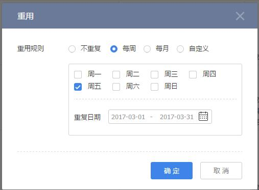

# 拜访概述

---

为了更好的维护好客户关系，销售需定期拜访客户，了解客户对需求或是产品使用情况等。在快消品行业，您还可以配置拜访任务和盘点任务，销售在拜访时执行任务，以便更好的管理销售过程。
 
身为外勤人员，少不了频繁拜访客户，为了让销售人员的拜访不再缺乏目的性，提高拜访效率，纷享支持经理给下级制定拜访计划和员工自己制定拜访计划，并且按照业务需求自定义拜访的动作表单，比如：拍堆头、收集竞品信息等。融合签到、签退、拜访动作、盘点动作真实业务场景，让外勤管理既有效又有趣。

可以通过盘点了解客户的产品库存，及时发现库存不足、临期和过期等状况，及时处理。

>如果需要使用拜访动作和盘点动作，需单独购买“快消模块包”。

## 拜访业务流程
 拜访的过程分为：计划-》执行-》反馈、评估-》优化
   
- 计划拜访：
    - 有计划的筛选要拜访的目标客户，比如根据客户类型、级别、区域分布、参与活动等属性筛选客户；
    - 规划合理的拜访路线；
    - 预设规定的拜访需要收集的客户信息；
    - 制定协访计划；
    - 重用拜访路线等等。
- 执行拜访：
    - 按计划、按路线拜访客户；
    - 执行签到/签退；
    - 填写拜访需要收集的材料；
    - 上级或同事执行协访等。
- 反馈、评估：
    - 评估员工绩效 
    - 分析拜访总量、执行效率及分布；
    - 分析拜访客户覆盖；
    - 分析拜访执行效果，如拜访一定时间内成交状况；
    - 分析收集的客户数据、市场活动执行情况等。
- 优化：
    - 调整销售覆盖客户范围，优化拜访路线，提高效率；
    - 制定合理的拜访客户数量，保障拜访质量；
    - 优化拜访执行过程，标准化拜访行为；
    - 优化拜访收集的业务数据模板，获得最有效的客户信息；
    - 分析最有效的拜访或市场活动（投入产出比），选择更优的销售方式，将有限的资源投入到更有效的客户或区域等。

## 业务使用场景举例
- 维护客户关系，促进成交；
- 收集业务数据，更好的服务和管理客户，比如收集库存、销量及价格等；
- 市场活动执行，搜集执行情况，判断执行效果及费用落地；
- 巡查督导：监督客户是否符合企业要求；监督业务员是否有效执行销售业务；

# 拜访的详细介绍

## 拜访视图

### 拜访预设场景
- **全部**：
    - 负责人为当前用户或其下属
    - 或者相关团队成员中包含当前用户或其下属
    - 或者在“数据权限管理”中配置拜访的“数据共享”规则为记录负责人或是负责人所属部门的数据共享给当前员工或是当前员工所在部门或是当前员工所在用户组
    - 或是“我负责部门的”
- **我负责的拜访**：负责人为当前用户
- **我参与的拜访**：相关团队成员中包含当前用户
- **我下属负责的拜访**：负责人为当前用户的下属
- **我下属参与的拜访**：相关团队成员包含当前用户的下属
- **我的协访**：协访人为当前用户
- **我下属的协访**：协访人员为当前用户的下属
- **共享给我的**：在“数据权限管理”中配置拜访的“数据共享”规则为记录负责人或是负责人所属部门的数据共享给当前员工或是当前员工所在部门或是当前员工所在用户组
- **我负责部门的**：
    - 当前用户为所在主部门的部门负责人
    - 同时记录中相关团队成员的主部门为该部门。
    - *备注：负责部门是否包含所有下级数据，由“CRM管理-规则设置-基础设置-上级可见数据范围”决定*。
    
> 备注：
> - “CRM管理员”可以查看所有数据。
> - 所有状态为“作废”的记录只有“CRM管理员”可见，其他人员均不可见。

### 拜访列表视图
- **列表视图**，以列表的形式展示拜访计划
- **日历视图**,以日历的形式展示拜访计划。
    - 
- **统计视图**，包括客户统计、签到统计、签退统计
    - 客户统计，统计值：全部拜访、客户数和已完成（已完成拜访数），已完成百分比=（已完成拜访数／全部拜访）*100%
    - 可通过地图模式查看拜访完成情况和分布情况：橘色的为未完成的拜访，绿色的为已完成的拜访
    
    
    - 

    - 签到统计:全部拜访、全部签到
    
    
    - 签退统计：全部拜访、全部签退
   
## 拜访的业务操作

### 新建拜访
- 新建拜访的方式
    - 手工创建
        - 入口：【拜访】列表页 
        - 关联对象【客户】详情页-【拜访】下。
        - 关联对象【联系人】详情页-【拜访】下。
        - 关联对象【销售订单】详情页-【拜访】下。
    - 拜访按规则复用。
    - 【外勤签到】中关联了客户，则自动创建拜访记录。
        - 入口: “*应用-外勤*” 中选择“客户”，同时完成“签到"操作。
    - 导入，详见[导入](2-8小工具.md)
- 快消版新建拜访业务补充
    -  可以选择拜访动作。详见[拜访动作设置](7-3-3拜访管理.md)
    -  可以选择盘点动作。详见[盘点动作设置](7-3-3拜访管理.md)

### 重用
- **业务说明**：为了维护客户关系，对于重要客户您可能需要定期拜访，比如每个月拜访一次，此时您可以为指定的拜访配置重用规则，系统将会根据规则自动创建多个拜访。
- **业务操作条件**：状态为“未完成”或“已完成”。
- **可执行此操作的员工或角色有**：负责人、负责人上级、数据被共享方且配置“读写”权限
- **业务操作入口**：拜访详情页中。
- **备注**：
    - 重用规则：不重复、每周、每月、自定义（随意指定日期重用。）
    - 规则覆盖：您为某一拜访配置了重用规则，之后对同一拜访修改了重用规则,则根据原有规则生成的拜访中未完成的拜访将会删除，并启用新的重用规则创建拜访。 

### 设置协访
- **业务说明**：即添加拜访的陪同人员。比如销售去拜访客户并了解客户需求时，可以带一名售前人员陪同前往，以便售前人员真实了解客户需求并做售前解决方案。协访人员也需要根据系统配置完成签到、签退和完成协访等业务操作。
- **业务操作条件**：拜访状态为“未完成”
- **可执行此操作的员工或角色有**：负责人、负责人上级、相关团队成员配置“读写”权限以及相关团队成员的上级、数据被共享方且配置“读写”权限
- **业务操作入口**：拜访列表页和详情页。
- **备注**：协访人员也需要“签到”、“签退”、“完成协访”动作以完成完整的协访工作。
- **关联操作**：
    - **取消协访**：只有设置了协访且未完成协访，可以将其取消。操作权限同设置协访的权限，入口在拜访的详情页中。
    - **签到**：同“拜访”的签到。
    - **完成协访**:协访未完成，由协访人员完成协访操作。操作入口在拜访的详情页中

### 线路
- **业务说明**：当您一天内有两个以上不同客户的拜访时，通过地图查看客户位置，直观定制最优拜访线路，节省时间提高拜访效率。
- **业务操作条件**：有拜访计划的某一天。
- **可执行此操作的员工或角色有**：负责人、负责人上级、相关团队成员配置“读写”权限以及相关团队成员的上级、数据被共享方且配置“读写”权限
- **业务操作入口**：【拜访】的“日历”视图下，在指定日期中选择“线路”链接定制线路。
- **备注**：系统会在地图上显示当天待拜访的客户定位信息。您可以“调整顺序”来定制线路，如果客户在预设的定位地址之外的地方时，您也可以选择新的定位信息，重新定制线路。

### 拜访执行

- 分步式拜访过程执行（快消版）

### 签到
- **业务说明**：即标识已到客户现场。您需要在“CRM管理-拜访管理-拜访设置-签到及签退设置”中启用“签到”。详见[拜访设置](7-3-3拜访管理.md)
- **业务操作条件**：后台管理中启用“签到”，拜访签到时间为空，协访签到时间为空。
- **可执行此操作的员工或角色有**：拜访人员（不包括CRM管理员），协访人员（不包括CRM管理员）
- **业务操作入口**：移动端拜访详细页。

### 签退
- **业务说明**：标识完成拜访或协访，您需要在“CRM管理-拜访管理-拜访设置-签到及签退设置”中启用“签退”。详见[拜访设置](7-3-3拜访管理.md)
- **业务操作条件**：后台管理中启用“签退”，拜访签退时间为空，协访签退时间为空。
- **可执行此操作的员工或角色有**：拜访人员（不包括CRM管理员），协访人员（不包括CRM管理员）
- **业务操作入口**：移动端拜访详细页。

### 完成拜访/协访
- **业务说明**：标识完成拜访或协访。
- **业务操作条件**：拜访状态/协访状态为“未完成”，如果开启签到或签退且完成签到和签退动作。
- **可执行此操作的员工或角色有**：拜访人员（不包括CRM管理员）完成拜访动作，协访人员（不包括CRM管理员）完成协访动作
- **业务操作入口**：拜访详细页
- **备注**：
    - 如果在“CRM管理-拜访管理-拜访设置-签到及签退设置”中设置“签到自动完成拜访”或是“签退自动完成拜访”，则不需另外操作“完成拜访/协访”。
    - 在“快消模块包”中，如果拜访动作设置为必填动作，则需完成此动作才可以完成拜访。
    - 当拜访完成后，拜访动作、盘点动作不能编辑。

### 完成拜访动作
- **业务说明**：业务人员到客户处拜访时，按公司预制的拜访动作模块填写内容，引导销售员正确的进行客户拜访，结构化收集拜访数据用于分析行为。比如销售到经销商处拜访时，需对区域做竞品收集表，了解竞品促销活动、竞品货架摆放情况等。
- **业务操作条件**：状态为“未完成”
- **可执行此操作的员工或角色有**：拜访负责人、协访人员或CRM管理员
- **业务操作入口**：拜访详情页中的拜访动作列表，选择某一条拜访动作并完成表单填写。
- **备注**：
    - 只有当您企业开通了“快消模块包”，且在拜访中添加了拜访动作。
    - 拜访动作模板需要“CRM管理-拜访管理-拜访动作设置”中添加，详见【拜访管理】
    - 如果在“CRM管理-拜访设置”中配置的指定拜访动作是必填动作，则您必需完成此拜访动作才可以完成拜访。

### 关联拜访动作
- **业务说明**：在拜访中关联新的拜访动作。
- **业务操作条件**：状态为未完成。
- **可执行此操作的员工或角色有**：拜访负责人、协访人员或CRM管理员
- **业务操作入口**：拜访详情页中

### 完成盘点动作
- **业务说明**：销售人员拜访时到超市或其它零售店盘点货架上的产品种类和数量，掌握产品的销售情况和为库存情况。
- **业务操作条件**：状态为未完成
- **可执行此操作的员工或角色有**：拜访负责人、协访人员或CRM管理员
- **业务操作入口**：移动端在拜访详情页中，选择某盘点动作完成表单。网页端在盘点列表中的详情页下
- **备注**：
    - 盘点动作模板需要“CRM管理-拜访管理-盘点动作设置”中添加，详见【[拜访管理](7-3-3拜访管理.md)】

### 关联盘点动作
- **业务说明**：在拜访中关联新的盘点动作。
- **业务操作条件**：状态为未完成
- **可执行此操作的员工或角色有**：拜访负责人、协访人员或CRM管理员
- **业务操作入口**：移动端在拜访详情页中，选择某盘点动作完成表单。网页端在盘点列表中的详情页下

    

## 拜访通用业务操作
- 列表页常用操作详见[列表页常用操作](2-5列表视图.md)
- 添加销售记录，详见[销售记录](2-2销售记录服务记录.md);
- 常用业务操作，包括更换负责人、添加相关团队成员、打印、导入、导出、编辑、作废、删除等，详见[常用业务操作](2-7常用业务操作.md)
- 与协同办公结合的业务操作，包括转发、日程、提醒、打电话、发邮件等，详见[常用业务操作](2-7常用业务操作.md)

# 拜访相关
- 拜访动作：查看本次拜访中关联的拜访动作，并完成拜访动作。
- 盘点动作：查看本次拜访中关联的盘点动作，并完成盘点动作。

