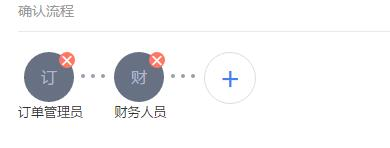


# 销售订单概述

---

销售订单是企业与客户之间签订的一种销售协议，销售订单实现企业与客户之间的沟通，实现客户对企业待售货物的一种请求，同时也是企业对客户的一种销售承诺。通过订单信息的维护与管理，实现企业对销售的计划性控制，使企业的销售活动、生产活动、采购活动处于有序、流畅、高效的状态。

纷享销客CRM系统销售订单，与客户，商机，合同，退货单，退款，回款，开票等各个业务模块关联，实现销售全流程的连接。同时可以通过纷享提供的OPEN API功能，将销售订单数据与企业其他的IT系统，如ERP，HR，物流等系统打通，进行公司内部的统一IT管理，保证整个企业的业务，从销售，生产，物流，财务各个环节的统一性，和业务流转的顺畅性。

## 业务使用场景举例
- **销售人员**：
销售人员确定客户的购买需求后，直接使用手机客户端下单，并跟踪整个订单审批流程，业绩能够及时体现在系统中。
销售订单下单过程中，根据企业的销售策略，如打折、促销、客户维系、挽留等情况，系统支持销售人员给客户权限范围内的折扣，包括产品价格上的折扣及订单范围内的折扣两类，支持灵活的折扣方式。
 - **订单管理员，财务人员**：
可从手机端获取待审批的订单通知，及时处理审批，提高订单审批效率。
 - **仓储人员**：
可从手机端获取待发货的订单通知，及时发货，提高订单处理效率
 - **销售总监，企业管理者**：
能够实时获取销售数据，掌握企业的经营状况。

# 销售订单的详细介绍

## 销售订单视图

### 销售订单预设场景
- **全部**：
    - 负责人为当前用户或其下属
    - 或者相关团队成员中包含当前用户或其下属
    - 或者当前用户作为订单管理或订单财务角色负责审批的部门的所负责数据（比如用户A拥有“订单财务”角色，负责审批部门B提交的订单记录，那么用户A可以查看所有负责人属于部门B的订单记录）。
    - 或者在“数据权限管理”中配置销售订单的“数据共享”规则为记录负责人或是负责人所属部门的数据共享给当前员工或是当前员工所在部门或是当前员工所在用户组
    - 或是“我负责部门的”数据。
- **我负责的**：订单负责人是当前用户
- **我参与的**：相关团队成员中包含当前用户
- **我下属负责的**：订单负责人是当前用户下属
- **我下属参与的**：相关团队成员中包含用户用户下属
- **共享给我的**：在“数据权限管理”中配置销售订单的“数据共享”规则为记录负责人或是负责人所属部门的数据共享给当前员工或是当前员工所在部门或是当前员工所在用户组
- **我负责部门的**：
    - 当前用户为所在主部门的部门负责人
    - 同时记录中相关团队成员的主部门为该部门。
    - *备注：负责部门是否包含所有下级数据，由“CRM管理-规则设置-基础设置-上级可见数据范围”决定*。

> 备注：
> - “CRM管理员”可以查看所有数据。
> - 所有状态为“作废”的记录只有“CRM管理员”可见，其他人员均不可见。

## 销售订单的业务操作

### 新建销售订单
- 新建销售订单的方式
    - 手工创建
        - 入口：【销售订单】列表页 
        - 关联对象【客户】详情页-【销售订单】下 
        - 关联对象【商机】详情页-【销售订单】下 
        - 关联对象【合同】详情页-【销售订单】下
        - 关联对象【拜访】详情页-【销售订单】下
    - 对已有订单“复制”，入口在待复制订单的详情页下
    - 导入，详见[导入](2-8小工具.md)
- 新建销售订单时业务补充
    - **添加产品**：在销售订单中购买的产品。您可以从产品列表中选择，另外企业在产品销售策略上可能会针对不同地区的客户或者不同级别的客户实施不同的产品单价和折扣以促进成交和赢利最大化，所以销售可以在订单中编辑与客户对应的产品折扣和产品数量等信息。可以在“*CRM管理-字段管理-销售订单-订单产品字段*”中定义针对订单的产品字段，比如产品折扣、产品单价等信息
    - **选择收货地址**：地址选择来源于销售订单对应客户的“地址管理”中创建的地址，同时系统会自动填充设为“默认地址”的地址。
    - **固定审批流程**：你可以在审批流程管理中创建审批流程，销售订单新建时可自动触发审批流程，并执行。详见【[审批流程管理](7-4-3审批流程管理.md)】
    - **自由审批流程**：因订单是企业与客户产生交易的依据，涉及企业财务信息和库存管理，所以需要相关人员审批确认。您可以在创建或编辑订单时选择相关人员处理。
        - ***自由审批流程是纷享CRM遗留的功能，不建议使用，后期将会关闭此功能，建议使用【审批流程管理】配置销售订单审批流程。*** 
    
 

### 订单自由审批流程
- ***提示***：*自由审批流程是纷享CRM遗留的功能，不建议使用，后期将会关闭此功能，建议使用【审批流程管理】配置销售订单审批流程。*
- **业务说明**：因订单是企业与客户产生交易的依据，涉及企业财务信息和库存管理，销售在创建订单时可以选择审批处理人。
- **审批流程定义**：在创建或编辑销售订单时定义审批确认流程，处理人员有系统预置角色“订单管理员”和“财务人员”，还可以指定同事确认。
- **审批流程处理**：系统会根据流程审批顺序发送通知给相应处理人员。“CRM提醒-待确认的销售订单”中可以查看流转到当前用户的待处理订单，点击“订单编号”处理，也可以在“销售订单”列表中打开订单详情处理。
    - **确认**：即通过审批，进入下一个节点或是完成审批确认。
    - **驳回**：驳回后，流程回到第一个节点，同时标记订单状态为“已驳回”，需修改订单信息后再次提交。
- **备注**：
    - 只有销售订单“状态”为“已确认”才会纳入“订单总额”计算，并可以“确认发货”。
    - 无论销售订单的审批状态是否确认，都可以被相关对象引用。

### 更换确认人
- **业务说明**：在流程流转过程中，当前待处理人离职或是调岗等原因可以更换确认人。
- **业务操作条件**：在自由审批流程中，销售订单状态为“确认中”
- **可执行此操作的员工或角色有**：审批节点确认人
- **业务操作入口**：“销售订单”详情页。

### 撤回
- **业务说明**：提交销售订单并已进入下一节点处理人确认时，上一节点处理人可以撤回流程，同时下一节点处理人的待处理销售订单会撤消。
- **业务操作条件**：在自由审批流程中，销售订单状态为“确认中”
- **可执行此操作的员工或角色有**：负责人、负责人上级、相关团队成员且配置“读写”权限以及相关团队成员的上级、数据被共享方且配置“读写”权限
- **业务操作入口**：“销售订单”详情页。

### 确认发货
- **业务说明**：订单审批确认后，可以由发货人员线上确认发货。
- **业务操作条件**：销售订单状态为“已确认”
- **可执行此操作的员工或角色有**：负责人、负责人上级、相关团队成员且配置“读写”权限以及相关团队成员的上级、数据被共享方且配置“读写”权限,或是拥有“销售订单-确认发货”操作点权限及相应销售订单的数据权限。
- **业务操作入口**：“销售订单”详情页，"CRM通知-待发货的订单"中。

### 确认收货
- **业务说明**：收货人员线上确认收货。
- **业务操作条件**：销售订单状态为“已发货”
- **可执行此操作的员工或角色有**：负责人、负责人上级、相关团队成员且配置“读写”权限以及相关团队成员的上级、数据被共享方且配置“读写”权限,或是拥有“销售订单-确认收货”操作点权限及相应销售订单的数据权限。
- **业务操作入口**：“销售订单”详情页。

### 销售订单通用业务操作
- 列表页常用操作详见[列表页常用操作](2-5列表视图.md)
- 添加销售记录，详见[销售记录](2-2销售记录服务记录.md);
- 常用业务操作，包括更换负责人、添加相关团队成员、打印、导入、导出、编辑、作废、删除等，详见[常用业务操作](2-7常用业务操作.md)
- 与协同办公结合的业务操作，包括转发、日程、提醒、打电话、发邮件等，详见[常用业务操作](2-7常用业务操作.md)

# 相关链接
- [销售订单退货单规则](7-3-6销售订单-退货单规则)
- [审批流程管理](7-4-3审批流程管理.md)
