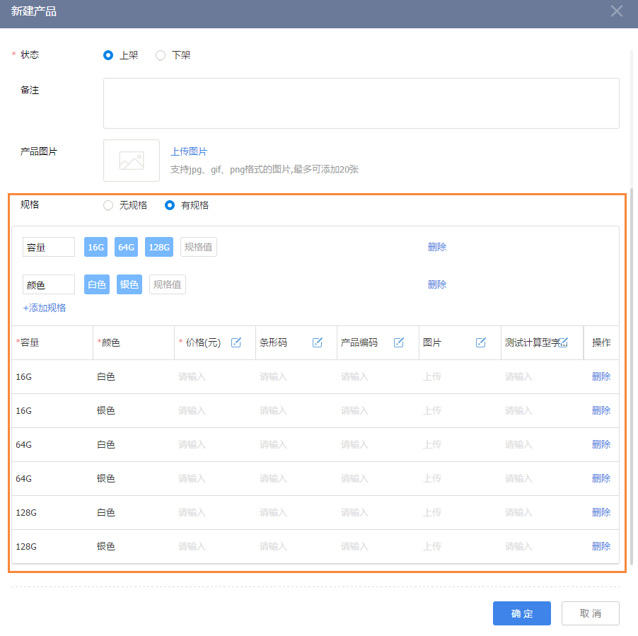


# 产品概述

---

产品为企业向客户提供的各种有价值的物品，服务，信息，人力，组织等，或它们的组合，可以是有形的或者无形的。但是他们均可以被某种单位或单位组合进行度量，同时表明价值。所以，产品作为企业提供服务的核心，整个企业的营销业务是围绕着产品展开的。

纷享销客CRM系统，预制产品对象模块，方便企业灵活定义，组织自身的产品，使用行业广泛。同时产品对象和商机，销售订单，退货单等对象预制了关联关系，方便企业业务流程的展开。同时在相应的对象内，预制产品价格的计算逻辑，可以大大简化用户的使用成本，使企业业务流程顺利展开。借助OPEN API的能力，可以是企业所有围绕产品的IT系统，如ERP，物流，采购系统等合为一体。

## 业务使用场景举例
- 作为企业销售单元，在销售工作启动以前，产品管理工作要先行，通过支持批量产品导入功能，可快速的在crm中新建产品信息，管理产品分类，产品价格，产品规格等信息。
    - 对于可销售的产品，可将其设为上架，对于不再销售的产品，置为下架。
    - 对于上架的产品，系统中创建销售订单时，可通过扫码添加等快捷方式加入到销售产品清单中，且产品的销售价格可以在下单时修改，给予一定的折扣。
- 产品管理作为企业的统一产品库，提供清洁统一的产品数据，为企业员工的日常工作提供产品查询服务。 企业管理者可在统计报表中查看产品的销售情况，退货情况，对企业的生产工作提供数据参考。

# 产品的详细介绍

### 产品预设场景
- **全部产品**：
    - 负责人为当前用户或其下属
    - 或者相关团队成员中包含当前用户或其下属
    - 或者当前用户作为订单管理或订单财务角色负责审批的部门的所负责数据（比如用户A拥有“订单财务”角色，负责审批部门B提交的订单记录，那么用户A可以查看所有负责人属于部门B的产品）。
    - 或者在“数据权限管理”中配置销售订单的“数据共享”规则为记录负责人或是负责人所属部门的数据共享给当前员工或是当前员工所在部门或是当前员工所在用户组
    - 或是“我负责部门的”数据。
- **上架产品**：状态为“已上架”的记录
- **下架产品**：状态为“已下架”的记录
- **我负责的**：负责人是当前用户
- **我参与的**：相关团队成员中包含当前用户
- **我下属负责的**：负责人是当前用户下属
- **我下属参与的**：相关团队成员中包含用户用户下属
- **共享给我的**：在“数据权限管理”中配置产品的“数据共享”规则为记录负责人或是负责人所属部门的数据共享给当前员工或是当前员工所在部门或是当前员工所在用户组
- **我负责部门的**：
    - 当前用户为所在主部门的部门负责人
    - 同时记录中相关团队成员的主部门为该部门。
    - *备注：负责部门是否包含所有下级数据，由“CRM管理-规则设置-基础设置-上级可见数据范围”决定*。

> 备注：
> - “CRM管理员”可以查看所有数据。
> - 所有状态为“作废”的记录只有“CRM管理员”可见，其他人员均不可见。

## 产品的业务操作

### 新建产品
- 新建产品的方式
    - 手工创建
        - 入口：【产品】列表页 
        - 关联对象【客户】详情页-【产品】下 
        - 关联对象【商机】详情页-【产品】下 
        - 关联对象【产品】详情页-【产品】下
        - 关联对象【拜访】详情页-【产品】下
    - 对已有订单“复用”，待复用订单的详情页下
    - 导入，详见[导入](2-8小工具.md#导入工具)
- 新建产品时“规格”补充
    - 如果产品有规格，则需要创建时定义规格及规格值。比如产品是手机，规格有“容量”、“颜色” ，同时容量有16G、64G、128G三个规格值，颜色有“白色”、“银色”两个规格值。则请按照如下图所示方式配置规格及价格等信息。
    - 
    - 注：规格配置好以后，规格会自动带入产品名称中，并不能修改。

### 上架
- 只有状态为“上架”的产品才可以出售，即在“销售订单”或“退货单”中被选择。
- 用户可以**批量选择**产品并设置为“已上架”状态。

### 下架
- 当产品不再出售时，可以将其下架。“销售订单”或“退货单”中选择产品时不能选择已下架的产品。
- 用户可**以批量选择**产品并设置为“已下架”状态。
只有已下架的产品才可以**作废**。

## 产品常用操作
- 列表页常用操作详见[列表页常用操作](2-5列表视图.md)
- 添加销售记录，详见[销售记录](2-2销售记录服务记录.md);
- 常用业务操作，包括更换负责人、添加相关团队成员、打印、导入、导出、编辑、作废、删除等，详见[常用业务操作](2-7常用业务操作.md)
- 与协同办公结合的业务操作，包括转发、日程、提醒、打电话、发邮件等，详见[常用业务操作](2-7常用业务操作.md)

# 相关链接
[产品分类](7-2-5产品分类.md)