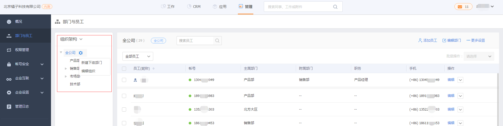

# 账号及组织架构

---

为了正常使用纷享CRM，您需要在纷享产品中添加组织架构及员工。比如查看下属部门数据、审批流中需要配置部门负责人审批等业务场景都需要用到企业组织架构。

## 组织架构管理
在纷享产品“管理-部门与员工”下维护组织架构。
- 全公司：即组织架构顶级结点，代表公司所有部门。默认为“全公司”，可以修改名称。
- 部门：您可以在“全公司”下新建部门
    - **上级部门**：每个部门都有上级部门。在纷享CRM中上级部门的部门负责人可以看到下级部门的所有数据。在纷享CRM中可配置“上级可见数据范围”为直属下级数据或是所有下级数据。
    - **部门负责人**：请配置部门负责人，以便在审批流或是业务流程管理中配置负责人上级审批，即负责人所属部门的部门负责人。

## 添加员工
在纷享产品“管理-部门与员工”下添加维护员工。
- 新建员工 
    - **主属部门**：即当前用户所属的主属部门，只能有一个，在审批流程或是业务流程中审批时可选择用户的主属部门负责人审批。  
    - **汇报对象**：默认为主属部门的部门负责人，可修改。目前纷享CRM数据权限中上级是指的汇报对象。比如客户中“我下属负责的客户”是指客户负责人的汇报对象为当前用户的客户记录。
    
## 添加CRM员工
上面提到的“添加员工”是指添加纷享产品协同办公的员工，如果使用纷享CRM，则
1. 系统管理员在“应用管理”中添加“CRM”应用；
2. 在CRM应用中添加CRM管理员，
3. 由CRM管理员在权限管理员为需要添加CRM应用的员工配置角色。
4. 备注：是否可添加“CRM”应用及添加CRM员工的数量是根据您企业购买情况决定。

    
## 用户组
为了方便批量选择用户或是选择某一类业务使用角色的用户。比如企业内负责某一项目的项目组，或是负责某指定产品的售后服务组等。
- 添加用户组入口：CRM管理-用户组。
- 用户组使用：人员选择窗口中按用户组查找，比如数据权限中将员工或部门的数据共享给指定用户组。