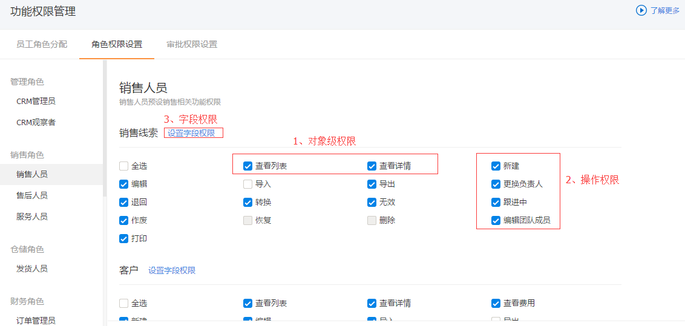


# 功能权限管理

---

功能权限：以角色为基础，通过划分不同角色的不同功能权限，并将员工添加到对应的角色中，实现员工功能权限的区分和隔离，包括：
- **对象级功能**：比如功能的入口是否可见，如角色为“发货人员”，对象“商机”的“查看列表”权限点取消，则此角色下员工不可见商机的功能入口。
- **操作点权限**：比如新建、编辑等业务操作；
- **字段权限**：可为角色配置对象字段的读写、只读或不可见。比如为角色“服务人员”配置销售订单的【销售订单金额】字段不可见。
- 
- 功能权限对于前端界面的影响点：
    - 如果员工没有某对象“查看列表”的权限，则该对象的功能入口会被隐藏；
    - 如果员工没有某对象的操作点权限，则在对象页面上隐藏相应操作按钮。
    - 如果员工没有某对象的指定字段的可见权限，则在对象页面上隐藏相应字段。

## 自定义角色
为了支持更灵活的权限，您可以根据自身业务场景自定义角色。如项目实施人员、物料采购人员等。

### 新建角色
- 入口：“CRM管理-功能权限管理-角色权限设置-自定义角色”下点击“新建”。
- 权限复用：自定义的角色可以复制已有的角色的所有功能权限

## 配置角色的功能权限

### 对象功能权限
- 可对CRM所有对象配置入口权限，【查看列表】即为对象入口权限。如不配置员工将在`我的工作台`中看不到`销售线索`。
- 可对CRM所有对象配置详情界面的权限，【查看详情】即为对象详情页权限。如果不配置，员工将无法查看`销售线索`的详情界面。
- 操作权限：配置了操作权限，员工才具备对业务数据进行操作的第一个条件。比如取消权限点“新建”、“编辑”、“导入”则在列表页及详情页都看不到这些操作点。

### 字段级权限
控制了员工对字段的可见性，可编辑性。比如不想要电销人员看到客户的电话号码，不需要服务人员看到客户销售订单中销售订单金额，则可以把相应字段隐藏，
- 【读写】权限：员工将具备该字段的最大权限，【新建】【编辑】时可编辑，列表和详情页可见该字段。
- 【只读】权限：员工在【新建】【编辑】时不可编辑，列表和详情页可见该字段。
- 【不可见】权限：员工在【新建】【编辑】【列表】【详情】界面对该字段（或该字段值）不可见。
 

## 员工角色分配
给员工分配角色，同样，可以给角色添加员工。
- **操作入口**：“CRM管理-功能权限管理-员工角色管理”下，
- **添加员工**：即为新的用户分配角色，分配角色的员工即拥有CRM应用。如需要为公司新入职的销售人员分配“销售人员”角色，点击“添加员工”，选择新入职的销售，并选中“销售人员”角色，保存即可。
    - 如果添加员工已拥有指定角色，则此处会叠加新添加的角色。 
- **角色编辑**：在“全部CRM用户”下的列表，可为已分配角色的员工修改角色，如添加新角色或是取消某角色。
- **移除**：
    - 在“全部CRM用户”下的列表，选择某员工点击“移除”，将会把该员工除“CRM管理员”（如果拥有该角色）外的所有的CRM角色移除，如果该员工不再属于任何一个角色，将不再拥有CRM应用。
    - 在指定角色下选择某员工点击“移除”将会该员工对应的角色移除。
- **复制角色到员工**：即将某员工的角色复制给另一位员工。
    - 备注：角色复制时会将被复制员工的角色覆盖。
- **主角色**：在为员工分配角色时，可指定员工所属主角色。主角色主要用于“自定义对象”中当一个员工拥有多个类型时，按主角色支持的类型及布局展示。
- **特殊业务逻辑**：
    - **“CRM管理员”角色**：此角色的维护需要在“应用-应用管理-CRM”的“应用管理员”中维护，点击“修改”可以添加或移除“CRM管理员”角色。
    - 如果一个员工有多个角色，则它的功能权限是取多个角色的合集。
    - 其中，字段级权限取最大权限：读写 > 只读 > 不可见

## 审批权限设置

> 1. “审批流程管理”已正式发布，建议在“审批流程管理”中配置销售订单和退货单的审批流程，同时请在“审批流程管理”的“自由审批设置”中关闭自由审批。
> 2. 审批权限设置只对自由审批流程有效，不推荐使用。

审批权限设置，可以给具备特殊审批权限角色中的员工分配审批负责的部门。
比如某制造行业，有多条生产线，不同部门负责不同生产线上的销售订单，同时在财务部不同的财务是负责不同部门的销售订单审批。此时就需要为每一个拥有订单财务角色的员工配置审批的部门，这样当负责部门有销售订单需要审批时，会自动分配给指定的订单财务人员。

### 分配审批部门
- 在审批权限设置页面，已列出每一个财务角色下的员工，您只需要每个角色下每个员工分配审批部门即可。
    - 点击“编辑审批部门”， 
    - 在弹出窗口中选择部门。
- 如果您需要为某一个财务角色增加员工，需要在“员工角色分配”中配置员工角色。

### 财务角色对应的审批业务
|角色|对应审批业务|
|--|--|
|订单管理员|可以查看和审批所负责部门的所有销售订单|
|订单财务|可以查看和审批所负责部门的所有销售订单|
|回款财务|可以查看和审批所负责部门的所有回款|
|退款财务|可以查看和审批所负责部门的所有退款|
|开票财务|可以查看和审批所负责部门的所有开票申请|
|发货人员|可以对所负责部门的所有销售订单执行【确认发货】操作|

## 典型场景解决方案

Q1：如何让一个新员工具备`客户`对象的权限？
A：将该员工加入到一个具备`客户->查看列表`权限的角色中。 

---
Q2：如何让一个员工只能查看客户数据，不可修改客户数据？
A：将该员工所在的所有角色中，对该客户对象的权限配置为：【查看列表】、【查看详情】勾选，【编辑】不勾选。

---
Q3：如何让一个员工`看不到`或`不可编辑`销售订单的【销售订单金额】字段？
A：将该员工所在的所有角色的功能权限配置为：销售订单-》字段级权限-》{销售订单金额}字段，配成`不可见`或`只读`。

---

Q4：如何让不同人员对同一个业务对象所见的字段不同？
A：定义不同的角色，分配不同的字段级权限，然后将员工分别放入对应角色。

 
    