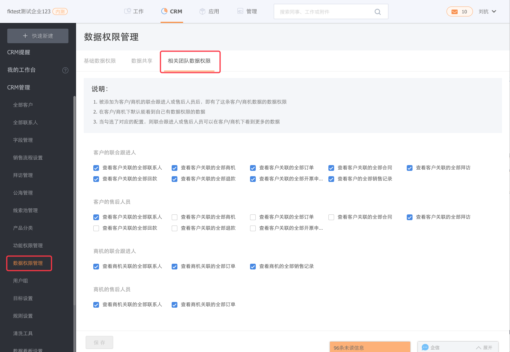

# 数据权限管理

---

数据权限管理主要控制某条数据记录对用户是否可见，结合功能权限可以更灵活的配置业务过程中每一位员工的功能操作权限及数据可见范围，全面保障企业数据的安全性。类似矩阵列表中，功能权限决定用户可见哪些列，比如客户对象中可见姓名、电话、邮箱等字段，数据权限决定用户可见哪几条数据，比如“王先生”、“李先生”等。
数据权限分三个层次来控制数据
1. 基础数据权限：即根据数据的负责人来决定，
2. 数据共享：根据基础数据权限中的数据记录所属将其共享给其它用户查看或编辑。
3. 相关团队数据权限：
    - 每一条数据记录都可以添加相关团队并配置相关团队成员的角色。更进一步控制数据权限。 
    - 为客户/商机中相关团队中的“联合跟进人”或“售后人员”独立配置数据可见权限。

## 基础数据权限

针对每个对象的基础数据权限，设置后该对象的数据权限遵循以下规则：
- 【私有】：对象中所有数据遵循相关团队成员（包括负责人）及其上级对数据可见，且具备对这条数据同样的权限[只读、可编辑]，比如“客户”对象，是一个私有属性很强的对象，不能随意被修改，或是被其它非相关人员查看客户的信息和跟进记录；
- 【公开只读】：对象中所有数据对全公司公开，即全部用户都可见。单条数据的负责人及其上级、以及相关团队具备编辑权限的成员可以编辑该数据。比如“产品”对象，相对公开，每一个销售都可以查看产品相关信息。
- 【公开读写删】：对象中所有数据对全公司公开，全员可编辑、删除该对象的所有数据。
- 备注：*此处的“上级”是指用户的汇报对象*

## 数据共享
数据共享规则是将`某个部门/员工（数据来源）`的某个`对象（比如客户）`的`全部负责的数据`共享给`某个部门、人员或者用户组（共享范围）`。配置数据共享规则后，被共享方对共享方所负责的所有数据可见，并具备共享权限对应的操作权限。
- **业务配置说明**
    - 数据来源于：即需要共享的数据，选择员工即指该员工负责的记录数据，选择部门即指该部门下员工负责的记录数据。
    - 共享的数据：选择需共享的对象，比如将员工A负责的客户数据共享给员工B。
    - 数据共享到：被共享方，可选择员工、部门或用户组，被选择的员工、部门或用户组成员将可以看到共享的数据。
    - 共享后的权限：配置被共享方可对数据查看或是可编辑的权限。如果配置为“读写”权限后，被共享方对共享数据的权限可类比于负责人的权限。
- **业务场景举例**：销售一部想让财务人员张三看到该部门的所有销售订单数据，并且让张三可编辑。
    - 共享规则配置：
        - 【数据来源】是“销售一部”;
        - 【共享数据】是“销售订单”;
        - 【共享范围】是“张三”;
        - 【共享权限】是“读写”;
    - 配置完成后，张三在【销售订单】对象，【共享给我的】场景下，可以看到销售一部的所有员工负责的销售订。

> 原CRM观察者观察部门的数据权限将全部被【数据共享】取代，系统将自动给原CRM观察者角色的员工创建【全对象】的共享规则：
> - 数据来源=原观察部门
> - 共享范围=原CRM观察者角色的员工
> - 共享数据=全部对象

## 相关团队数据权限
记录级数据权限：主要指每一条数据的相关人员（相关团队），相关团队的所有成员都对该条数据可见，并具备相应的编辑权限。如果想让某个人看到某条数据，可将其加入到该数据记录的相关团队。

- 【客户】【商机】2个对象，可选择添加人员的团队角色包括：联合跟进人|售后|普通成员（默认值）。
    - 联合跟进人及售后类型的团队成员可设置特殊的数据权限
    - 
    - 商机的联合跟进人及售后，对销售流程具备特殊的操作权限。
        - 商机的联合跟进人：可以操作售前流程。
        - 商机的售后：可以操作售后流程。

- 其它对象团队成员分为：负责人、普通成员2类
    - 【负责人】：具备该条数据的最大权限，可以对该数据执行【具备功能权限】且【满足对应业务条件】的所有操作（部分特殊操作除外）；
    - 【普通成员】：可以分为【只读】和【读写】2种权限。
        - 只读：只能够进行不进行权限控制的操作；
        - 读写：可执行除【更换负责人】外的所有具备功能权限的操作。

## 其他
- **禁止无查看数据权限的员工在工作流中看到完整客户名称**
    - 为了企业数据的安全性，在“销售记录”中或是“工作”中关联了客户，但没有客户“查看详情”的权限时，可以将客户名称隐藏部分，如“北京世纪未来科技有限公司”在“工作”标签中将显示为“北京********公司”。
- **上级可见数据范围**：这是数据权限中的全局配置，包括“首页”中的“查看下属”、“数据权限”中上级可见等应用。此处的上级是指员工的“汇报对象”。
    - 直属下级数据：即只会按直属下级查看数据，不会再下钻到直属下级的下级数据。
    - 所有下级数据：可查看所有下级数据，包括直属下级，及下钻的所有下级。
##临时权限
- **临时权限解决什么场景？**

> 待处理审批列表处理人没有数据权限问题
>
> 没有临时权限的解决方案：需要负责人把审批流处理人加入到相关团队中，处理人才有数据权限

> 临时权限解决方案：针对三个流程处理人没有数据权限的问题，做临时授权的功能，入口放在数据权限后的临时权限处
>   1. 开启临时授权，可以配置开启的是读写，只读权限，配置授权时间。
>   2. 临时权限开启之后对三个流程都生效。
>   3. 关闭之后，对已经赋权限的数据收回权限，再次开启，也不会恢复权限，新数据走新的临时权限规则。
>   4. 管理员可以针对数据解除权限。

- **什么是临时权限？**

> 临时权限是针对待处理的审批流，待处理的业务流程，的处理人没有待办的数据权限，而临时赋予的权限，此权限需要管理员根据公司需要配置临时权限的天数，以及对数据的读写、只读的权限。

- **什么时候对什么数据生效？**

> 开启临时权限后，生成的流程实例，会根据临时权限的配置添加临时权限，关闭之后生成的流程实例不走临时权限，如果需要对数据长期有数据权限，需要正确配置数据权限及数据共享的权限，或者通过相关团队配置。

- **临时权限会对系统有什么影响？**

> 临时权限开启之后，流程待办人员在原来系统里没有数据权限，也会在代办理看到数据详情，因为有管理员配置的临时权限。从公司的管理角度需要准确无误的配置数据权限。

###临时权限列表

###可以手动解除权限

​    

[1]: http://static.zybuluo.com/wangjunzhu/5r0x2y4uclaqcv679x50kz7n/image_1cenvfg4buh41n421cv31o51op26.png
[2]: http://static.zybuluo.com/wangjunzhu/9pj3h6xbmyv4diwwrg11c069/image_1cenvidsg1r3v199fmtf1coi1tnk5m.png