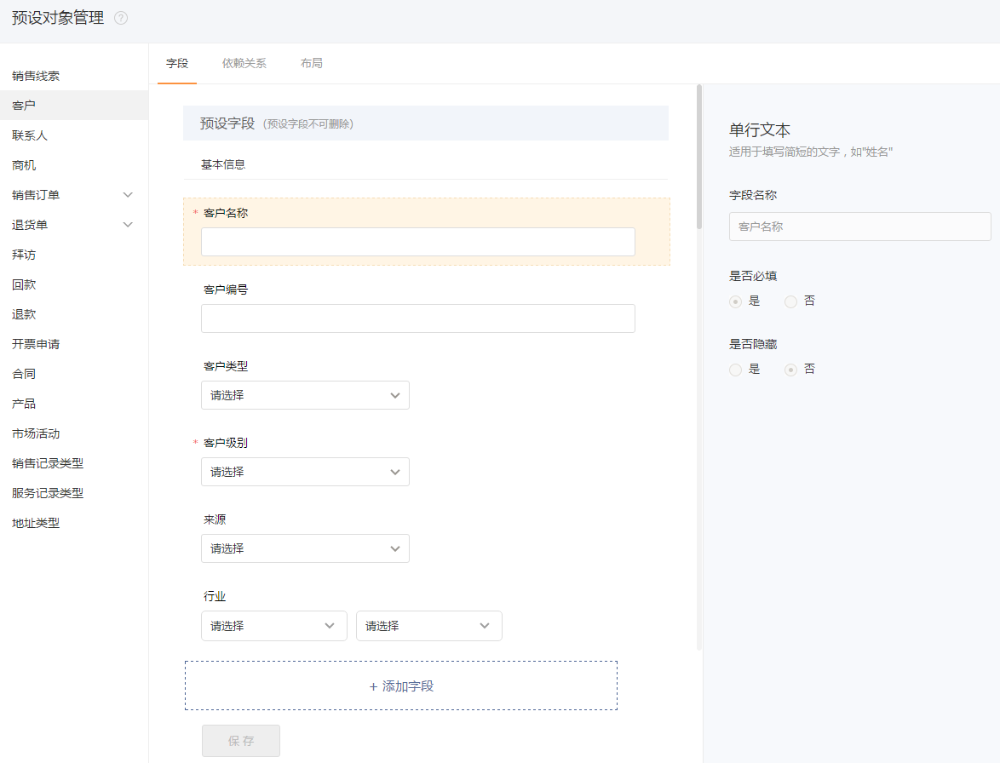


# 预设对象管理

---

因每一个企业的业务各有不同，对每一个业务对象的需存储的记录信息也各不相同。比如某制造业企业，客户群体主要为代销商，同时会关注客户的“注册资本”、“享受折扣”。而某金融行业公司主要为个人客户，且需关注客户的“资金量”、“信用度”、“股齡”等财务信息。

纷享CRM灵活支持企业的个性需求，支持修改业务对象预设字段，添加自定义字段等，另外自定义字段类型还支持自动编号，计算字段等特殊类型，完美支持企业根据各种业务场景配置业务对象。
 

## 系统预设字段
 
 
 在纷享CRM中每一个业务对象都有系统预设字段，这些字段不可删除，但部分是可以修改和隐藏。
 - 字段名称：不可修改。
 - 是否必填：即新建业务记录时当前字段是否必填。
 - 是否隐藏：如果隐藏，则新建业务记录时此字段不可见。
 - 选项设置：如果是选择类型字段，您可以修改选项值。如商机中的“输单原因”，您可以配置适合自己企业的输单原因，如“被竞争对手抢单”、“未满足客户需求”等。
 
 
## 自定义字段
系统预设字段不能完全满足企业业务需求，您可以为每一个业务对象添加自定义字段。
 
### 支持的字段类型
- 单行文本：如“企业主营业务”
- 多行文本：如“客户特殊要求”
- 单选：如“企业规模”
- 多选：如“客户群体”
- 二级单选 ：固定的二级级联单选。
- 整数
- 小数
- 金额
- 日期：如“客户注册日期”， 格式为“yyyy-MM-dd”
- 图片:如“客户场地照片”、“产品照片”
- 附件：如“合同电子版”
- 分割线
- 电话：为对象插入“电话”类型的字段，以便负责人可以直接联系业务人员，在移动端，可以直接读取“电话”字段打电话。
- 邮件：为对象添加“邮件”类型的字段，以便负责人可以直接联系业务人员发邮件，在移动端可以直接读取“邮件”字段并调用移动端的邮件客户端发送邮件。
- 自动编号：按自定义规则定义某一业务记录的编号。如商机编号。
- 计算字段：按公式定义字段值。如*订单金额=产品合计  * 整单折扣 * 折旧率*。
- 查找关联：可以创建本对象和其他对象的1对多关系，例如，在订单上创建一个查找关联字段，关联项目对象，则项目和订单对象为1对多关系。

>注意：
> 1. 预设对象字段删除后，所有产生的数据也会被删除且无法恢复；
> 2. 预设对象字段修改后，第二个自然日会同步到报表中。

## 依赖关系

### 添加依赖关系
依赖关系是指同一业务对象内字段与字段的前后依赖关系，子字段的可选值依赖于父字段的值，类似于“国家省市区”的级联关系，不同的是在依赖关系中，子字段的某一个选项值可以与父字段中的多个选项联动，多用于多级分类。如父字段有“客户分类”，选项有“企业客户”、“个人客户”两类，子字段为“客户级别”，选项有“VIP客户”、“重要客户”、“一般客户”。设置依赖关系时，可为“企业客户”分配子值为“VIP客户”、“重要客户”、“一般客户”三项，为“个人客户”分配子值“VIP客户”和“一般客户”两项。在使用时，只能先选择“客户类型”才能选择“客户级别”。当选择“企业客户”时，客户类型可选项有三项，当选择“个人客户”时，客户类型可选项只有两项。

您也可以通过依赖关系创建多个依赖关系组成多级依赖，即创建第二个依赖关系时，父字段选上一个依赖关系的子字段，依此类推，最多可以组建10级依赖关系。

- 业务限制：
    - 只能为“单选”类型的字段配置依赖关系。  
    - 最多可以设置10级依赖关系

### 解除依赖关系
即解除依赖关系，两个单选字段不再互相依赖，可以独立选择使用。

## 枚举类型
可以为“销售记录”和“服务记录”添加修改类型选项。
- 销售记录类型：添加销售记录时，可选择记录类型。
- 服务记录类型：在“服务管理”中添加服务记录时可选择服务类型。
- 地址类型：为客户记录添加地址信息时，可选择地址类型，如办公地址、仓库地址等。

