# 自定义对象管理

---

自定义对象介绍包括以下几项内容：
- [业务场景举例](7-2-2自定义对象.md#业务场景举例)
- [配置功能说明](7-2-2自定义对象.md#配置功能说明)
    - [创建新业务对象](7-2-2自定义对象.md#创建新业务对象)
    - [添加自定义字段](7-2-2自定义对象.md#添加自定义字段)
        - [系统预置字段](7-2-2自定义对象.md#系统预置字段)
        - [自定义字段](7-2-2自定义对象.md#自定义字段)
    - [设置字段依赖关系](7-2-2自定义对象.md#设置字段依赖关系)
    - [创建自定义对象关联关系](7-2-2自定义对象.md#创建自定义对象关联关系)
        - [创建两个对象的关联关系](7-2-2自定义对象.md#创建两个对象的关联关系)
        - [两个对象的展示形态](7-2-2自定义对象.md#两个对象的展示形态)
    - [自定义对象的多业务类型与多布局](7-2-2自定义对象.md#自定义对象的多业务类型与多布局)
        - [多业务类型](7-2-2自定义对象.md#多业务类型)
        - [多页面布局](7-2-2自定义对象.md#多页面布局)
        - [设置员工主角色](7-2-2自定义对象.md#设置员工主角色)
        - [设置效果展示](7-2-2自定义对象.md#设置效果展示)
    - [自定义对象的功能权限](7-2-2自定义对象.md#自定义对象的功能权限)
    - [自定义对象的验证规则](7-2-2自定义对象.md#自定义对象的验证规则) 
    - [自定义对象的按钮](7-2-2自定义对象.md#自定义对象的按钮)
    - [查重设置](7-2-2自定义对象.md#查重设置)

个性业务，轻松定制！

- 实际企业的业务活动中，除了行业标准化的业务及流程以外，都存在很多差异化有特色的业务；然而，之前纷享销客CRM是通过预设标准化的业务模块为客户提供服务，很难满足客户差异化的业务需求。
- 为了更好的满足客户个性业务需求，提升业务定制能力，特推出了自定义对象功能。企业可以根据自身的需求创建符合要求的自定义对象（功能模块），并可以建立该对象与其他对象的关联关系，例如，给客户新建一个关联的业务对象：工单。
- 并且，通过对象多业务类型多界面布局，解决不同业务类型对数据/字段差异化需求问题，例如，个人客户与企业客户所需要的字段信息不同，想要分别录入。

## 业务场景举例
#### 场景描述
- 某服务型企业，需要对其服务客户的业务场景进行全过程的系统管理，主要管理的内容包括客户、订单、工单、费用等业务，其中客户、销售订单是CRM系统现在预设的功能模块，但是工单和费用却没有。而且，其工单业务分为多种类型，有些是客户的咨询业务，有些是客户的投诉，需要记录不同的信息。那我们如何用自定义对象功能来实现？

#### 场景分析
- 由于系统没有工单、费用这个功能模块，需要首先自定义名为“工单”“费用”的对象；
- 其次，工单对象是和客户/销售订单关联的，需要定义它们的关联关系；
- 另外，由于工单存在投诉或者咨询两种业务类型，因此可以定义两种不同的业务类型——客户投诉、客户咨询，并针对不同的业务类型设计不同的界面（字段）。

#### 场景实现

1. 新建自定义对象“工单”，设置对象基础属性。
  - 自定义对象名称设置为“工单”，API Name建议使用系统自动生成。
  - 主属性可设置为自增编码，新建工单数据时可自动生成唯一编码。
2. 新建需要使用的自定义字段。
  - 支持20多种不同的字段类型，分别满足不同信息记录需求。
3. 设置对象的关联关系
  - 使用自定义字段中的“查找关联”字段建立对象与对象的关联关系。在工单对象中新建自定义字段，选择“查找关联”类型，并选择查找关联的对象为“客户”，这样便建立了客户与工单的一对多关系。
4. 由于有客户投诉、客户咨询这两个工单类型，需要设置工单对象的业务类型与布局。
  - 新建两种业务类型：客户投诉、客户咨询，为不同的角色分配不同的业务类型。
  - 新建两种界面布局：客户投诉布局、客户咨询布局。在客户投诉布局中，设置投诉业务需要填写的信息，并设置必填属性等；在客户咨询布局中，设置咨询业务需要填写的信息。
  - 为相应的角色和业务类型分配相应的界面布局。需要注意的是，一种角色和一种类型会唯一决定一个界面布局。
5. 设置该对象的功能权限
  - 根据角色可以对工单可进行操作的不同，可以为不同的角色设置不同功能权限点，并可以针对字段单独设置权限。

## 配置功能说明
#### 创建新业务对象
- 从CRM管理---自定义对象管理中新建自定义的业务对象，`从简易模式新建`可以编辑自定义对象的基本信息以及增减字段；`从高级模式新建`可以在简易模式的基础上进行字段依赖关系、角色权限、业务类型、布局等的设置。
- 自定义对象名称标识对象的名称及唯一性，各个对象的名称不能重复，如客户、联系人、商机等。自定义对象的API名称主要提供给开发人员使用，如无需要，建议不要修改。
- 图标：目前支持预设的图标。
- 主属性：每个对象都拥有一个主属性字段，目前系统支持单行文本和自增编号两种类型的主属性字段。
- 是否可以重复：决定创建数据时主属性字段的值是否可以重复，若选择‘否’，则数据不能重复，如创建“客户”对象，主属性为“客户名称”，那么就不能出现客户名称重复的数据。

         注意：主属性类型选择后不能修改。
     
     ![图片1.png-53.8kB][1]

#### 添加自定义字段

- 每个自定义对象的具体信息都是由字段承载的，因此设置好了自定义对象的基本信息后需要添加自定义字段。
- 目前支持的字段类型有26种，业务组件3个。每种类型的字段或业务组件适用情况如下所示：

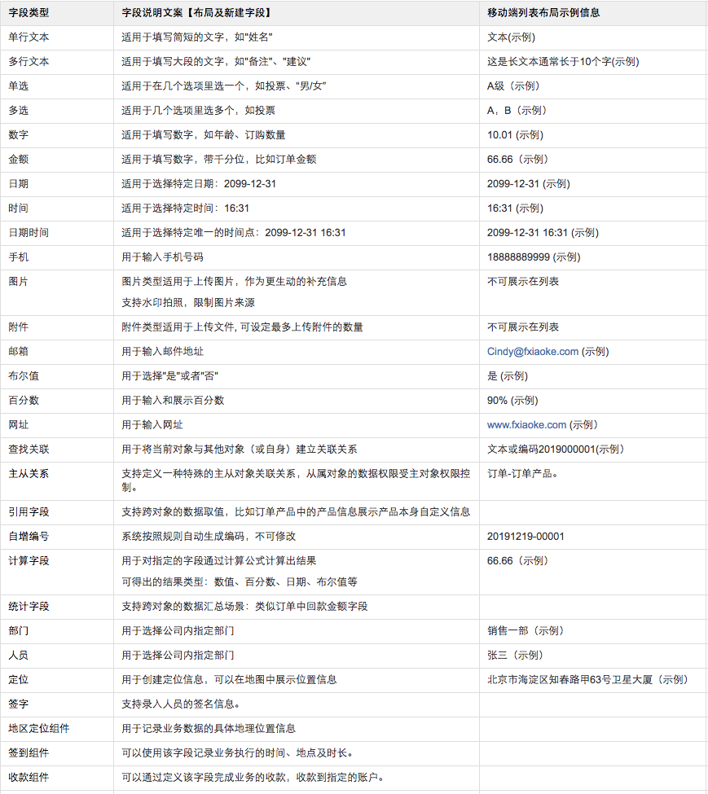

- 特别说明
    - 主从关系字段：
        - 在1:多的主业务和明细业务的关系中，可以在明细业务对象中添加该字段。
        - 添加完成后，可以选择在新建主业务的时候同时批量新建明细。
        - 明细业务的数据权限与主业务的权限保持一致。
        - 可以设置新建主业务时，从属业务必填。
        - 一个主对象最多可设置5个从对象。
        - 一个对象仅支持设置一个主从字段。
        - 主从关系不能设置多级，例如：C是B的子对象，B对象不可再设置MD字段。
        - 级联操作：作废/恢复/删除主对象时同步作废/恢复/删除从属对象。
        - 从属对象的修改记录将同步显示到主对象修改记录中。

    - 统计字段
        - 字段描述：支持在关联关系和主从关系的主对象中新建，对从属对象本身或某个字段进行统计运算。

        - 支持统计方式
            - COUNT(计数)：统计数据的个数，比如客户下面的联系人数量。
            - SUM(求和)：统计某个字段的和，比如销售订单下产品的金额合计。
            - MAX（求最大）：统计某个字段的最大值，比如客户下最大的商机金额。
            - MIN（求最小）：统计某个字段的最小值，比如客户下最低的销售费用。
            - AVG（求平均）：统计某个字段的平均值，比如订单产品的平均折扣。

        - 支持设置过滤条件：含有过滤条件的统计字段将不出现在对象的新建/编辑界面。
            - 被过滤条件引用的字段将不可禁用。
            - 过滤条件变更系统需对所有数据重新计算，请勿频繁修改过滤条件。

        - 统计类型为MAX、MIN时，字段汇总增加支持日期、日期时间、时间类型字段。

            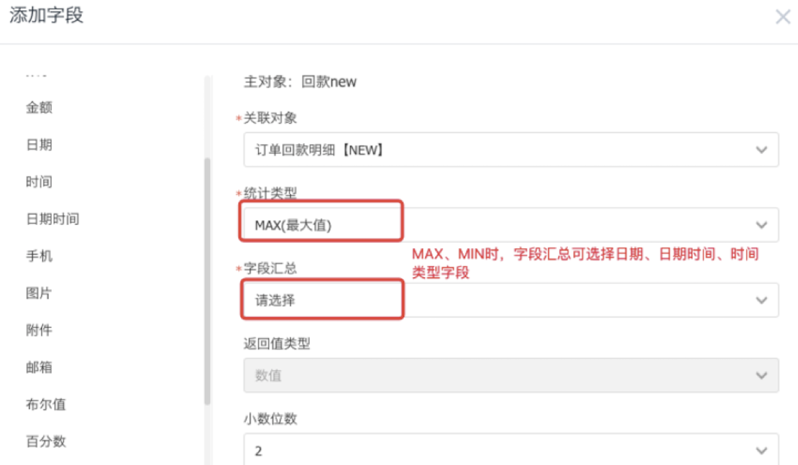

    - 计算字段

        - 计算型字段的插入字段还可支持插入计算字段、统计字段 ，作为变量进行计算。		

    - 引用字段

        - 支持跨对象的数据取值，在1对多关系中的多方中展示1方的某个字段的信息。
        - 引用字段会在新建、编辑、详情页和列表页中展示。
        - 和默认值的差异：引用字段会跟随其引用的字段的值的变化而变化。而字段的默认值不是。

    - 查找关联字段
        - 支持形成2个对象之间的1对多关系，在多方定义查找关联字段。

        - 支持设置查找关联对象可选择的数据范围：全部、根据条件

            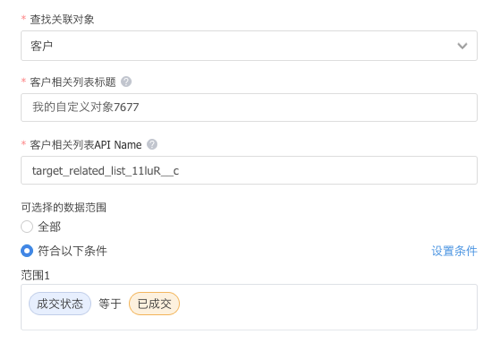

        - 设置后
            - 可选择关联的数据必须满足条件
            - 在lookup对象的详情页，新建相关对象数据，校验数据是否满足过滤条件，不满足的不可新建相关数据。

        - 支持设置默认值

            比如订单关联客户，回款关联订单和客户（订单、客户、回款存在三角关系），当希望在新建回款时，选择了订单，把订单的客户名称带到回款的客户名称字段，就可以在回款下客户名称字段设置默认值，取值为订单下的客户名称字段即可。 

            

    - 签到组件

        - 新增签到组件后，可以执行签到/签退。
        - 可以根据需求设置是否启用签退。
        - 记录业务进行的地点、时间、时长。
        - 

    - 收款组件
    
- 自定义对象中加入收款组件，使对象直接具备收款到企业钱包的功能。
        
    - 全局变量
        - 全局变量：一种在CRM系统任何地方都能够被引用的字段类型，设置完成后，可以在计算字段、默认值和业务校验规则等多种场景下使用该变量。 
        - 预设全局变量
            - 当前时间
            - 当前日期
            - 当前日期时间
        - 可自定义全局变量
            - 可选择字段类型：单行文本、多行文本、数字、金额、日期、时间、日期时间
            - 全局变量的使用可按照类型加入到【计算型字段】/【字段默认值】/【校验规则】中。
        - 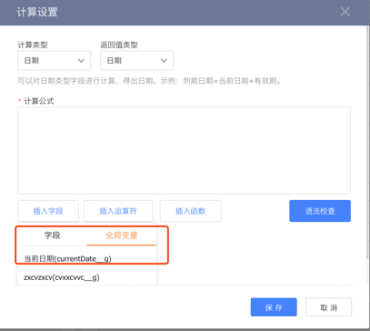

##### 系统预置字段

- 系统预置字段:每个对象新建以后都有“创建时间”、“创建人”、“最后修改时间”、“最后修改人”、“负责人”、“负责人所在部门”6个系统，这些字段不可编辑。

##### 自定义字段
- 自定义字段的字段名称和API name：字段名称在本对象内不可重复，API name主要提供给开发人员使用，如无需要，建议不要修改。
- 默认值：可以为每个字段设置一个默认值，不同字段类型设置的默认值不同。
 - 单行文本、多行文本：可输入一段文字作为字段的默认值，也可输入公式计算得出默认值。
 - 数字、金额字段：可以输入一个计算公式作为默认值。
     -  可选择参与计算的字段为当前对象中已定义的数字、金额类型字段。比如：销售订单金额=数量*单价，在新建/编辑界面编辑数量和单价的值时，自动计算销售订单金额。
 - 布尔值：可设置将“是/否”作为默认值；选项值支持修改名称。
 - 手机：支持设置默认值，默认值只能为lookup关系中其他对象中的手机/电话类型字段。
 - 单选、多选：可将某个选项值作为默认值。
- 提示信息：可以为该字段设置一些提示信息，在新建、编辑、详情页都可以看到。
  ![2017-05-22_164652.png-17kB][3]
- 是否允许重复：若选择‘否’，将会校验数据的唯一性，该字段的值完全一致的将不可新建、编辑、保存、导入。
- 是否必填：选择‘是’，该字段必填，否则无法保存。

#### 设置字段依赖关系
- 当需要对两个单选类型的字段产生依赖关系的时候，如设置个性化的行业分类，可以使用字段依赖关系。
- 首先建好一级行业、二级行业的所有可选字段，然后在字段依赖关系中建立两个字段的关联关系。
  ![2017-05-23_160102.png-14.9kB][4]
  ![2017-05-23_160147.png-16.1kB][5]

#### 创建自定义对象关联关系
##### 创建两个对象的关联关系
- 创建该自定义对象与其他对象或者自身的关联关系是通过添加字段中的`查找关联`字段实现。
- 例如：创建客户与一个自定义对象工单的一对多关系。
  - 首先在工单对象中添加查找关联类型的字段；
  - 选择查找关联对象为“客户”。
  - 设置其他相关内容后便建立了客户与工单的一对多关系。
    ![2017-05-22_174439.png-22.9kB][6]

##### 两个对象的展示形态
- 新建一条工单时，该条工单可以关联客户。
  ![2017-05-22_175705.png-9.2kB][7]
- 在客户中这条工单的展示。根据设置的关联字段是否必填，在客户列表中展示的操作是有差异的。
 - 假如该字段必填， 则只能“新建”。
     ![image.png-28.6kB][8]
 - 假如该字段设置为“非必填”，则可以进行的操作有新建、关联、解除关联。
     ![image.png-31.6kB][9]

#### 自定义对象的多业务类型与多布局
- 在同一个自定义对象中，我们可能需要的业务类型有所差异。以工单为例，有些是客户投诉，有些是客户咨询，分别对应了一些需要填写的信息。在以前的对象中，我们需要把所有的字段都列出来，页面比较混乱，而且对于必填的字段也不好设置，比较麻烦。通过多业务类型可以解决这个问题。
  ![image.png-37.2kB][10]

##### 多业务类型
- 点击工单这个对象，选择“业务类型”，建立自己的业务类型，并为不同的角色配置对应的类型。例如：售后服务人员可以分配“客户投诉”这个类型，售前人员可以分配“客户咨询”这个类型。
  ![2017-05-22_202304.png-23.7kB][11]
  ![image.png-29.5kB][12]
- 每个角色至少要有一个业务类型，当一个角色没有可用业务类型，默认把“默认业务类型”分配给这个角色。
- 如果原来有多个业务类型，把其他自定义业务类型都禁用时，“默认业务类型”会配置给所有角色。

##### 多页面布局

- 点击工单对象，选择“布局”，可以建立不同的业务布局，根据每种布局需求的不同，设置显示与隐藏的字段。
- 例如：客户咨询布局，显示咨询类型与咨询内容两个字段，把投诉内容与投诉类型这两个字段隐藏。
  ![2017-05-22_203947.png-37.9kB][13]
- 分配布局：一个CRM角色和一种业务类型可以唯一选择一种布局。
  ![2017-05-22_210714.png-24.3kB][14]

##### 设置员工主角色
- 在自定义对象中，使用主角色可使用的业务类型和布局，也就是员工拥有的主角色决定了这名员工可见的业务类型与布局，其他角色的业务类型和布局不可见。添加员工的主角色有三种方法：
- 一是添加员工可选择主角色。

![image.png-54.2kB][15]
- 二是编辑员工角色可选择主角色。

![image.png-63.1kB][16]
- 三是某个角色下可设置员工主角色。

![image.png-29kB][17]

##### 设置效果展示
- 列表页的展示：列表页有业务类型的选择框，选择对应的业务类型展示出来的字段不同。

![2017-05-23_094046.png-9.9kB][18]
![2017-05-23_094131.png-9.7kB][19]
![2017-05-23_094213.png-9.9kB][20]
- 员工可见字段：在新建、编辑、详情页展示的是上面配置的“员工角色”+“业务类型”+“布局”决定当前员工的可见字段。例如，一个售后角色的业务类型是客户投诉，而且选择了客户投诉的布局，那么拥有售后角色的员工可选客户投诉的类型，并且可见字段只有投诉类型和投诉信息。

![image.png-11.1kB][21]
![image.png-21.3kB][22]
![image.png-21kB][23]

##### 设置头部摘要和相关信息
- 点击详情页头部区域，点击右侧“编辑”按钮，可设置摘要字段的显示/隐藏及排序。
- 摘要字段最多可设置7个。
  ![image_1c7ipmdva1jvf1mku18s68to73r3d.png-97.9kB][24]

- 点击相关信息区域，可设置相关对象的显示/隐藏及排序。
  ![image_1c7ippnpffmj1ube167qn0b1e6f3q.png-47.6kB][25]

- 移动端详情页布局：将同步网页端详情页布局摘要字段及相关信息的设置，由于移动端交互与网页端不同，主从字段在移动端单独页签展示，销售记录、相关团队保持在相关中展示。

#### 自定义对象的功能权限
- 根据角色可以对对象操作的不同，可以为不同的角色设置不同功能权限点，并可以针对字段单独设置权限，具体设置与其他对象功能权限设置相同。
  ![image.png-51kB][26]

#### 自定义对象的验证规则

- 可以针对对象的新建和编辑设置检验规则，控制不符合要求的业务数据新建。
- 验证规则功能支持定义一到多个验证规则，包括检测问题的条件表达式及相应的错误提示信息。
  
    - 举例：如商机提交时，校验客户状态是否为报备中，如果为报备中，则提示错误信息，保存失败。
- 功能入口：自定义对象管理-》校验规则
    - 新建验证规则。

    - 支持同时新建多条验证规则：系统会按照创建时间逐条校验。

    - 支持停用或启用验证规则，停用后验证规则不生效。

    - 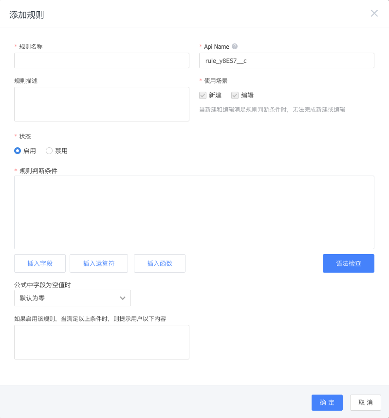

    - 支持函数：

    - 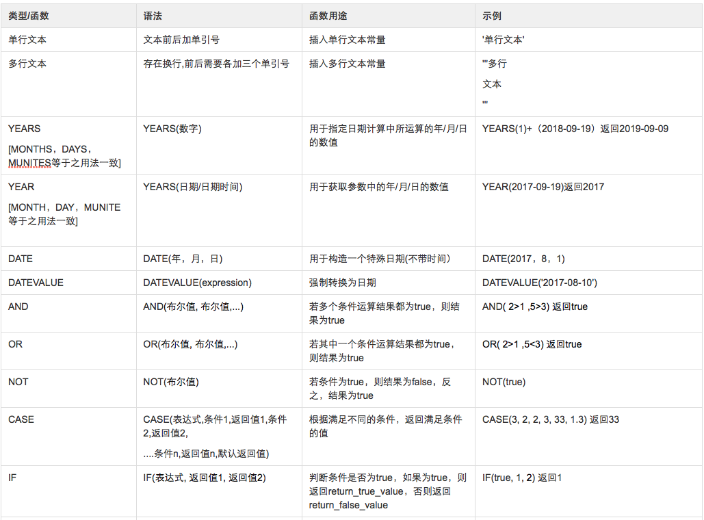

    - 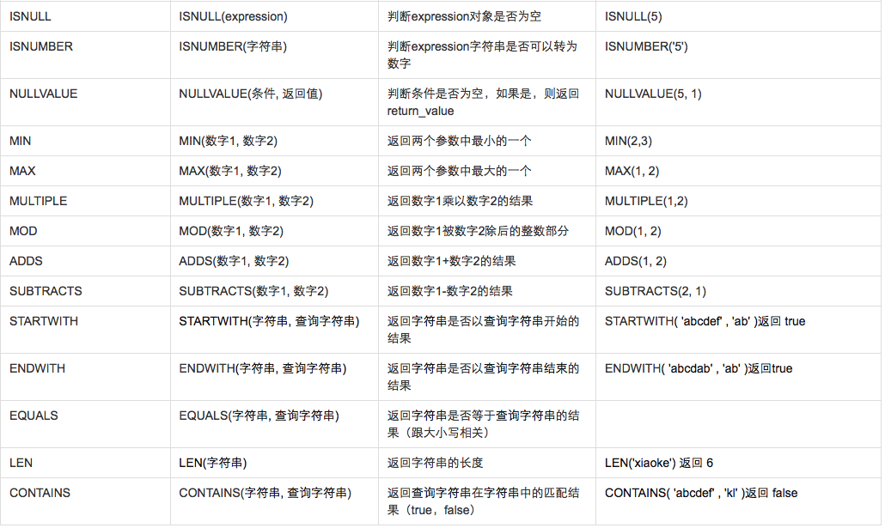

      | 类型/函数          | 语法                   | 函数用途                              | 示例                                       |
      | :------------- | -------------------- | --------------------------------- | ---------------------------------------- |
      | VALUE          | VALUE（字符串）           | 将文本形式的数字转化成数字，支持负数和小数，如果转化不成功，返回空 | 例如：-1982.0413 = VALUE('-1982.0413')      |
      | DATETIMETODATE | DATETIMETODATE(日期时间) | 返回日期时间字段中的日期                      | 例如：1982-4-13=DATEVALUE('1982-04-13 17:00:00') |
      | DATETIMETOTIME | DATETIMETOTIME(日期时间) | 返回日期时间字段中的时间                      | 例如：17:02:40=DATEVALUE('1982-04-13 17:02:40') |

    - 支持计算型字段和统计型字段出现在验证规则的插入字段中，作为变量进行计算

#### 自定义对象的按钮

- 支持在对象详情页创建自定义按钮，可设置按钮显示条件、点击按钮后需填写的内容及后动作。

##### 创建自定义按钮

![image_1c7inoush63h17h619bq1q2rb8e9.png-98.2kB][27]

- 按钮位置：即按钮要放在哪个页面。

- 显示条件：满足什么条件显示该按钮。

- 点击按钮后需输入的内容：可配置对象下字段或添加新字段（添加的新字段仅在点击按钮时使用）。
    ![image_1c7iof7e21ton1ot914o63pmtd6m.png-73.1kB][28]

- 按钮点击后操作分为两种类型：执行动作、执行动作成功后。

     

    - 执行动作：可配置字段变更、执行自定义函数。

        - 一个按钮只可设置一个自定义函数。

        - 当按钮执行动作配置的自定义函数中需要入参时，需匹配为函数传参的变量。可选择当前对象下的字段、全局变量、以及按钮的入参变量。

            

    - 执行动作成功后：可发送CRM提醒、发邮件。

    - 后操作中使用入参变量：点击按钮后输入的内容可作为变量被按钮后动作调用，例如：定义一个“无效”按钮，点击按钮时需要填写“无效原因”，按钮执行成功数据状态将置为无效且变更无效原因字段。设置按钮时需先将“无效原因”设为点击按钮后需输入的内容，然后在后动作-字段变更中配置将“状态”变更为“无效”且“无效原因”变更为前端输入的变量。
        ![image_1c7iottce108a12e8jetjqc1s0j30.png-36.7kB][29]

- 谁可以用：设置角色功能权限。

##### 自定义按钮的操作

- 禁用：禁用按钮后，在对象对应页面将不显示。
- 删除：已禁用的按钮可删除。

##### 销售订单支持自定义函数

- 在新建/编辑保存订单时，可通过保存前置自定义函数实现订单产品实时查库存并返回库存数量场景。
- 预置按钮“新建保存”、“编辑保存”，且执行动作预置为保存动作。

#### 自定义对象的布局规则

- 支持设置布局的动态展示，在新建或者编辑数据的时候，可以根据不同的情况产生不同的动态变化。
- 入口：预设对象管理/自定义对象管理->布局规则

##### 新建布局规则

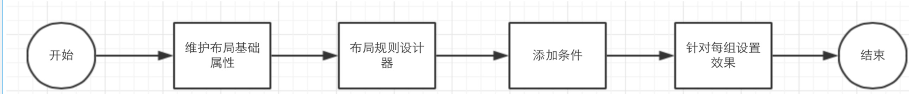

- 每条布局的规则针对一个布局。

- 每条布局规则选定一个【主字段】，主字段可选字段类型：下拉单选、单行文本、多行文本、多选、数字、金额、日期、时间、日期时间、手机、邮箱、网址、布尔值、百分数。 

  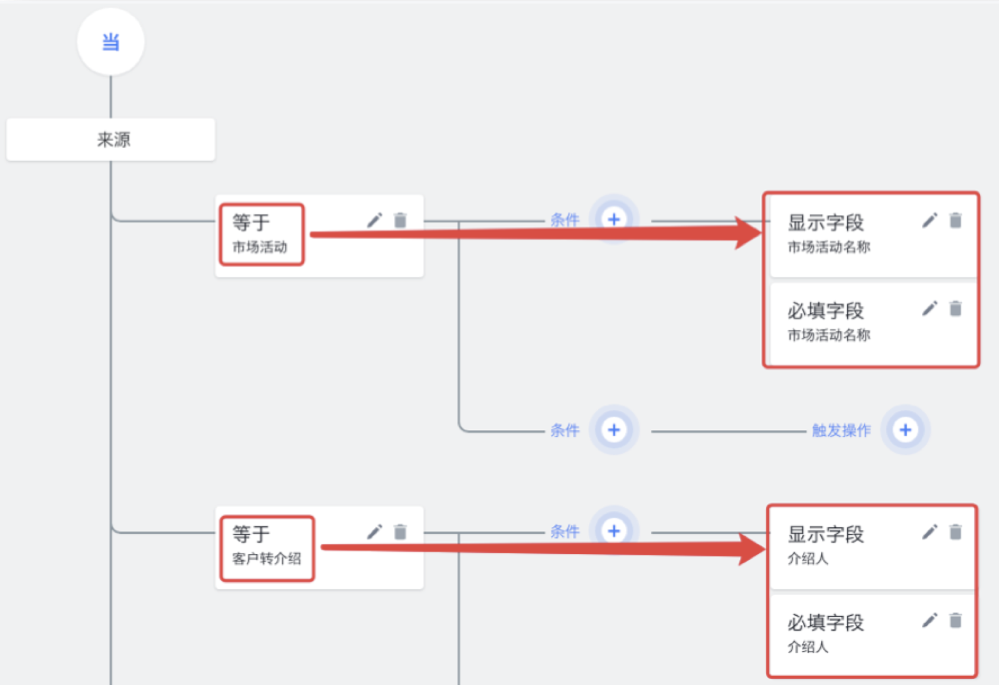

- 不同组之间的条件关系为“或”，与同组其他条件是“且”的关系。

- 每个布局规则可以设置多组条件，最多可以设置20组操作。

- 每个布局最多可以设置10个布局规则。

- 字段间的控制可以成线，不能成环控制，如下图所示。 

- 满足条件后触发的操作：

  - 【显示字段】：可设置多个字段

    可选范围：布局中的非必填字段（过滤掉系统字段、负责人、负责人所在部门、生命状态、锁定状态、业务类型、主从关系、支付组件、签到组件、地区定位、自增编码、计算字段、统计字段、有父级的字段）。
    效果：默认不展示，满足条件时展示字段。

  - 【设置必填字段】：

    可选范围：布局中的非必填且非只读字段（过滤掉系统字段、负责人、负责人所在部门、生命状态、锁定状态、业务类型、主从关系、支付组件、签到组件、地区定位、自增编码、计算字段、统计字段、有父级的字段）。
    效果：满足条件字段设置为必填

    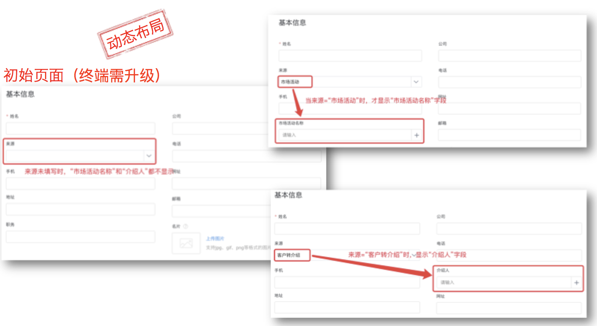

##### 布局规则适用范围

- 布局规则仅在手动新建/编辑、详情页显示时生效，对于导入、openAPI、工作流后动作字段变更、批量更新不生效。

##### 布局规则列表

- 支持按规则名称搜索。

- 支持按所属布局过滤：默认全部。

- 列表显示字段：规则名称、主字段（显示字段的状态：已禁用、已删除）、所属布局、API Name、状态、备注（Hover显示备注信息）、操作。

- 操作：

  新建
  编辑：主字段被禁用/删除的规则，不显示“编辑”按钮。
  启用：状态=已禁用
  禁用：状态=已启用
  删除：状态=已禁用
  状态=已启用 时操作，提示：“禁用的布局规则方可删除”。

#### 查重设置

线索，客户及联系人作为CRM的主数据信息载体，在不同行业的唯一辨识往往是多维的，要排除人为操作出现的重复信息，就需要量身定制的复杂规则支撑。

#####新建查重

主要用于指定对象在手动新建时，根据此规则查重。

- **开启新建查重**：如果开启，则在新建对象记录时可根据查重规则匹配对象下的记录（包括已作废数据）。如果匹配到重复记录，则会提示用户有重复记录，当然您也可以不理会继续新建对象记录。
- **支持新建查重对象**：客户、联系人和线索。
- **查重逻辑设置**：根据对象的系统预设字段匹配。可组合字段的精确查询或模糊查询。如客户的 "客户名称" 部分重复并且 "电话" 完全重复，则判定为重复客户。
- **查重结果显示**：如果匹配到重复记录可配置显示的字段。因为重复记录可能对于查重人员没有数据权限，所以可配置查重后可见的字段，保证数据安全性，避免查重人员根据查重结果窃取客户信息。

##### 查重工具

主要用于通过“查重工具”查重时的查重逻辑配置。

- **开启查重工具**：三个支持查重对象至少开启一个，则在“我的工作台-首页”中可见“查重工具”，并支持记录查询。详见【[小工具-查重工具](2-7小工具.md#查重工具)】
- **支持新建查重对象**：客户、联系人和线索。
- **查重逻辑设置**：根据对象的系统预设字段匹配。可组合字段的精确查询或模糊查询。如客户的 "客户名称" 部分重复并且 "电话" 完全重复，则判定为重复客户。
- **查重结果显示**：如果匹配到重复记录可配置显示的字段。因为重复记录可能对于查重人员没有数据权限，所以可配置查重后可见的字段，保证数据安全性，避免查重人员根据查重结果窃取客户信息。

##### 商机查重

为避免企业内多个销售跟进同一客户同一项目，可以开启“禁止在同一客户下创建重复商机名称”。

##### 简易查重

- **配置且(AND)关系**：在客户对象下，我们对“客户名称”“客户简称”“地址”和“手机号”字段设置查重规则，在系统中存在以下三条数据：

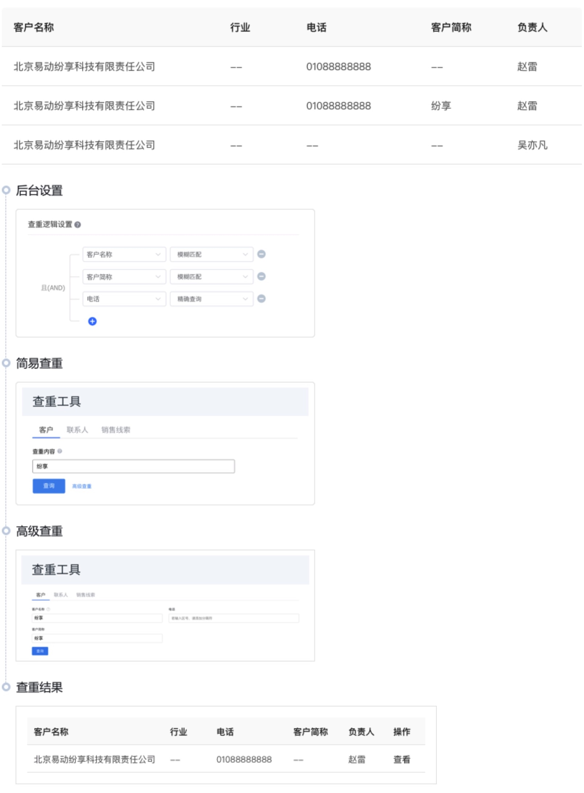

- **配置或(OR)关系**：在客户对象下，我们对“客户名称”“客户简称”“地址”和“手机号”字段设置查重规则，在系统中存在以下三条数据：

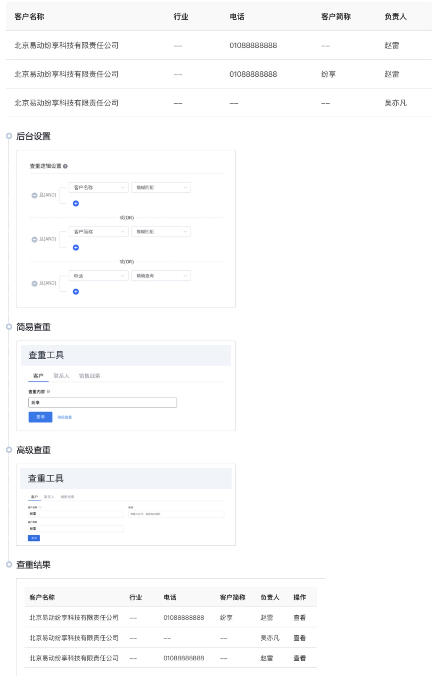

- **既配置且(AND)也配置或(OR)关系**：在客户对象下，我们对“客户名称”“客户简称”“地址”和“手机号”字段设置查重规则，在系统中存在以下三条数据：

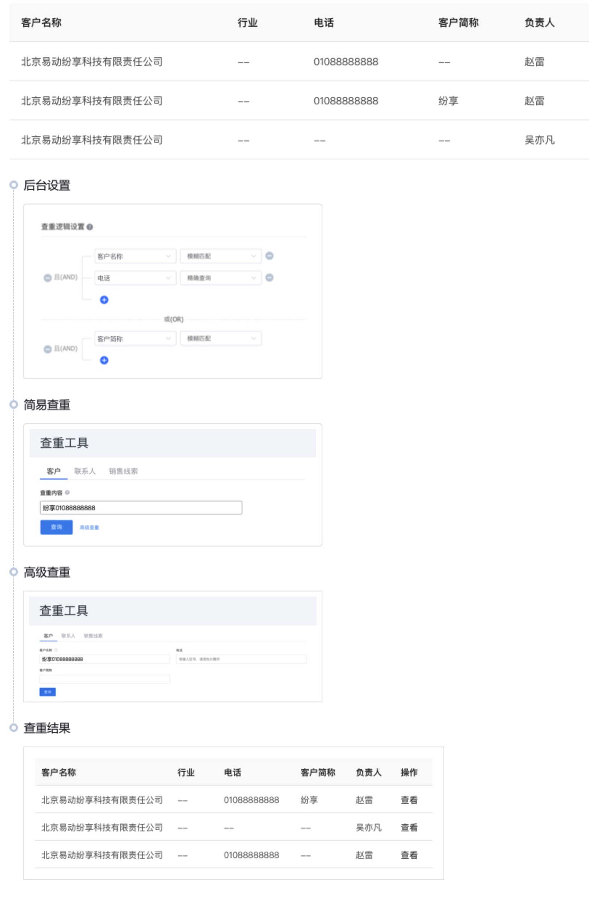

[1]: ./images/73325.png
[2]: http://static.zybuluo.com/luking1990/abfwzk4kqjg9kef0gqqqenct/image_1c7it4asb17f91d9tl1u72sf4k.png
[3]: ./images/2017-05-22_164652.png
[4]: ./images/2017-05-23_160102.png
[5]: ./images/2017-05-23_160147.png
[6]: ./images/2017-05-22_174439.png
[7]: ./images/2017-05-22_175705.png
[8]: ./images/jg9g9gn4kx12demx44vqx9yz.png
[9]: ./images/hsp82ffklukpzptxfeoib0l0.png
[10]: ./images/jjdp8c8iilpj6ruhm7x5afe4.png
[11]: ./images/2017-05-22_202304.png
[12]: ./images/err5xy72h8116ve978qbjlmh.png
[13]: ./images/2017-05-22_203947.png
[14]: ./images/2017-05-22_210714.png
[15]: ./images/pk8ipx1ral8xsaonk3czoek6.png
[16]: ./images/00ysunru80qfx1yqfgac7fk4.png
[17]: ./images/iy367d7snx7148tdf93bl3ds.png
[18]: ./images/2017-05-23_094046.png
[19]: ./images/2017-05-23_094131.png
[20]: ./images/2017-05-23_094213.png
[21]: ./images/y0nn6ap2smrf6gbwup7k74aw.png
[22]: ./images/h179lbenewfzj2cpmjxrjdda.png
[23]: ./images/3g31uiaz6qn9p3or5o6ww7r8.png
[24]: ./images/image_1c7ipmdva1jvf1mku18s68to73r3d.png
[25]: ./images/image_1c7ippnpffmj1ube167qn0b1e6f3q.png
[26]: ./images/l1yjxhfy1aexgxtigv0jo1ke.png
[27]: ./images/image_1c7inoush63h17h619bq1q2rb8e9.png
[28]: ./images/image_1c7iof7e21ton1ot914o63pmtd6m.png
[29]: ./images/image_1c7iottce108a12e8jetjqc1s0j30.png