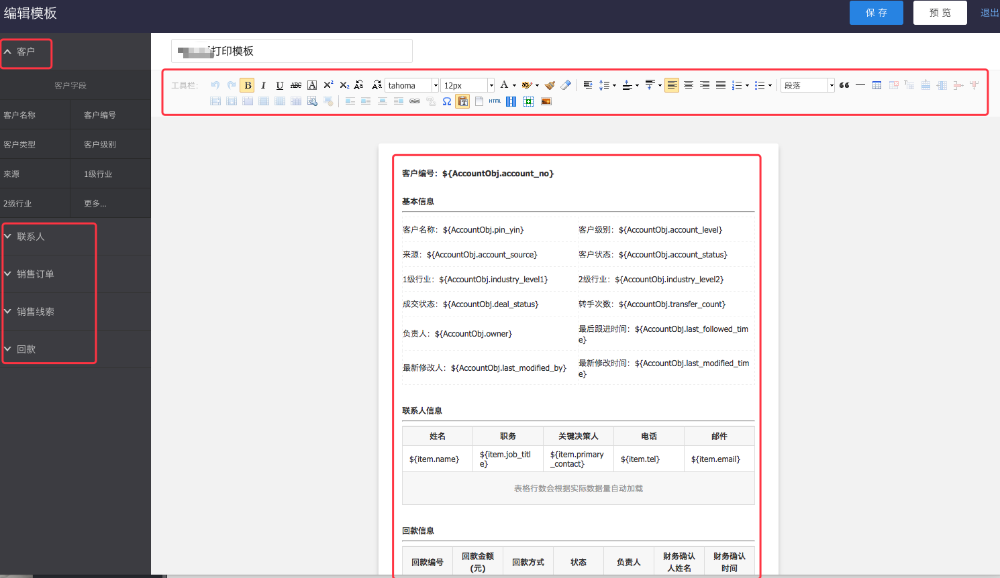

# 模板管理

---

## 打印模板
根据企业自身业务需求自定义各业务对象的打印模板，使用内嵌的副文本编辑器，支持灵活调整页面布局，业务记录数据项点击即带入编辑器中，操作简便，协助您打印理想的业务单据。

### 打印模板管理
- 预设模板：为了方便企业快捷操作使用打印模板，纷享CRM为相关业务对象都预置了一套打印模板，您可以直接使用，或是复制一份再稍作修改即可使用。
- 默认模板：您可以根据不同的使用场景配置多个打印模板，并指定一个默认模板，在打印的时候，系统会读默认模板，您也可以更换模板。
- 支持打印模板的对象：销售订单、客户、产品、联系人、销售线索、回款 、退货单 和合同。

#### 新建模板
- 新建方式
    - 从现有模板复制：从已有的模板中复制一份直接新建，这样您只需要将复制的模板调整布局和修改相关字段即可，简化操作，提高工作效率。
    - 不复制，直接新建：打开空白页面，从零开始画一份新的模板。
- 编辑模板
    - 模板名称：如“销售订单-客户确认模板”。
    - 适用范围：即可以使用模板的员工范围。
    - 模板编辑器：内嵌的副文本编辑器，符合word使用习惯，方便快捷编辑模板布局。
        - **插入布局**：为了打印的单据美观，可以插入布局，使模板内各元素排列整齐。布局会指定行和列，但相关线条并不会显示出来。图标：
        - **插入动态表格**：比如销售订单，一份订单中可能有多个产品，此时可以直接插入动态表格，一次指定主对象下子对象的所有记录，在打印预览时系统会自动加载实际的子记录列表。图标：
            - 自增长序号：动态表格可设置启用自增长序号，启用后系统将自动添加自增序号列。
        - **插入二维码**：可插入业务对象详情页的二维码或自定义二维码。图标：![image_1bqc4k4uk18sk1hqr1vk71ha71enm9.png-0.3kB][1]
        - **插入水印**：可设置水印文字、字号、文字方向、透明度。图标：![image_1bqc4mvq8kko6gr1c2iv6o1pahm.png-0.5kB][2]
        - **页眉页脚**：支持页眉页脚，可插入常量、变量信息或图片。图标：![image_1bqc4o7k3est13ki11cf1qoo1vrr13.png-0.5kB][3]
        - **插入业务对象字段**：当您需要在编辑器中插入一个数据项如“订单编号”时，只需将光标停留在待插入的位置，然后点击左边“销售订单”下的“订单编号”字段即可将变量插入页面布局中。操作简单，容易上手。
    - **关联业务对象及字段**：为了打印一份完整的业务单据，我们提供打印主对象及关联业务对象的所有字段，包括预设字段、自定义字段和系统字段。比如您需要打印一份“销售订单”单据，用于发送给客户进行确认，在这个打印模板中，您需要打印主对象“销售订单”相关字段，需要订购产品的列表，需要附加回款信息等。这样才能组合一张完美的打印单据。
    - 打印时可导出PDF。

- 业务补充  
    - 字段类型支持：
        - 文本类型和选择类型字段在打印预览时直接填充值。
        - 图片类型：固定图片大小，展示图片。
        - 附件类型：只显示附件名称。
    - 数据源支持全局变量：
        - 设计器左侧数据源有“全局变量”单独的分类
    - 权限：
        - 如果当前员工对某个打印字段无权限，打印时不展示。
        - 如果当前员工对某个关联对象无数据权限，打印时不展示。

 
​       

#### 设为默认
在模板列表中，标识为“默认”的模板即不系统默认模板。将某一模板设置为默认打印模板，以便打印时直接按默认模板预览并打印。

#### 初始化
在模板列表中，标识为“预设”的模板即为系统预设的模板，不支持删除。预设模板是一个标准模板，企业可以直接使用，也可以根据企业业务需求修改调整。预设模板调整后如果需要恢复可以点击“初始化”，将预设记录恢复为系统预设的模板样式布局。

#### 删除
如果打印模板不再使用，可以直接删除。

## 邮件模板
根据企业自身业务需求自定义各业务对象的邮件模板，使用内嵌的副文本编辑器，支持灵活调整页面布局，标准化企业信息发送，节约员工操作及学习成本，提升交易成功率。提升企业运营效率，邮件模板结合工作流和智能表单，打造自动营销全流程。

### 邮件模板管理
- 支持打印模板的对象：销售线索、客户、联系人、商机、销售订单、回款 、退款、退货单、开票申请、产品、合同和自定义对象。

#### 模板设计器
- 编辑模板
    - 模板名称：如“销售订单-客户确认模板”。
    - 邮件主题：用模板发邮件时将自动带入邮件的主题中，可插入参数。
    - 适用范围：即有权限使用该模板的员工。
    - 模板编辑器：内嵌的副文本编辑器，符合word使用习惯，方便快捷编辑模板布局。
        - **插入智能表单**：邮件模板中可插入任意对象的智能表单的链接，可设置链接的显示文字。图标：![image_1bqc3um546it1nqkeu644511so9.png-0.2kB][4]
        - **插入布局**：可以插入布局，使模板内各元素排列整齐。布局会指定行和列，但相关线条并不会显示出来。图标：
        - **插入动态表格**：比如销售订单，一份订单中可能有多个产品，此时可以直接插入动态表格，一次指定主对象下子对象的所有记录，在发邮件时系统会自动加载实际的子记录列表。图标：

        - **插入业务对象字段**：当您需要在编辑器中插入一个数据项如“订单编号”时，只需将光标停留在待插入的位置，然后点击左边“销售订单”下的“订单编号”字段即可将变量插入页面布局中。操作简单，容易上手。
    - **关联业务对象及字段**：为了发送完整的业务数据，我们提供主对象及关联业务对象的所有字段，包括预设字段、自定义字段和系统字段。比如您需要发送“销售订单”的信息，在这个邮件模板中，您需要主对象“销售订单”相关字段、订购产品的列表、附加回款信息等。这样才能组合一张完美的邮件。

- 业务补充  
    - 字段类型支持：
        - 文本类型和选择类型字段在打印预览时直接填充值。
        - 附件类型：只显示附件名称。
    - 权限：
        - 如果当前员工对某个打印字段无权限，打印时不展示。
        - 如果当前员工对某个关联对象无数据权限，打印时不展示。

 
​       

#### 删除
如果邮件模板不再使用，可以直接删除。但已被工作流、审批流、业务流程调用的邮件模板不可删除。

[4]: ./images/image_1bqc3um546it1nqkeu644511so9.png

[1]: ./images/image_1bqc4k4uk18sk1hqr1vk71ha71enm9.png
[2]: ./images/image_1bqc4mvq8kko6gr1c2iv6o1pahm.png
[3]: ./images/image_1bqc4o7k3est13ki11cf1qoo1vrr13.png