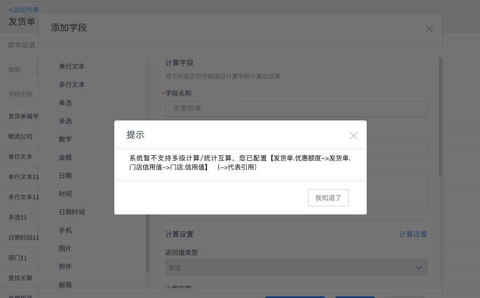

# 计算字段

---

用户在使用纷享销客CRM产品过程中，会涉及各种数学运算，如根据产品官方报价和折扣计算出货价等。

使用计算型字段，可以方便的满足上述功能。

纷享销客提供的计算型字段，可以根据不同的预期结果值，采用不同的运算符和函数进行计算，结合满足要求的参数（其他字段或常量），计算相应的结果。

## 计算字段可以在数据列表页支持筛选

场景描述：销售订单列表，添加两个计算字段，合同已开始时间和合同剩余结束时间，用户希望能够在数据列表筛选这两个字段。

- 数据列表页支持筛选计算字段，用户可以根据需要通过计算字段去过滤数据，更好的协助用户进行数据筛选和查看。
- 

## 统计字段与计算字段可以互算

#### 场景举例

在发货单产品下计算单个产品的成本，希望在发货单中能够统计总成本，进行利润分析。

#### 逻辑分析

统计字段支持了统计主对象或相关对象上的统计字段和计算字段 。

- 具体业务上的使用举例

  也许上面的图很多人还是看着两眼蒙圈，那下面给大家拿其中一个点举个具体栗子：

  开头我们提过用户希望能够通过我们的统计能力支持利润分析，现在我们就可以支持啦，具体怎么配置呢？再来一图：

  

  上图可以看出，原本我们只能通过计算字段计算每条明细数据的利润，而统计能力提升后，我们支持了主对象统计从对象的计算字段，那么用户就可以在主对象上进行总利润的分析啦。

- 原来错误的做法纠正

## 计算/统计互算的层级限制

鉴于性能考虑，对计算和统计支持的链路层级有所限制，具体可参考下面图解：

#### 1.由【计算字段】发起校验时的层级限制

图解：

- 层级分析：
  - 上层：主对象或者lookup对象字段
  - 本层：本对象的字段
  - 下层：从对象或相关对象字段
- 注意：
  - “相关对象”是指lookup本对象的对象，比如：[销售订单] lookup [客户]，则：[销售订单]为[客户]的相关对象
  - 建议从发起校验的节点开始查看层级，方便理解。
  - **计--默–(only 主)-统**   表示对于计算字段向上引用的默认值，只有主对象的默认值字段可以引用本对象的统计字段。
- 实例：将上图的一部分进行举例说明
  - 
  - 如上图：发起校验的节点如果从【报价单】的计算字段触发，向上层下层进行引用。当此“计算字段”已引用本对象中的一个“统计字段”，则此“统计字段”是不能引用【报价单明细】的计算字段/统计字段的，只能引用【报价单明细】中的默认值。

#### 2.由【统计字段】发起校验的层级限制

- 可参考1中“由【计算字段】发起校验时的层级限制”中的解释与示例。

#### 3.由【默认值】发起校验的层级限制

- 可参考1中“由【计算字段】发起校验时的层级限制”中的解释与示例。

## 配置页面提示信息

当配置了不满足规则的场景时，会提示用户错误的配置链路。这里给大家详细解说下提示信息，帮助大家理解。

- 提示信息：“<u>系统暂不支持多级计算/统计互算，您已配置【对象名.字段名->对象名.字段名->对象名.字段名】（->代表引用）</u>”

- 示例说明：

  - 
  - 当【发货单】中已配置“门店信用”字段计算相关对象【门店】下的信用值时，如果再在【发货单】中添加“优惠额度”字段去引用本对象的“门店信用”时，字段保存时会如下报错。说明这个链路是不支持配置的。
  - 

