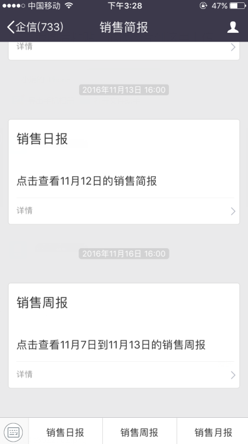
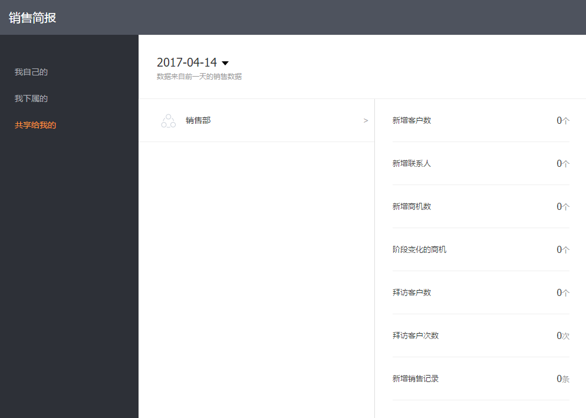

# 销售简报设置

---

销售简报是指在指定时间范围内重要对象的新增情况，包括“新增客户”、“新增联系人”、“新增商机”、“阶段变化的商机”、“拜访客户数”、“拜访客户次数”、“新增销售记录”。CRM管理员可以这里配置销售简报推送的时间点，简报推送范围等，相关人员可以在企信的服务号“销售简报”中收到推送消息，直接打开查看即可。

企业管理者或是销售人员可以通过销售简报能及时了解下属或是自己的CRM使用情况及销售业绩，并及时调整自己的工作。

## 销售简报配置项

- 是否开启推送：包括日报、周报、月报、目标设置页面推送。只有开启推送，才会收到推送通知
- 推送范围：配置推送范围，属于指定范围内的用户将会定期收到推送提醒。
- 不参加推送：在指定的推送范围内需要剔除个别员工。
- 推送时间点：
    - 日报：可以指定每日推送的时间点。
    - 周报：指定每周星期几的时间点。
    - 月报：指定每月第几天的时间点
     
    
## 销售简报接收及查看
销售简报内容会在企信的服务号“销售简报”中接收和查看。

- 
- 
- 