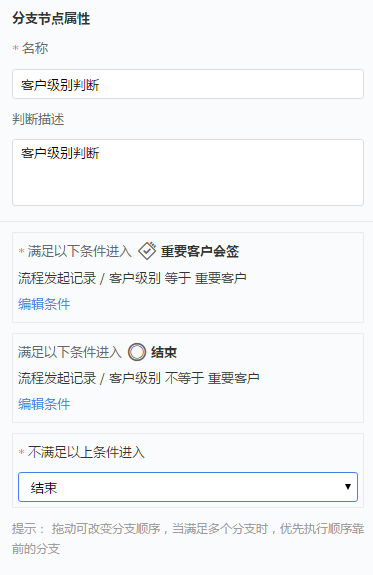

# 业务流程配置

---

业务流程配置包括以下几个部分：
- [业务流程列表管理](8-1-0业务流程配置.md#业务流程列表管理)
- [业务元素说明](8-1-0业务流程配置.md#业务元素说明)
    - [业务活动](8-1-0业务流程配置.md#业务活动)
    - [审批](8-1-0业务流程配置.md#审批)
    - [会签](8-1-0业务流程配置.md#会签)
    - [阶段](8-1-0业务流程配置.md#阶段)
    - [分支节点](8-1-0业务流程配置.md#分支节点)
    - [并行任务](8-1-0业务流程配置.md#并行任务)
    - [开始](8-1-0业务流程配置.md#开始)
    - [结束](8-1-0业务流程配置.md#结束)

## 业务流程列表管理
### 业务流程属性说明
- **流程名称**：如“大客户备案流程”、“教育行业客户签约流程”等
- **流程描述**：描述流程的用途或是意义等信息。
- **流程发起对象**：指明当前业务流程主要服务的业务对象，以便流程在指定对象下发起。
- **适用范围**：当前业务流程的适用范围，即只有在指定范围内的用户才可以发起此流程。

### 启用/停用
- 启用：只有启用中的流程可以发起业务流程记录。
- 停用：已停用的流程不能发起业务流程。如企业业务调整，流程已不再适用，可以将其停用，这样用户发起流程时不会看到此停用流程。

### 删除
可以将已停用的业务流程删除。流程删除后原业务流程实例仍支持查询和查看详情。

## 业务元素说明

### 过滤器

![image_1bq2dg4ue83uvc21i9ptbj8669.png-32.1kB][1]

业务说明：手动触发业务流程时，校验过滤条件，满足条件的才会触发，不满足条件的提示：“触发失败，不满足触发条件”。

### 业务活动

- **业务说明**：属于业务流程中的人工活动，即在业务流转中，需要员工去执行的一件指定业务操作。比如在客户跟进中补充客户信息，或是在执行过程中根据业务需要调整业务记录的团队成员，包括更换负责人和添加团队成员，以便其可以加入团队，拥有记录的数据权限，可以参与后续业务活动。

- **业务属性**：
    - **业务名称**： 业务活动的名称，标识业务流转中的某一个业务活动。如“客户信息补充”、“添加服务成员”等。
    - **业务描述**：描述这个业务活动的任务要求
    - **本业务活动针对哪个对象**：每一个业务活动都是针对某指定的业务对象进行操作。可选值为流程上一环节同一对象以及关联对象，或是流程发起对象以及关联对象。比如上一环节是针对“客户”进行操作，那么当前可操作对象可选值为“客户”及与客户关联的对象，如联系人、销售订单等（目前只支持客户和自定义对象）。
    - **需要做什么事情**：可选值有编辑对象、操作对象及选择或新建关联对象
    - 如果是**编辑对象**：即编辑指定的对象记录。如编辑客户信息，补充客户的级别，客户的需求等。
        -  **编辑哪条记录**：选择您需要编辑哪条记录，目前可选值为“流程发起记录”，即编辑流程发起时指定的业务记录。
        -  **配置要编辑的字段**：指定在当前活动中需要补充哪些字段，字段来源于当前活动中指定的业务对象的预设字段和自定义字段。在这里您可以指定某个字段必填或是只读，同时执行者对字段的操作权限依赖于纷享CRM的权限管理。即如果执行者对某字段本没有编辑权限，那么在执行过程中也不能编辑此字段，即使任务配置了需填写此字段，也不可以编辑。
        -  编辑的字段增加了签字组件
            - **必填**：是指完成当前活动您必需填写的字段，不同于“对象管理”中指定的字段必填。如在跟进过程中上门拜访了解客户需求，那么业务人员必须补充此客户的级别和客户需求两个信息。
            - **只读**：即在完成此活动时，提示执行者相关信息，但不同修改。
    - 如果是**操作对象**：配置在纷享CRM中对某对象的业务操作。通过业务流程配置以引导业务人员在某阶段应该做什么 业务操作。
        - **执行什么操作**：目前支持“更换负责人”和“添加相关团队”。操作权限依赖于纷享CRM中的权限管理，即只有执行人拥有“更换负责人”的权限，才可以在执行时可执行此操作。
    - 如果是**选择或新建关联对象**：即新建关联对象，比如在客户下新建“联系人”记录，或是选择已有“联系人”关联至此客户下。
        - **选择或新建关联哪个对象**：选择本业务活动对象被关联的对象。如业务活动操作的是客户对象，则此处可选择关联客户的“自定义对象”
        - **对哪一个｛对象｝执行任务**：即指定选择或新建的记录与哪条业务关联。比如本业务活动是针对“客户”对象，需要新建或选择已有“联系人”关联到客户下，那么此处是选择关联到哪条“客户”数据下，即选择流程中前置结点涉及到“客户”数据结点。

    - **谁来处理本业务**：指定任务执行人，当流程流转到此阶段时，系统根据配置自动分配执行人。对于“业务活动”节点每次只能一人处理。如果选择了多个执行人，只要有一人处理，则认为当前活动已处理完成。
        -  **记录相关人员**：即根据记录的相关角色人员来处理当前活动。可选值包括“记录负责人”、“记录负责人所在部门的负责人”、“记录相关团队成员”、“记录相关团队成员所在部门负责人”。比如某业务活动是“处理客户反馈”，则此处可以选择“记录相关团队成员”来执行，因团队成员中包括服务人员。
        -  **人员部门角色或用户组**：按业务需求选择指定人员或角色等 。比如某业务活动是“客户回访”，此处可以选择“用户组”中专做客户回访的员工组。
        -  **流程发起人**：即由流程发起人执行此操作。
    - 业务停留n小时超时：为了提高流程处理效率，可设置超时时间，如果超时了，可通过“CRM通知”通知客户。
    - 设置更多提醒：可设置提醒触发时机，包括超时前、超时后、完成时，以便及时提示任务处理人及时处理任务。“完成时”可用于任务完成后通知相关人员，及时同步信息。

### 审批

- **业务说明**：在业务流转中免不了需要领导审批，比如客户资料审核，设计方案审核等。此时可以用“审批”元素，同时可配置同意或不同意的后动作。
- **业务属性配置**：
    - **名称**：如“客户资料审核”，“施工设计方案审核”等。
    - **业务描述**：描述业务审核要求。
    - **审批哪个业务**：指定审批的业务记录。如审核客户资料，则需要指定是审核哪个客户资料。可选值目前只有“流程发起记录”
    - **谁来审批**：即指定审核人员。如记录负责人的上级。
        -  **前置业务处理人员**：即指定当前流程的前置某一结点的处理人来审批。如审核客户资料，需要前置某一节点“编辑客户资料”的处理人的上级来审批。
         -  **记录相关人员**：即根据记录的相关角色人员来处理当前活动。可选值包括“记录负责人”、“记录负责人所在部门的负责人”、“记录相关团队成员”、“记录相关团队成员所在部门负责人”。如审核客户资料，可选择记录负责人所在部门的负责人来审批。
        -  **人员部门角色或用户组**：按业务需求选择指定人员或角色等 。比如“财务审核”，此时可选择指定的财务角色。
        -  **流程发起人**：即由流程发起人执行此操作。
    - **审批条件**：根据审批结果进入不同的业务元素。此处只能有“同意” 或“不同意” 两个分支路径 
    - **业务停留n小时超时**：为了提高流程处理效率，可设置超时时间，如果超时了，可通过“CRM通知”通知客户。 
    - 设置更多提醒：可设置提醒触发时机，包括超时前、超时后、完成时，以便及时提示任务处理人及时处理任务。“完成时”可用于任务完成后通知相关人员，及时同步信息。

### 自动节点

- **业务说明**：在业务活动中工单服务之后，通过自动节点发送客户反馈意见表，收集工单服务人员的服务情况

### 完成条件

![image_1bq2jn5ad1ldnjg01fmb1m8sr7jf.png-29kB][2]

-**业务说明**：完成条件和过滤器设置一致，只有满足条件后才可以点击完成任务按钮

### 流程增加完成后动作
![image_1bq2kq0e96lbqdk1ald1uo17e4s.png-18.8kB][3]

审批节点的后动作可以分开配置通过的后动作和驳回的后动作

 - 节点后动作支持：字段变更，发起业务流程，发邮件，后动作支持外部通知，后动作支持自定义函数

  - 字段变更
      
      
      

描述：后动作字段更新支持更新当前对象以及当前对象lookup对象的字段，字段更新日期类型和数值类型支持公式
例如：商机lookup客户，商机流程中可以更新客户下的字段
场景：商机阶段是赢单，更新客户状态为已成交

  - 发起业务流程
    ![image_1bqa27239n3qh40123g16b51sqs9.png-21.9kB][7]
   - 发邮件
       
         描述：例如：业务流程发起对象是客户，字段变量是这个客户下的邮箱字段都会列出来
   - 后动作支持外部通知

   - 后动作支持自定义函数

### 会签

描述：会签节点，勾选了配置则会签处理人任意一人驳回即驳回，如果不勾选配置则需要所有会签处理人发表意见后驳回
例如：会签节点处理人A、B、C 勾选了配置A驳回即驳回
不勾选配置A驳回还需要B、C发表意见后驳回

- **业务说明**：可以是多个部门同时审核某一工作内容。如设计部为客户出了一稿装修设计方案，因方案的实施需要多个部门一起协作完成，此时可配置相关的部门一起会签审核这稿设计方案。
- **业务属性配置**：
    - **名称**：如“施工设计方案审核”等。
    - **业务描述**：描述业务审核要求。
    - **审批哪个业务**：指定审批的业务记录。如审核客户资料，则需要指定是审核哪个客户资料。
    - **谁来审批**：即指定审核人员。可以选择多人一起会签，且每一个选择的人员都需要审批，其中只要有一人不同意，则标识会签结果为“不同意”。
        -  **记录相关人员**：即根据记录的相关角色人员来处理当前活动。可选值包括“记录负责人”、“记录负责人所在部门的负责人”。
        -  **人员**：指定人员
        -  **流程发起人**：即由流程发起人执行此操作。
    - **会签条件**：根据会签结果进入不同的业务元素。此处只能有“同意” 或“不同意” 两个分支路径  
    - **业务停留n小时超时**：为了提高流程处理效率，可设置超时时间，如果超时了，可通过“CRM通知”通知客户。 
    - 设置更多提醒：可设置提醒触发时机，包括超时前、超时后、完成时，以便及时提示任务处理人及时处理任务。“完成时”可用于任务完成后通知相关人员，及时同步信息。

### 阶段
- **业务说明**：标识业务流程的阶段状态。像家居装修行业，业务流程相对较长，比如有设计方案确认、材料验收、施工、收房验收等多个阶段。通过阶段可以清晰标识业务当前在哪个阶段。
- **业务配置**：
    - **名称**：如“设计方案确认”、“材料验收”、“施工”等。
    - **描述**：即阶段描述。

### 分支节点

- **业务说明**：根据业务记录的属性作分支判断，当满足不同条件时进入不同的业务活动，“分支节点”有且只能有一个分支条件满足条件。比如客户级别判定，当客户级别为重要客户时，进入客户级别审批；当客户非重要客户时，直接结束客户审核流程。
- **业务配置**：
    - **名称**：如“客户级别判断”、“销售订单金额判断”等。
    - **描述**：即分支结点描述。
    - **业务分支**：在配置分支路径的条件时，请先配置好分支路径，以便为每一个分支路径的配置进入条件。
        - 选择任务：即指定业务记录。可以根据业务流程中某一节点的业务记录做条件判定。
        - 字段选择：此处的字段取值是根据前一步选择的任务决定。选择任务时会选择业务活动，业务活动是对指定对象的操作，所以此时是根据对象的预设字段和自定义字段做条件判断。如在“客户审核流程”中流程发起记录为客户相关记录，则此处可以选择客户的字段作条件判断。
    - **不满足以上条件进入**：即当以上的业务分支条件都不满足时，需选择一个进入的业务节点，以便流程能正常流转下去。
- **业务补充**
    - 分支节点只能有一个满足条件的可执行路径，如果多个分支条件都满足条件，则取优先级高的的分支。
    - 优先级：拖动改变分支顺序，排前的分支为高优先级。
    - 如果没有找到满足条件的分支，流程将自动结束 

### 并行任务

- **业务说明**：能够支撑一个业务流程中同时进行多个业务的场景。配置后，可以由此节点流出多条业务路径（分支），上一业务结束后同时触发多个业务。如施工阶段需要同时准备材料和组建施工团队，此时可以选用并行任务。

### 开始
- 标识业务流程的开始，只能有一个。

### 结束
- 标识业务流程流转结束，可以有多个。在并行任务中可标识某一分支任务结束。

### 流程保存

- 流程定义支持草稿想
- 第一步

- 第二步

- 第三步

[1]: ./images/image_1bq2dg4ue83uvc21i9ptbj8669.png
[2]: ./images/image_1bq2jn5ad1ldnjg01fmb1m8sr7jf.png
[3]: ./images/image_1bq2kq0e96lbqdk1ald1uo17e4s.png
[4]: ./image_1c1co90pr18ib16f01kaj53d1jjc19.png
[5]: ./image_1c1cof220bsm1q3lcubpe423.png
[6]: ./image_1c1cofhpa8eh1f1s16c21v0i1b342g.png
[7]: ./images/image_1bqa27239n3qh40123g16b51sqs9.png
[8]: ./image_1c1coao4k3e63u8utp2i31n6j1m.png
[9]: ./image_1c1copk0ad6idvd1p2t1ou5gf79.png