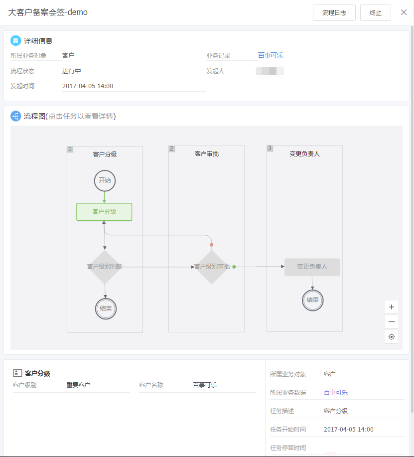

# 业务流程执行

---

本章节分以下几个部分介绍业务流程的执行过程。
- [如何发起业务流程](7-4-2-2业务流程执行.md#如何发起业务流程)
- [如何查看业务流程中的待办活动](7-4-2-2业务流程执行.md#如何查看业务流程中的待办活动)
- [如何处理业务流程中的业务活动](7-4-2-2业务流程执行.md#如何处理业务流程中的业务活动)
- [如何处理业务流程中的审批](7-4-2-2业务流程执行.md#如何处理业务流程中的审批)
- [如何处理业务流程中的会签](7-4-2-2业务流程执行.md#如何处理业务流程中的会签)
- [如何终止正在流转的业务流程](7-4-2-2业务流程执行.md#如何终止正在流转的业务流程)
- [如何查看完整业务流程](7-4-2-2业务流程执行.md#如何查看完整业务流程)
- [作废数据同时终止业务流程](7-4-2-2业务流程执行.md#作废数据同时终止业务流程)

##  如何发起业务流程
目前纷享CRM的业务流程都是由用户手工发起。流程发起后，即可根据流程配置给相关处理人员发送任务待办，实现业务过程协同处理。

 - **流程发起入口**：业务对象详情页下，点击“发起流程”，选择一条已配置好的业务流程即可发起。
 - **流程触发业务流程**：工作流，审批流，业务流程后动作可以设置触发业务流程

 - **流程发起条件**：
  - 当前用户具备发起流程对象下的“发起流程”操作权限。
  - 待发起业务记录不是“已作废”状态。
  - 当前用户对于当前记录还有未发起过的业务流程。（已发起的业务流程不能再发起。）

 - **前端页面展示**：流程发起后，在流程发起记录的详情页会展示当前流程的详情内容，包括流程阶段、当前任务配置及待处理的任务内容。
 - **业务补充**：
    - **流程发起对象**：每个业务对象可以发起的业务流程，是由业务流程中的“流程发起对象”决定。即如果某流程的流程发起对象是“客户”，则针对客户的业务记录发起流程时，可以选择本条流程。
    - **适用范围**：每个业务流程都会指定“适用范围”，只有属于此范围内的用户才可以在指定对象下发起此流程。

##  业务流程实例详情支持发送销售记录
- 发送销售记录功能：业务流程对象化，流程动态，可以发销售记录，记录每个任务下的操作和记录

![image_1bqa2kd4g1lff15gq1lg62id1dfnm.png-71.1kB][1]

##  如何查看业务流程中的待办活动
业务流程发起后，系统会根据流程配置给相关处理人员发送任务待办，以便执行人员可以及时了解并查看待办活动。

-  **待办查看入口**：您可以通过多个入口查看待办任务并处理。
    - 在“CRM提醒-待处理的业务流程”中会展示待当前用户处理或是已处理的业务流程。您可以直接打开某一条业务流程，即可看到详细的流程待办任务。
    - 在相关的业务记录详情页下，如果有待当前用户处理的流程任务，系统会自动展示流程任务的详细内容。
-  **流程待办活动**：流程待办活动的都是在业务记录的详情页下展示。在这里您可以查看业务流程的阶段划分、待处理任务的详细描述、当前待处理的任务执行操作。
    - **业务流程阶段**：通常业务人员在处理业务活动时，并不清楚当前业务操作对整个业务过程或是销售过程中的意义，通过简单清晰的阶段视图可以明确知道自己的工作是为了什么，从而提高工作主动性和积极性。
    - **待处理任务执行**：指示当前用户待执行的任务内容，包括业务记录信息补充、审批、业务操作等，任务清晰明确，用户只需按要求操作即可，降低用户学习成本，并提高工作效率。
    - **任务详情**：在右边清晰指出任务要求及当前状态，可以全面掌握任务要求。

##  如何处理业务流程中的业务活动
业务活动包括业务过程中的业务记录编辑、及业务相关操作，以便明确指示业务相关人员按指定的任务要求执行业务操作，以降低学习成本，同时统一规范业务活动，提高团队战斗力。

- **触发条件**：当前任务在业务流程管理中指定为“业务活动”。
- **操作入口**：打开待办任务即可看到待处理的业务活动。
    - 如果是编辑业务记录，则点击“填写”，在弹出窗中根据活动配置补充字段信息。如果当前用户对于此业务记录没有编辑权限，则“填写”按钮也会隐藏。
    - 如果是业务操作，则直接点击操作按钮执行任务即可，此处的业务操作内容同业务记录原本的业务操作。如“更换负责人”、“添加相关团队”。
- **完成任务**：
    - 如果是业务记录编辑，则直接点击“完成任务”，即自动流转至下一节点。
    - 如果是业务操作，则完成业务操作后直接进入下一节点。
- 签到组件，可以重新定位，选择附近商圈

##  如何处理业务流程中的审批
在业务过程中如果涉及到方案审批或是资料审核等业务场景时，可以在业务流程中配置审批环节，以便监管业务活动过程。
- **触发条件**：当前任务在业务流程管理中指定为“审批”。
- **操作入口**：打开待办任务即可看到待审批的任务。您可以填写审批意见，也可以直接点击“同意”或“驳回”作为处理意见。系统会根据您的处理意见及系统配置进入不同的业务分支。

##  如何处理业务流程中的会签
当某一项工作涉及多个部门协同处理时，可以在业务流程中配置“会签”节点，在会签节点中，您可以选择多个部门相关人员一起填写处理意见，以便这项工作后续推进。

- **触发条件**：当前任务在业务流程管理中指定为“会签”。
- **操作入口**：打开待办任务即可看到待会签的任务。系统会根据会签的处理意见及系统配置进入不同的业务分支。
- **业务补充**：
    - 每个人都需填写会签意见。
    - 会签意见中只要有一人的意见是“驳回”，则会签意见为“驳回”。需会签处理中每个人同意才认为会签通过。

##  如何终止正在流转的业务流程
由于业务调整等原因需要将正在流转的业务流程终止，可以直接点击“终止”以结束当前业务流程。

- **操作入口**：打开待办任务，在流程详情块即可看到链接“终止”。

- 业务流程终止，可填写终止原因

  

##  如何查看完整业务流程
销售人员在执行某个业务操作时，通常不知道自己所做的这一项工作在整个业务流程或是销售过程中是处于哪个环节，对整个业务过程有什么影响和意义。我们提供查看完整业务流程图，可以实时查看当前活动在业务流程中的位置，以及流程后续的流转方向，这样销售人员就可以随时了解业务进展及自己的角色，把握主动权，提高工作积极性。

 

- 完整流程支持全屏显示

- **操作入口**：打开待办任务，在流程详情块即可看到链接“查看完整流程”。点击打开流程详情页。
- **流程图**：在流程图中可以实时查看流程当前执行状态，包括走过的流程路径、当前停留的活动节点。点击已执行过的节点时，可以查看任务的执行情况。具体执行内容是依据当前用户的权限展示。
- **流程日志**：记录当前业务流程记录的执行日志，可以完整查看每一个节点的处理人、处理时间及业务活动。
- 业务流程移动端任务详情图片和附件支持预览和下载
  

##  作废数据同时终止业务流程
场景：作废数据时，进行中的业务流程已经没有数据主题，没有存在的意义，本版本将进行中的业务流程都终止

## 流程待办支持批量迁移

