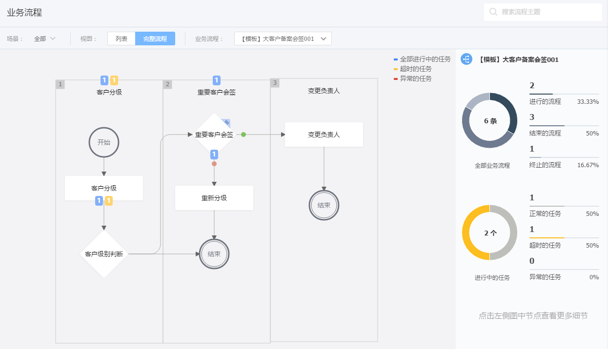
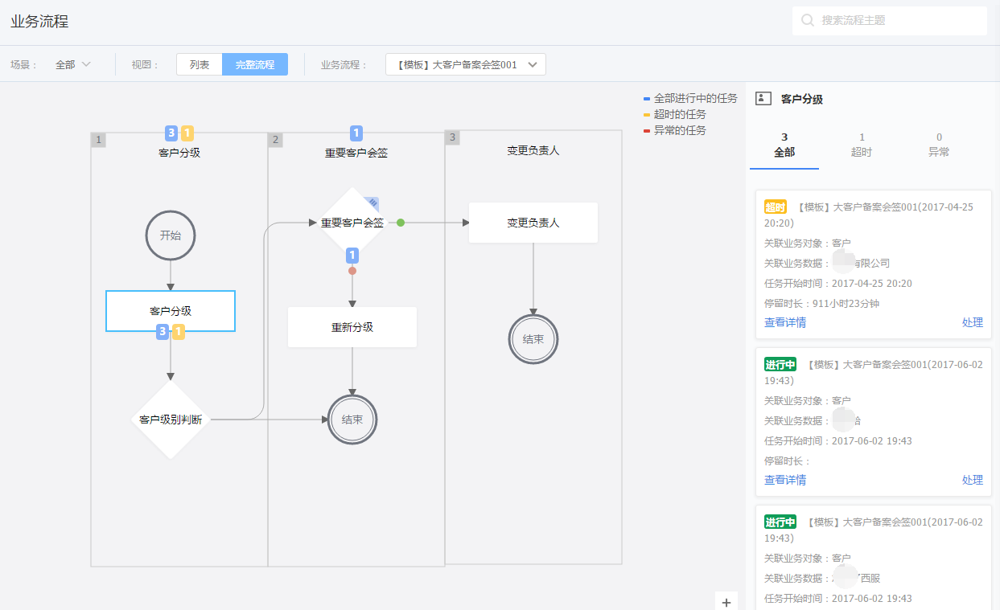
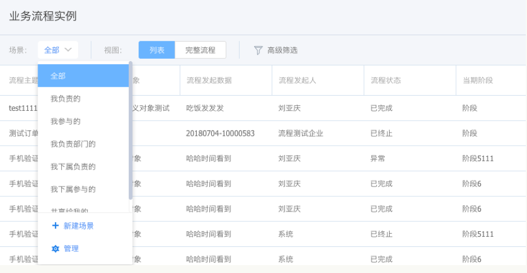

# 业务流程监控

---

业务流程监控下可以查看当前用户参与的或是下属参与的所有业务流程，在这个里可以切换不同的视图以便更直观的监控每一条流程的执行状态，及时了解业务流程进行到哪一阶段了，每一阶段下停留的任务数，超时的任务数等信息。

- 业务流程监控入口：我的工作台-业务流程

## 业务流程场景

- **全部**：业务流程发起人是当前用户或其下属，或者流程中某一任务由当前用户或其下属处理
- **进行中**：【全部】业务流程中，流程状态为“进行中”
- **已结束**：【全部】业务流程中，流程状态为“已结束”
- **已终止**：【全部】业务流程中，流程状态为“已终止”
- **我的流程**：业务流程发起人是当前用户，或者流程中某一任务由当前用户处理
- **我下属的流程**:业务流程发起人是当前用户下属，或者流程中某一任务由当前用户下属处理

 ## 业务流程视图

- 列表视图：以列表的方式展示业务流程
- 完整流程视图：直观展示指定业务流程的完整流程图，同时在流程图上显示每个阶段每个任务结点的全部任务数及超时的任务数，方便用户一眼便能了解业务流程的执行情况，比如当前停留在“方案设计”阶段的业务流程有多少个，当前有多少个任务超时等等。
    - 点击某一阶段时，可以在右侧查看本阶段未结束的具体业务流程。
    - 点击具体流程结点时，可以在右侧查看本结点未结束的具体业务流程。

通过完整流程直观监控业务流程的进展情况，及时发现问题并跟进解决，提高工作效率。

- 流程列表支持自定义对象的场景

  

