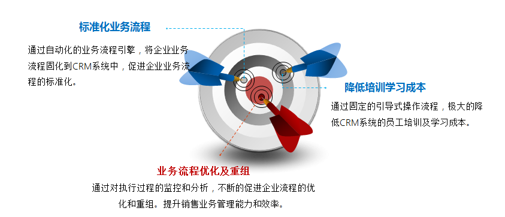
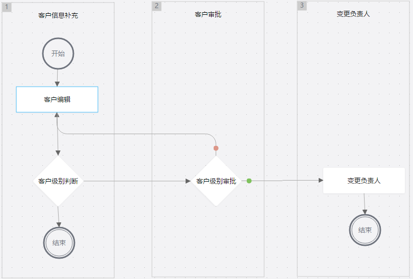

# 业务流程管理

---

业务流程管理是一整套企业梳理业务流程，建模，多方参与且自动化执行，持续监控执行过程，并不断分析改进的管理过程和方法。对于纷享CRM来说，您可以将各个业务对象的业务操作通过业务流程建模固化，销售人员只需按配置好的业务流程完成当前待自己执行的任务即可。

比如“大客户备案审批流程”，销售新建客户后，在跟进过程中补充客户信息，如果定级为大客户，需要审核并重新指定销售跟进。这个示例中涉及三个业务操作，一是编辑客户信息，二是客户审批，三是更换客户负责人。此时你可以将这三个业务操作固化为业务流程，销售人员按此配置完成任务即可。

通过业务流程管理将企业业务流程固化到CRM系统中，促进企业业务多人协同处理，提高工作效率，促进企业业务流程标准化和规范化。
另一方面流程在执行过程中引导式的操作，极大降低CRM系统的员工学习成本，只需完成指定任务即可。同时员工可以随时查看完整业务流程，清晰获取业务流程路线，提高企业业务透明度和员工归属感，知道自己的工作对企业的重要性。

## 业务场景举例
### 场景描述
大客户备案审批流程：销售新建客户后，在跟进过程中补充客户信息，如果定级为大客户，需要审核并重新指定销售跟进。

### 场景分析
- “跟进过程中补充客户信息”：即编辑客户信息，可配置“业务活动”编辑客户信息。
- “定级为大客户”：即根据客户信息判断，如果是重要客户则需要审批。可添加“分支节点”作判断。
- “需要审核”：即审批。添加“审批”业务元素
- “重新指定销售”:即更换负责人。可以添加“业务活动”，并配置执行业务为“更换负责人”。
- 根据完整描述，可以将此流程分为三个阶段“客户信息补充”、“客户审批”、“变更负责人”。您可以根据实际业务划分阶段，以便清晰了解业务的流转过程。

### 场景配置

1. 新建业务流程，定义业务流程基本属性。
    - 流程名称：大客户备案审批流程
    - 流程发起对象：客户
    - 适用范围：销售部
2. 流程配置：进入流程设计器
    - 流程阶段：拖拽三个“阶段”，并编辑阶段名称，分别为“客户信息补充”、“客户审批”和“变更负责人”。
    - 补充业务元素和基本元素，如开始、结束和路径等。
    - “客户信息补充”阶段添加业务活动“客户编辑”和分支节点“客户级别判断”。
        - “客户编辑”：即补充客户信息。客户初步创建后，销售人员可以并不能完全掌握客户信息，需要在跟进中逐步接触了解更多，所以这一阶段为补充客户信息。 
            - *业务名称：客户编辑*  
            - *业务描述：补充客户信息，重点判定客户级别*
            - *本业务活动针对哪个对象：客户*
            - *需要做什么事情：编辑对象（编辑客户对象）*
            - *编辑哪条记录：流程发起记录*
            - *配置要编辑的字段：客户级别（必填）、客户类型、备注。*
            - *谁来处理业务：流程发起人。*
        - 客户级别判断：系统自动判断客户级别，如果是重要客户，则选择领导审核；如果非重要客户，则不需要审核，可结束当前流程。
            - *名称：客户级别判断*
            - *判断描述：客户级别判断*
            - *满足以下条件进入‘客户级别审批’：流程发起记录中，客户级别等于重要客户*
            - *满足以下条件进入‘结束’：流程发起记录下客户级别不等于重要客户*。
    - “客户审批”阶段下添加审批节点“客户级别审批”
        - “客户级别审批”：即客户补充信息审批，确认是否为重要客户。
            -  *名称：客户级别审批*
            -  *业务描述：重要客户会签*
            -  *审批哪个业务：流程发起记录*
            -  *谁来审批：记录相关人员--> 记录负责人所在部门的负责人*
            -  *审批———后进入变更负责人：同意*
            -  *审批———后进入客户编辑：不同意*
            -  *业务停留n小时超时：24小时*
    -  “变更负责人”阶段下添加业务活动“变更负责人”
        - “客户负责人”：即如果是一位重要客户，则指派一位更加专业的销售人员更进，以保证赢率。
            - *业务名称：变更负责人*
            - *业务描述：变更负责人*
            - *本业务活动针对哪个对象：客户*
            - *需要做什么事情：操作对象（操作客户对象）*
            - *执行什么操作：更换负责人*
            - *编辑哪条记录：流程发起记录*
            - *谁来处理业务：记录相关人员--> 记录负责人所在部门的负责人*
    - 流程保存，保存后即发布。在适应范围内的人可以发起流程了。
    

    ​    

