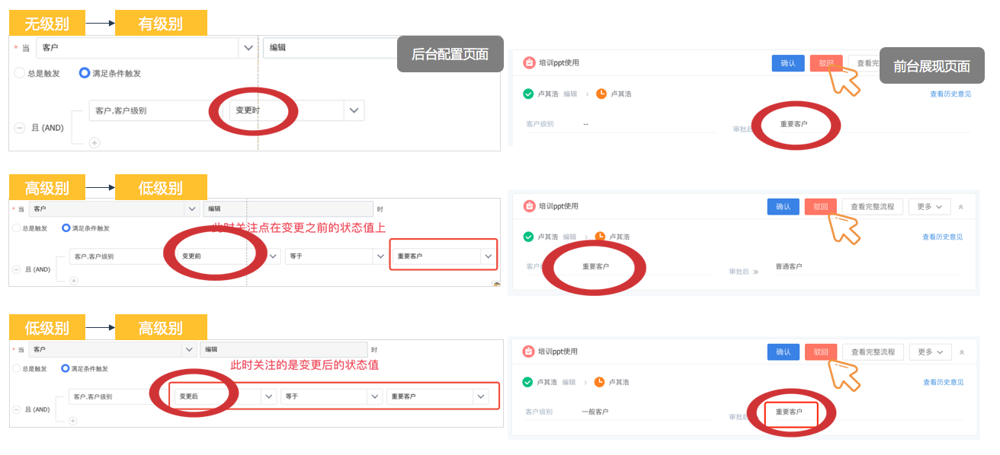
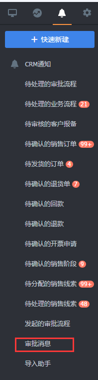

# 审批流程设置

---

审批流程设置包括以下几个部分：
- [审批流程设置](8-2-1审批流程设置.md#审批流程设置)
    - [基础设置](8-2-1审批流程设置.md#审批流程基本信息设置)
    - [触发器](8-2-1审批流程设置.md#触发器设置)
    - [过滤器](8-2-1审批流程设置.md#过滤器设置)
    - [流程设置](8-2-1审批流程设置.md#流程设置)
    - [审批后操作](8-2-1审批流程设置.md#审批后操作)
- [优先级](8-2-1审批流程设置.md#优先级)
- [其他功能点的关系](8-2-1审批流程设置.md#其他功能点的关系)
    -  [客户报备](8-2-1审批流程设置.md#客户报备功能)
    -  [自由审批](8-2-1审批流程设置.md#自由审批)

## 审批流程设置 ##

审批流程的设置设计5个主要部分

- 1，基本信息：审批流程名称，API名称，描述等

- 2，触发器：针对某个对象，某个动作，触发审批

- 3，过滤器：满足某种条件，才会触发审批，过滤条件为对象的字段，支持变量的比较

- 4，流程设置：有某些人，部门，角色，用户组，某部门负责人，提交人所在主部门的上级领导审批，支持单人，多人，会签类型

- 5，审批后操作：审批结束后，根据通过和驳回，系统自动完成的动作

![image_1bos2hp78ig61u69dp9bggegc1t.png-555.1kB][1]

---
#### 审批流程基本信息设置 ####

设置审批流程名称，API名称，审批流程描述

注意：
 - API名称为后续调用使用，新建后不能修改
 - 审批流程的API名称统一为appr开头
     ![image_1bos2ii0utqp183o1p341rcakke2a.png-207.3kB][2]
---
#### 触发器设置 ####

 - 设置针对某个对象的审批，由那个对象触发

 - 触发类型：新建、编辑、作废、领取、退回、更换负责人、自定义按钮

 - 编辑触发审批

 - 场景1：订单金额变动时需要财务主管审批。

 - 场景2：项目变动，需要项目经理审批。

 - 场景3：需求变更需要开发负责人审批。

 - 触发条件：编辑，并且满足条件，就会触发编辑的审批
    后台配置

    ![image_1c853msvmjfe1d91dgc1cns9ck9.png-25kB][3]

前台展示

![image_1c853nik421qr45hun1hhs1rvom.png-57.8kB][4]

注意：

- 针对对象的设置，后续不可以修改，因为过滤器设置和后动作设置都依赖对象

- 动作可以多选

![image_1bos2n0fu8h7172so7d17mq1u2l34.png-27.5kB][5]

![image_1c1cmta9rb1n130c10ai8u31kqt2q.png-37.1kB][6]

如果是主从关系的审批，触发流程时可以配置是否锁定从对象的数据

- 领取、退回、更换负责人、自定义按钮可触发审批

> 场景：企业为了管控公海，线索池里比较杂乱的数据，不能任意的被销售领取，退回，需要公海管理员/线索池管理员审批，通过后才能领取成功

---

#### 过滤器设置 ####

针对触发后的审批流程，可以根据字段进行过滤，只有满足过滤条件的数据，才会执行审批流程和后动作。

其中，时间型，数值型支持变量过滤，变量为触发器中的对象下的同类型字段，和对象下查找字段关联的对象下的字段。例如触发器中的对象为销售订单，订单下有一个字段为客户，那么变量范围为销售订单和客户下的同类型字段。

![image_1bos2np096lbuj510p91udn1g953h.png-189.1kB][7]

有些客户企业可能希望针对不同的部门设置不同的审批流程。纷享销客CRM中每个对象的数据有一个负责人字段，每个负责人都有一个主部门，可以根据负责人的主部门进行过滤，实现设置不同审批流程的需求。

![image_1bos2q4ss1dlt18roful7ndab64b.png-179.6kB][8]
过滤条件支持lookup对象的字段
场景：根据客户等级筛选出等级为vip1的客户下的所有订单。 
![image_1c8547h4010cd1gm81j02qji88s4e.png-29kB][9]

- 审批流过滤条件增加变更前，变更后比较符

> 什么是变更时？ 
> 答：特定条件下特定字段变更了就触发审批 
> 场景：当客户级别变更时，需要负责人直属上级审批

> 什么是变更前？ 
> 答：变更前的字段等于特定字段值时，触发审批 
> 场景：当客户级别变更前等于重要客户时，需要负责人直属上级审批

> 什么是变更后？ 
> 答：变更后的字段等于特定字段值时，触发审批 
> 场景：当客户级别变更后等于重要客户时，需要负责人直属上级审批。

---

#### 流程设置 ####

##### 审批人员设置 #####

审批过程中，最重要的就是各级审批的设置，当前版本支持最多100个审批节点

审批节点中，支持三种类型，普通审批节点，层级审批节点，逐级审批节点。

![image_1bos4bdbb1beq1gaq9nerm1ir99.png-16.8kB][10]

-  审批流节点可配置通过和驳回两种后动作

> 场景：订单审批流程，需要在每个节点通过或者驳回通知销售（新建订单的人）通知内容：节点名称，被XXX通过/驳回了，审批意见：数量不对，库存不足。

普通审批节点中，可以选择的范围包括同事，部门，部门负责人，用户组，角色。
审批人可以选择数据相关变量

![image_1c854crut1ev117suh021s651au958.png-36.4kB][11]

注意：如果选择了部门，用户组，则其内部包含的人员都会参与审批

![image_1bos4cmll17bcsaloi31afn1ssnm.png-31.5kB][12]

注意：如果选择超过一个人进行审批，则要选择多人审批和会签审批。

- 多人审批：一人通过，则通过；一人驳回，则驳回

- 会签审批：所有人通过，则通过；一人驳回，则驳回

![image_1bos4e337140k1lg3dar2fr1uk713.png-26.2kB][13]

![image_1c1cj6rg05ge12v7jaj4h713079.png-27.4kB][14]
层级审批节点，可以选择本级部门、上一级、上两级、上三级部门负责人审批

![image_1c1cl5nl615gm1thb1u1h159k1nodm.png-28.3kB][15]

当提前交人就是所选部门负责人或所选负责人超过公司最高级别时，可以选择指定审批人（当前版本只支持选择单人）、流程终止两个选项

![image_1c1cl9lqt1m425v111v4t4id213.png-31.7kB][16]
逐级审批节点，可以选择一级到十级部门负责人审批
![image_1c1claa1i18t91ujmlh8ego17g41g.png-25.4kB][17]
当提交人超过或等于固定级别时，可以选择由上一级部门负责人审批、终止流程、指定审批人（当前版本只支持选择单人）

注意：“CRM管理”-“功能权限管理”-“审批权限设置”设置了审批人和数据负责人主属部门的关系。例如，订单管理员角色中，A负责销售一部的审批，B负责销售二部的审批，如果审批节点选择了订单管理员，提交的数据负责人主部门为销售一部，则此时A可以审批，B不能审批。

![image_1botjeil7vpc1jiai9msfl2baaj.png-76kB][18]

客户企业设置审批流时，有时候需要根据提交人设置对应的部门负责人，纷享销客CRM支持层级审批，可以根据提交人，直接选择提交人所在主部门的部门负责人来进行审批，最大支持上三级部门，如果上N级部门超过了组织架构树，则该节点直接通过。

![image_1bos4enis1e9f1fjb13ap138e1nak1g.png-17.8kB][19]

客户企业设置审批流时，有些情况需要审批到某一级别，如重要客户的报备审批需要审批到二级部门负责人（副总）的层次，不论提交人属于某一层次。纷享销客CRM审批，提供逐级审批功能，满足客户上述需求。

![image_1bos4tqiuqsm10t41j3u1f68j4v9.png-26.8kB][20]

---

##### 支持分支 #####

审批过程中，需要根据不同情况，需要不同的人员进行审批，此时需要对流程进行分支设置。例如下面实例场景。

![image_1bos57elvrase9egup1kr64nc13.png-85.4kB][21]

在设置流程的时候，可以选择进行设置分支

![image_1bos522ug30qu651hfp13l417qtm.png-20.8kB][22]

![image_1c1cln26m1rs0pdn461ucf17032d.png-26.7kB][23]
设置分支后可以设置分支条件
![image_1bos5qib41tm217n61d947st1dab2d.png-24.4kB][24]

然后选择对应分支的审批人

![image_1bos5ol0q1d641bg33rjhaa1gc20.png-31.5kB][25]
如果多个分支条件都满足，按照优先级的设置，进入高优先级的分支。

![image_1bos5uln5c0p182e129cqrf1rus37.png-25kB][26]

如果所有分支都不满足，进入默认分支
![image_1bos5v917t1485l1atp1bna16hn3k.png-24.3kB][27]

##### 支持当前审批人操作数据 #####

审批过程中，不能对数据进行修改。但是，很多审批场景需要审批人能够对数据进行操作，例如针对开票申请的审批，需要财务人员在该节点进行发票票号的录入。允许管理员在设置审批的时候，对相应节点进行配置，允许审批人可以操作数据。

![image_1botlf39v2hjont1ec31qfiarjbq.png-13.4kB][28]

---

#### 审批后操作 ####

审批流程结束以后，审核功能和职能确认工作已经完成，很多客户希望审批完成后能够自动完成一些操作，使流程运转的更顺利。纷享销客CRM的审批流程设置支持用户设置审批后动作，来满足客户上述需求。

纷享审批流支持每个节点后完成后动作，也支持流程结束后执行的后动作。

最新版本支持CRM提醒，更新字段，邮件通知，数据操作，数据锁定/解锁等操作，每个节点，包括结束节点的通过和驳回后，每个节点最多支持10个后动作。

每个节点通过后，支持的后动作包括：CRM提醒，更新字段，邮件通知

![image_1botgdvlfleu1u3d1qn2gv2dtr1m.png-20.6kB][29]

流程彻底通过，或者结束后，支持的后动作包括：CRM提醒，更新字段，邮件通知，数据操作，数据锁定/解锁

![image_1botgia1s1taib2khsm1kl51uo42g.png-15.9kB][30]

可以针对审批确认后和驳回后分别设置

**发送CRM提醒**

发送CRM提醒时，需要选择提醒人，提醒内容的标题和正文。

注意：审批通过或者驳回后会自动发消息给审批提交人。

针对提醒人，可以选择的范围同普通审批节点，和如下所示的变量。

![image_1botgluj81m3a10bfcps13r3og3t.png-30.1kB][31]

在标题和正文中可以支持变量，变量范围同过滤器中的范围，同时支持3个审批特有的变量：审批提交人，审批提交时间，审批结束时间。

![image_1botgocak1omn1igo1qp519fdmk74a.png-47.8kB][32]

该消息将发送到审批消息中

**字段变更**

支持更新字段的类型包括，选择类型字段（布尔，单选，多选），数值类型字段（整数，小数，金额），时间类型，人员字段。
![image_1c854592b1vq018bs1lvejou1d5q41.png-32.8kB][33]

支持更新字段范围包括自定义字段和部分预定义字段。

其中：

- 数值类，时间类可以支持变量，变量范围同过滤器设置

- 数值类可以支持公式，逻辑同计算型字段。
- 审批意见可以赋值给多行文本字段
- 场景：作为销售，自己的订单，无法直观的看到订单的审批意见。

---

![image_1c854a55tfcm1e8l173412haul4r.png-46.6kB][34]

注意：

当字段变更后的值不符合规则或者出现异常时，则该字段不变更。如：

- 将必填字段变更为空值时，则该必填字段不变更

- 将字段A变更为 字段B 除以 字段C（C值=0）时，则该字段A不变更

- 整数字段A最大支持18位，计算结果超过18位，无法赋值，则该字段A不变更

- 当对象内出现某些逻辑异常时

- 等

![image_1botgvbqc10hh1b7ucr2lh2n5v57.png-52.9kB][35]

**发送邮件**

流程可以发送邮件给系统内部人员，或则外部人员的邮箱。
首先请在系统邮箱设置中设置邮件发送的邮箱

![image_1bothfq8r4i0qn91ap3e3j1oju61.png-65.2kB][36]

配置邮接收人，也允许用户直接写入邮箱
![image_1bothdgvl1uaqilqf461eh217dg5k.png-32.7kB][37]

![image_1bothlk5h1hph1r1ert5n91gdi6e.png-27kB][38]

然后选择你希望发送的邮件模板，模板中设置了邮件的标题和正文

![image_1bothp0q31gu8k56g9gvpu1cki6r.png-30.7kB][39]

**数据锁定和解锁**

针对单据类的对象，如合同，订单，开票申请等，用户期望审批结束后，数据已经审核完毕，希望直接加锁以保证数据的正确性。

![image_1bothqupe1q30103i177a12v14i778.png-21.4kB][40]

**发起业务流程**

记录类型的对象，在创建后，经过审批确认数据有效性，则希望直接发起相关流程，开始销售业务。例如商机审批通过后，即开始一个商机跟进的业务流程

![image_1boti7mnj149l4rg8gi1ms2bd97l.png-14.4kB][41]

**业务操作**

纷享销客目前针对很多对象有CRM业务操作，客户希望审批流程进行中，能够自动执行相关操作。

目前支持客户的退回公海，公海转移。

![image_1botiogtf1ui3jvu5vu1m951e7c9c.png-13.7kB][42]

---

### 优先级 ###

针对一个对象可以建立多个审批流程。

当客户的某一操作触发审批流程时，有可能会出现超过一条审批流程被匹配的情况。应该只能触发一条审批流程才符合逻辑。所以客户可以设置审批流优先级，出现上述情况时，会使用优先级高的流程进行审批。

![image_1botir6kb1kqi116215vceispaj9p.png-284.3kB][43]

---
### 审批流异常处理方案

1. 审批人异常——管理员可以更换审批人
    ![image_1c853v0f81thp1ndse7j9rbgd513.png-51.7kB][44]
2. 后动作字段更新异常——提交人/数据负责人可以重试，管理员可以重试，忽略，撤回流程
    ![image_1c853vqlp15mq1mu0n3e1tp7c20.png-28.3kB][45]
3. 后动作操作异常——提交人/数据负责人可以重试，管理员可以重试，忽略，撤回流程
      ![image_1c8540cun9op1it11lis1gfrdmi2d.png-22.2kB][46]
4. 后动作触发业务流程异常——提交人/数据负责人可以重试，管理员可以重试，忽略，撤回流程
      ![image_1c8540q3q16k5916na51usn1h7n2q.png-24.5kB][47]
5. 后动作锁定、解锁异常——提交人/数据负责人可以重试，管理员可以重试，忽略，撤回流程
    ![image_1c854180s4s4ed1ule15gn36p37.png-61.3kB][48]
    ![image_1c8541hpca35nqtsoj1fj51krr3k.png-61.3kB][49]

### 其他功能点的关系 ###

#### 客户报备功能 ####

为了更灵活方便的进行客户报备,CRM现已提供审批流程管理，建议您尽快设置客户的审批流程，然后关闭客户报备。**客户报备功能不再推荐使用**。

关闭客户报备功能后，将直接移除客户报备功能。

新企业和5.6发版时没有开启客户报备功能的企业，则直接不再提供客户报备功能。

如果开启客户报备功能，则不能使用针对客户的审批流程管理。

#### 自由审批 ####

之前版本，销售订单，退货单的新建操作支持自由审批流程。**后续不再推荐使用**。

请在“审批流程管理”的“自由审批设置”中关闭自由审批。

![image_1botj0svf19761i6ri1a5mgp5a6.png-85.7kB][50]

针对销售订单和退货单的新建操作。

为了兼容历史，支持审批流程设置与自由审批的切换

- 如果自由审批开启，则新建执行自由审批

- 如果自由审批关闭，且有启用的审批流程设置，执行审批流程设置

- 如果自由审批关闭，且没有启用的审批流程设置，则不用执行审批，状态直接是已通过

[1]: ./images/image_1bos2hp78ig61u69dp9bggegc1t.png
[2]: ./images/image_1bos2ii0utqp183o1p341rcakke2a.png
[3]: ./images/image_1c853msvmjfe1d91dgc1cns9ck9.png
[4]: ./images/image_1c853nik421qr45hun1hhs1rvom.png
[5]: ./images/image_1bos2n0fu8h7172so7d17mq1u2l34.png
[6]: ./images/image_1c1cmta9rb1n130c10ai8u31kqt2q.png
[7]: ./images/image_1bos2np096lbuj510p91udn1g953h.png
[8]: ./images/image_1bos2q4ss1dlt18roful7ndab64b.png
[9]: ./images/image_1c8547h4010cd1gm81j02qji88s4e.png
[10]: ./images/image_1bos4bdbb1beq1gaq9nerm1ir99.png
[11]: ./images/image_1c854crut1ev117suh021s651au958.png
[12]: ./images/image_1bos4cmll17bcsaloi31afn1ssnm.png
[13]: ./images/image_1bos4e337140k1lg3dar2fr1uk713.png
[14]: ./images/image_1c1cj6rg05ge12v7jaj4h713079.png
[15]: ./images/image_1c1cl5nl615gm1thb1u1h159k1nodm.png
[16]: ./images/image_1c1cl9lqt1m425v111v4t4id213.png
[17]: ./images/image_1c1claa1i18t91ujmlh8ego17g41g.png
[18]: ./images/image_1botjeil7vpc1jiai9msfl2baaj.png
[19]: ./images/image_1bos4enis1e9f1fjb13ap138e1nak1g.png
[20]: ./images/image_1bos4tqiuqsm10t41j3u1f68j4v9.png
[21]: ./images/image_1bos57elvrase9egup1kr64nc13.png
[22]: ./images/image_1bos522ug30qu651hfp13l417qtm.png
[23]: ./images/image_1c1cln26m1rs0pdn461ucf17032d.png
[24]: ./images/image_1bos5qib41tm217n61d947st1dab2d.png
[25]: ./images/image_1bos5ol0q1d641bg33rjhaa1gc20.png
[26]: ./images/image_1bos5uln5c0p182e129cqrf1rus37.png
[27]: ./images/image_1bos5v917t1485l1atp1bna16hn3k.png
[28]: ./images/image_1botlf39v2hjont1ec31qfiarjbq.png
[29]: ./images/image_1botgdvlfleu1u3d1qn2gv2dtr1m.png
[30]: ./images/image_1botgia1s1taib2khsm1kl51uo42g.png
[31]: ./images/image_1botgluj81m3a10bfcps13r3og3t.png
[32]: ./images/image_1botgocak1omn1igo1qp519fdmk74a.png
[33]: ./images/image_1c854592b1vq018bs1lvejou1d5q41.png
[34]: ./images/image_1c854a55tfcm1e8l173412haul4r.png
[35]: ./images/image_1botgvbqc10hh1b7ucr2lh2n5v57.png
[36]: ./images/image_1bothfq8r4i0qn91ap3e3j1oju61.png
[37]: ./images/image_1bothdgvl1uaqilqf461eh217dg5k.png
[38]: ./images/image_1bothlk5h1hph1r1ert5n91gdi6e.png
[39]: ./images/image_1bothp0q31gu8k56g9gvpu1cki6r.png
[40]: ./images/image_1bothqupe1q30103i177a12v14i778.png
[41]: ./images/image_1boti7mnj149l4rg8gi1ms2bd97l.png
[42]: ./images/image_1botiogtf1ui3jvu5vu1m951e7c9c.png
[43]: ./images/image_1botir6kb1kqi116215vceispaj9p.png
[44]: ./images/image_1c853v0f81thp1ndse7j9rbgd513.png
[45]: ./images/image_1c853vqlp15mq1mu0n3e1tp7c20.png
[46]: ./images/image_1c8540cun9op1it11lis1gfrdmi2d.png
[47]: ./images/image_1c8540q3q16k5916na51usn1h7n2q.png
[48]: ./images/image_1c854180s4s4ed1ule15gn36p37.png
[49]: ./images/image_1c8541hpca35nqtsoj1fj51krr3k.png
[50]: ./images/image_1botj0svf19761i6ri1a5mgp5a6.png