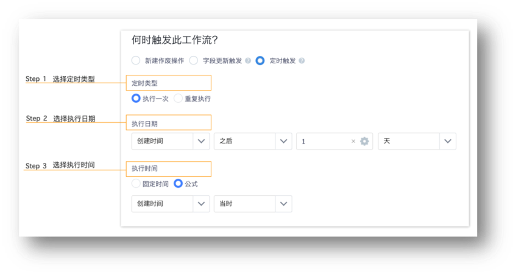
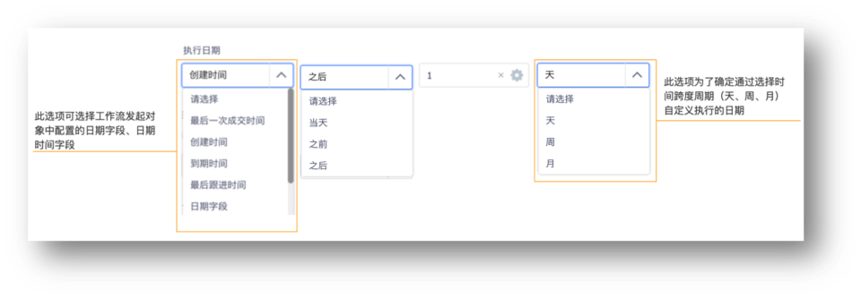
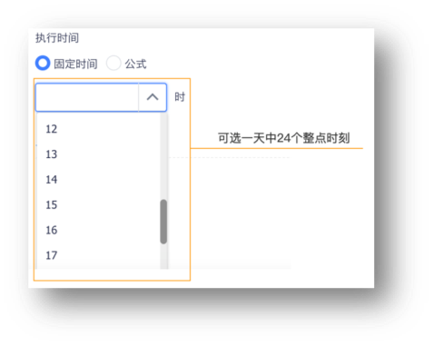
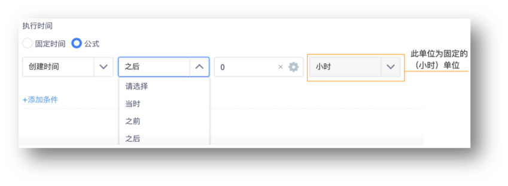
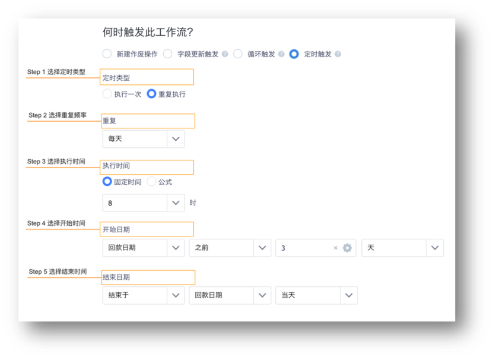
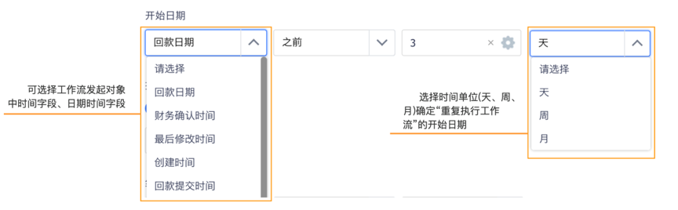
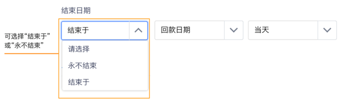

# 工作流配置

---

## 工作流配置
![image_1bpbab0lc6el19bb18s2gecel4m.png-64.8kB][1]

### 工作流基本信息设置
设置工作流名称，API名称，工作流描述，以及触发对象
注意：

 - API名称为后续调用使用，新建后不能修改
 - 工作流的API名称统一 为_crmwf结尾

![image_1bpbdp0241d0l13snbjd1q2m1b173k.png-28.7kB][2]

### 触发器设置
设置针对某个对象的某个动作触发工作流
注意：

 - 针对对象的设置，对象的操作设置后续不可以修改，因为过滤器设置和后动作设置都依赖对象

 - 对象和动作都是单选

     ![image_1bpbe2mkedht483c1mvv21j2v41.png-24.4kB][3]

 - 触发动作支持：

 - 新建
     新建一条数据满足条件触发工作流

 - 作废
     作废一条数据满足条件触发工作流

 - 字段变更
     字段变更触发工作流：字段变更包含手动编辑和后动作字段更新 

 - 场景：积分累计到一万分自动调整客户等级。 配置：过滤条件，配置积分大于一万分，后动作字段变更，客户等级等于高级客户。 

 - 字段变更触发工作流：目前只支持：客户，订单，销售线索，自定义对象。

 - 定时触发
> #### 什么是定时触发？ 
>
> ​      若crm对象数据新增和更新满足了触发工作流的配置条件，系统可自动匹配并计算出执行时间。最终在执行时间节点触发该工作流。目前，定时触发通过执行次数分为“执行一次”和“重复执行”两种定时类型。
> #### "执行一次"的定时触发
>
> ​       ***场景举例1***:用户新建订单数据后，次日提醒库管发货。假设创建订单日期是"2018年08年04日10:00"，计划次日10:00发送CRM提醒给库管人员，提醒库管人员发货。此类场景可通过配置"执行一次"对定时触发工作流实现。
>
> ​      场景对应配置图：
>
> 
>
> 步骤说明：
>
> ​        **Step 1    选择定时类型**
>
> ​       "定时类型"：工作流定时触发支持“执行一次”和“重复执行”两种定时类型。其中“执行一次”为此定时触发工作流仅执行一次，“重复执行”意为定时触发工作流可配置重复频率（每年、每月、每周、每天）触发工作流。其详细操作可查看下述**“重复执行”**的定时触发。
>
> ​       若实现上述"***场景举例1***"，管理员可在步骤选择"执行一次"
>
> ​         **Step 2    选择执行日期**
>
> ​        “执行日期”：管理员可选择工作流发起对象中，日期、日期时间字段，其中日期时间字段只获取其日期（年/月/日）
>
> 
>
> ​       若实现上述"***场景举例1***"，在此步骤管理员可配置“创建时间——之后——1——天”，系统可计算得出工作流执行日期为2018年8月5日。具体执行时间在**Step 3**配置。
>
> ​         **Step 3**     **选择执行时间**
>
> ​       “执行时间”：管理员可通过选择“固定时间”和“公式”两种类型来确定执行工作流的时间。
>
> ​        固定时间： 一天内24个整点时刻
>
> 
>
> ​          公式：管理员可选择工作流发起对象中日期时间、时间字段，其中日期时间字段只获取其时间（时/分/秒)。
>
> 
>
> ​       若实现上述"***场景举例1***"，管理员可配置“创建时间-当时”。
>
> 通过以上3个步骤可管理员可结合实际需求场景配置“执行一次”的定时触发工作流。
>
> #### "重复执行"的定时触发
>
> ​       ***场景举例2***：销售人员新建回款时，填写了“回款日期“字段为“1月6日”，管理员希望在”回款日期“当天以及之前三天（1月3、4、5、6日）的每天8：00发送CRM提醒，提醒该回款负责人执行操作。此类场景可通过配置”重复执行“的定时触发工作流实现。
>
> ​      场景对应配置图：
>
> 
>
> 步骤说明：
>
> ​        **Step 1    选择定时类型**
>
> ​        若实现“***场景举例2”***，CRM管理员在此步骤中可选择“重复执行”。
>
> ​        **Step 2    选择重复时间频率**
>
> ​        “重复执行”：目前支持“每天、每周、每月、每年”时间频率，管理员可根据场景需求选择。
>
> ​        若实现“***场景举例2”***，管理员在此步骤中可选择“每天”。
>
> ​        **Step 3    选择执行时间**
>
> ​         “执行时间”：管理员也可通过选择“固定时间”和“公式”两种类型来确定执行工作流的时间。
>
> ​         若实现“***场景举例2***”，CRM管理员在此步骤中可选择“固定时间——8时”。
>
> ​        **Step 4    选择开始时间**
>
> ​        "开始时间"：重复执行的定时触发的开始节点。管理员可选择工作流发起对象中，日期、日期时间字段，其中日期时间字段只获取其日期（年/月/日）
>
> ​         
>
> ​           若实现“***场景举例2***”，CRM管理员在此步骤中可选择“回款时间——之前——3——天“。
>
> ​        **Step 5    选择结束时间**
>
> ​           管理员可选择“结束于”一个工作流发起对象中日期、日期时间字段，其中日期时间字段只获取其日期（年/月/日）；也可选择“用不结束”从而不停止此定时触发工作流。
>
> 
>
> ​         若实现“***场景举例2***”，管理员在此之前步骤中可选择“结束于——回款时间——当天“。
>
> 通过以上5个步骤，管理员可结合实际需求场景配置相应的定时触发工作流。

### 过滤器设置
针对触发后的工作流，可以根据字段进行过滤，只有满足过滤条件的数据，才会执行工作流和后动作。

其中，时间型，数值型支持变量过滤，变量为触发器中的对象下的同类型字段，和对象下查找字段关联的对象下的字段。例如触发器中的对象为销售订单，订单下有一个字段为客户，那么变量范围为销售订单和客户下的同类型字段。

![image_1c851vqupkmg10351o1e2om1913g.png-40.6kB][5]

有些客户企业可能希望针对不同的部门设置不同的工作流。纷享销客CRM中每个对象的数据有一个负责人字段，每个负责人都有一个主部门，可以根据负责人的主部门进行过滤，实现设置不同工作流的需求。

![image_1c8522phv1vkh152lg4e211stg5d.png-37kB][6]

 - 工作流过滤条件支持lookup对象的字段
    ![image_1c852durv1e881vno1lv41a4a1a8v67.png-32.7kB][7]
 - 工作流过滤条件支持变更时选项
     ![image_1c852abd41l1g1562cds1rtl12rk5q.png-24.4kB][8]

 ![image_1bpbe2mkedht483c1mvv21j2v41.png-35.1kB][9]

### 工作流支持分支
- 工作流支持分支：工作流最大支持10个分支，超出10个分支给提示
  ![image_1boufjrki1t6t9ki1ggp13e71kam9.png-41.3kB][10]

### 工作流分支支持匹配下一条件
- 工作流支持匹配下一条件，匹配下一条件指的是，第一个节点通过后，需要判断下一个分支条件，满足条件继续执行
  使用场景：不同地区的客户分配给不同的客户经理，设置分支条件是地区，使用匹配下一条件，逐个判断执行后动作分配负责人
  ![image_1boufknjjhg7rm1iae1n1a14urm.png-19.5kB][11]

### 分支支持过滤器
- 分支支持过滤器：过滤器支持对象常用字段
  例如：订单成交金额大于10万的订单后动作发邮件通知销售的上级
  例如：订单成交金额大于100万的订单后动作发邮件通知全公司同事表扬等
  ![image_1bouic0d9r46jcc1e021u4u107g5v.png-20.1kB][12]

### 工作流支持后动作
工作流支持后动作

 - CRM提醒
    CRM系统是给内部员工发送的系统内部消息，提醒人可以选择数据相关变量，提醒内容可以选择工作流发起人，发起时间
    ![image_1c1cp4r6kuj21ik11cc6qdn1rf61g.png-46.6kB][13]

 - 字段更新
    字段更新支持当前对象及lookup对象的部分字段，数值类型和日期类型支持公式计算
    ![image_1c1cp0brgfbt1f5s1m0v1kdbmqtm.png-48.1kB][15]
    ![image_1c1cp0qoc19m3e90ud1m741ser13.png-45.5kB][16]

  - 分配负责人
      例如：客户级别是一级客户的分配给小王
        例如：客户来源是线下市场活动，则分配给小张
        ![image_1boui8kb34851oaptaqhlbfu35i.png-30kB][17]

 - 发送邮件

流程可以发送邮件给系统内部人员，或则外部人员的邮箱。并且支持lookup对象的邮箱字段
https://www.fxiaoke.com/mob/guide/6.2.0/crm/6.2/images/lc8.png![image_1c852ge6b10a6eg1ing6gd1tra6k.png-31kB][18]
![image_1c1cov68kave1uia6ifb6e16u19.png-41.2kB][19]

 - 数据锁定和解锁

针对单据类的对象，如合同，订单，开票申请等，用户期望审批结束后，数据已经审核完毕，希望直接加锁以保证数据的正确性。
![image_1botoaqn23s81uternj2v4hk2a.png-21.4kB][20]

 - 发起业务流程

记录类型的对象，在创建后，经过审批确认数据有效性，则希望直接发起相关流程，开始销售业务。例如商机审批通过后，即开始一个商机跟进的业务流程
![image_1botod3b013qbinqa61h5k10v2n.png-14.4kB][21]

 - 业务操作退回和转移

纷享销客目前针对很多对象有CRM业务操作，客户希望审批流程进行中，能够自动执行相关操作。

目前支持客户的退回公海，公海转移。
![image_1botoe81eks31jrv1ucat6f3sp34.png-13.7kB][22]

[1]: ./images/image_1bpbab0lc6el19bb18s2gecel4m.png
[2]: ./images/image_1bpbdp0241d0l13snbjd1q2m1b173k.png
[3]: ./images/image_1bpbe2mkedht483c1mvv21j2v41.png
[4]: ./images/image_1c850voq8gki1kcikbq160j1po12m.png
[5]: ./images/image_1c851vqupkmg10351o1e2om1913g.png
[6]: ./images/image_1c8522phv1vkh152lg4e211stg5d.png
[7]: ./images/image_1c852durv1e881vno1lv41a4a1a8v67.png
[8]: ./images/image_1c852abd41l1g1562cds1rtl12rk5q.png
[9]: ./images/image_1bpbe2mkedht483c1mvv21j2v41.png
[10]: ./images/image_1boufjrki1t6t9ki1ggp13e71kam9.png
[11]: ./images/image_1boufknjjhg7rm1iae1n1a14urm.png
[12]: ./images/image_1bouic0d9r46jcc1e021u4u107g5v.png
[13]: ./images/image_1c1cp4r6kuj21ik11cc6qdn1rf61g.png
[14]: ./images/image_1c1cp5fe71cqi1g7q1fpeda93vm1t.png
[15]: ./images/image_1c1cp0brgfbt1f5s1m0v1kdbmqtm.png
[16]: ./images/image_1c1cp0qoc19m3e90ud1m741ser13.png
[17]: ./images/image_1boui8kb34851oaptaqhlbfu35i.png
[18]: ./images/image_1c852ge6b10a6eg1ing6gd1tra6k.png
[19]: ./images/image_1c1cov68kave1uia6ifb6e16u19.png
[20]: ./images/image_1botoaqn23s81uternj2v4hk2a.png
[21]: ./images/image_1botod3b013qbinqa61h5k10v2n.png
[22]: ./images/image_1botoe81eks31jrv1ucat6f3sp34.png