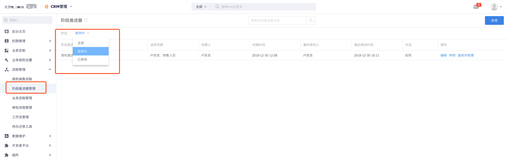
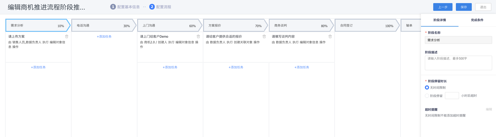
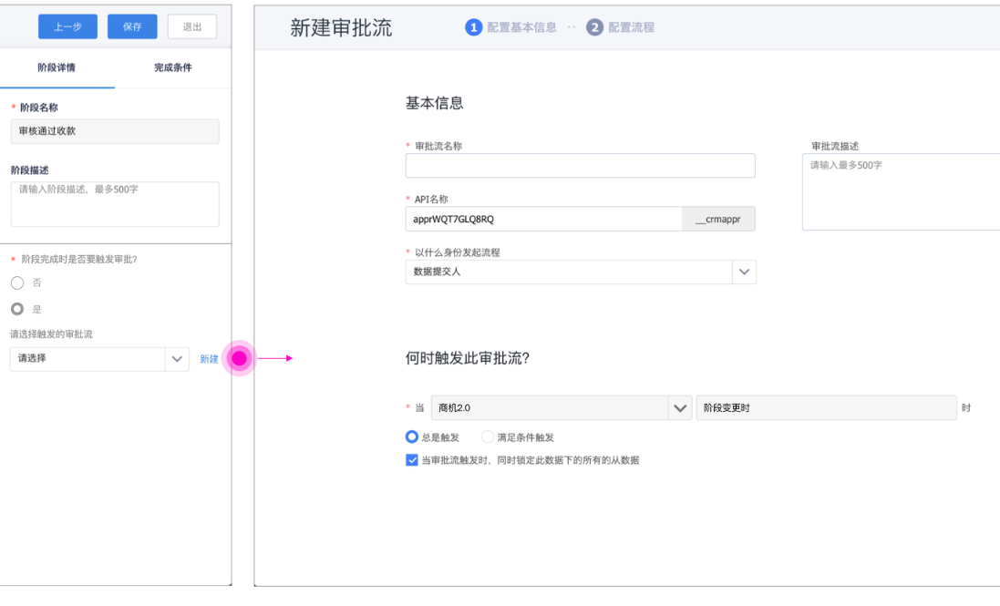
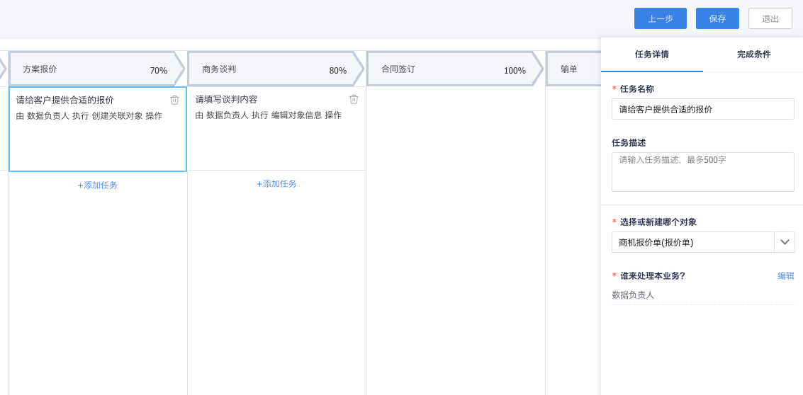
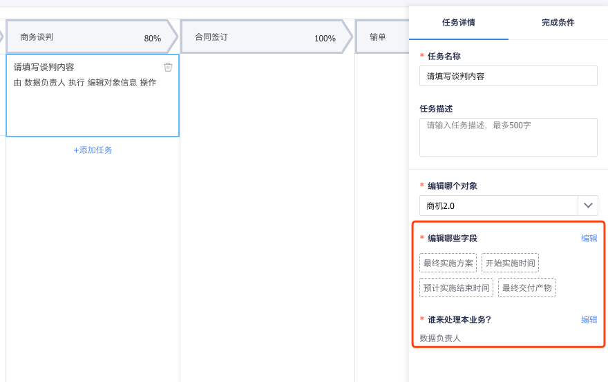
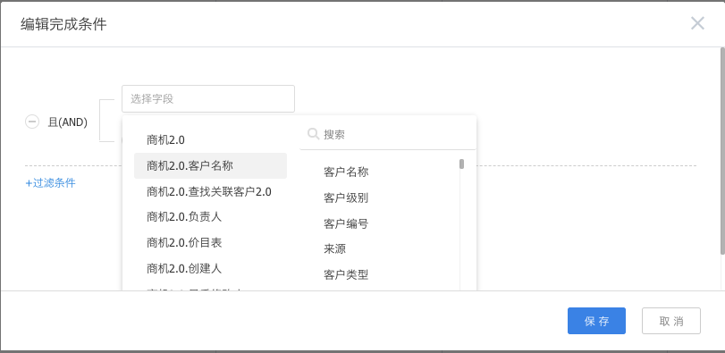

# 阶段推进器配置

阶段推进器配置包括以下几个部分：

- 阶段推进器列表管理
- 属性说明
  - 阶段
  - 阶段配置
  - 阶段完成条件
  - 阶段审批配置
  - 任务配置
  - 任务完成条件

## 阶段推进器列表管理

### 属性说明

- 流程名称：如：“商机阶段推进流程”，“线索跟进流程”等

- 流程描述：描述流程的用途或者是意义等信息。

- 适用范围：当前阶段推进器的适用范围，即只有在指定范围内的用户才可以发起此流程。

- 设置阶段：商机对象的一个阶段字段，所选的值从这个字段里选取，作为当前流程的阶段。

### 启用/停用

- 启用：只有启用中的流程可以被发起。
- 停用：已停用的流程不能被发起。如企业业务调整，流程已不再适用，可以将其停用，这样用户发起流程时不会看到此停用流程。

### 删除

可以将已停用的阶段推进器删除。流程删除后原阶段推进器实例仍支持查询和查看详情。

### 阶段配置

- 阶段名称：选取对象上的阶段字段值，不可修改。
- 阶段描述：描述阶段的用途或者是意义等信息。
- 阶段停留时长：
  - 无时间限制：不可配置超时提醒
  - 阶段停留XX小时候超时：可以配置超时提醒
- 超时提醒
  - 可添加超时前和超时后提醒
  - 提醒人员可以选择数据变量、人员、用户组、部门、角色、人员相关变量
  - 提醒内容可以选择数据变量

### 阶段完成条件

- 请选择进入下一阶段必须完成的任务
  - 列出该阶段下的所有任务，勾选后完成该阶段必须要完成任务

### 阶段审批配置

- 阶段完成时是否需要触发审批

  - 默认否

  - 选择是，可以选择触发的审批流

    

### 任务配置

- 任务有两种类型：新建类型的任务、编辑类型的任务
  - 新建类型的任务可以新建查找关联当前对象的所有对象，例如：“当前对象是商机，可以新建订单对象，自定义关联商机的对象。
  - 编辑类型的任务可以编辑当前对象及当前对象查找关联的对象，例如：“当前对象是商机，可以编辑商机对象也可以编辑商机查找关联的客户对象”。
- 新建类型的任务
- 
  - 任务名称
  - 任务描述
  - 新建哪个对象
  - 谁来处理任务
- 编辑类型的任务
- 
  - 任务名称
  - 任务描述
  - 编辑哪个对象
  - 编辑哪些字段
  - 谁来处理任务

### 任务的完成条件

- 满足以下条件此节点才可完成
  - 条件由当前对象及当前对象的关联对象的字段组成，还包括人员对象的字段，例如：”当前对象是商机，由商机及商机关联的客户对象的字段

