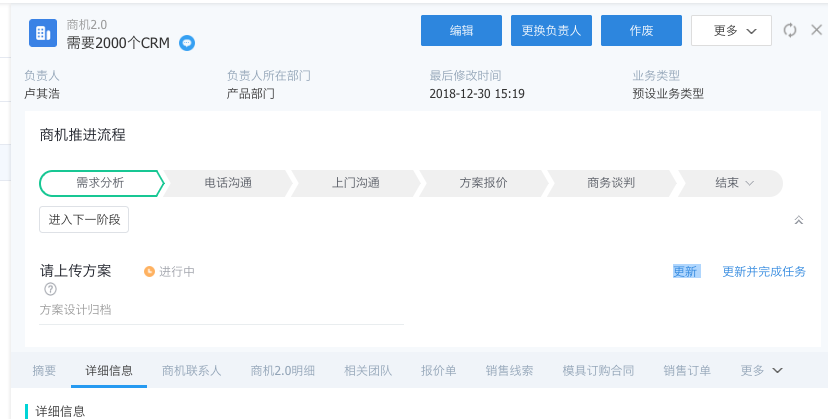

# 如何使用阶段推进器

## 如何发起阶段推进器

> 阶段推进器目前只支持商机2.0对象，在商机2.0对象里有一个销售流程的字段，该字段获取的是阶段推进器的名称，新建商机2.0数据时可以选择一个阶段推进器名称，保存时即可触发阶段推进器
>
> 新建商机2.0数据选择的阶段推进器名称，由当前登录人的身份获取适用范围是他的所有启用的阶段推进器

### 如何处理阶段推进器中的任务

#### 待处理的阶段任务

点击请上传方案这个任务进入商机详情页

点击更新，弹出任务填写页面

新建的任务处理

​	可以新建一个报价单，也可以选择一个与该商机关联的报价单

### 移动端阶段任务如何处理

待处理的阶段任务

点击进入待处理的阶段任务

点击一个待办任务

点击任务进入的是新建类任务的任务界面

编辑类任务的任务页面

