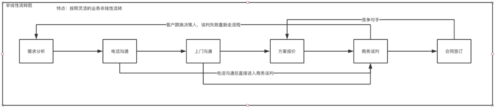
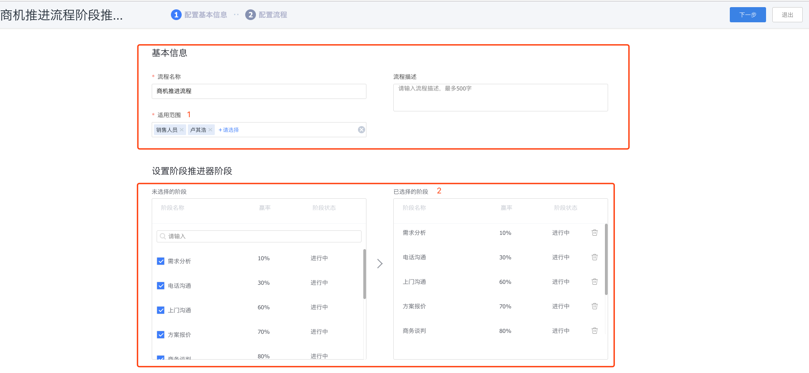
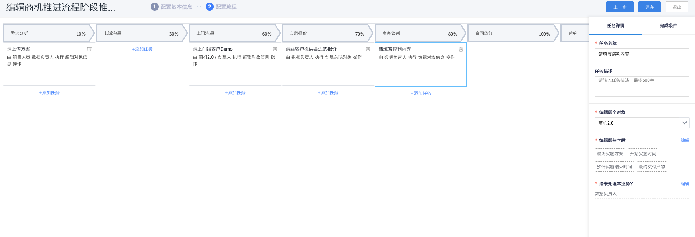

# 阶段推进器管理

## 阶段推进器概述及价值

阶段推进器是以流程的形态推动一个业务生命周期的全过程流转，匹配生命周期不同的阶段定义标准的业务动作，推动业务成功。

•特点：可逆转，可跳过，可重复执行

例如”客户的销售过程，一般分为几个主要的阶段（需求分析—电话沟通—上门沟通—方案报价—商务谈判—合同签订—成单）“阶段推进器能将客户的销售过程管理结合流程有计划，有目标的沉淀到系统里。

## 业务场景举例

商机推进流程：销售跟进商机，在跟进过程中分析客户需求，通过电话或上门沟通的方式获取需求，实施Demo及销售方案报价，商务谈判及合同整理，最终成单的整个过程管理。

### 场景分析

- 需求分析：即通过客户反馈的信息整合阶段推进器如何实现出实施方案能否满足客户需求，呈现在系统里就需要销售和实施出解决方案上传到这个商机下的需求方案设计里
- 电话沟通：需要销售或实施打电话给客户，反复确认方案与客户提出的需求是否吻合
- 上门沟通：客户的需求比较复杂，还需要上门当面沟通以及Demo演示给客户看
- 方案报价：这个阶段需要销售给客户提供报价，购买需求量，折扣等，呈现在系统里需要在商机下建一个报价单
- 商务谈判：需求搞定了，需要进入商务洽谈，怎么实施项目，具体什么时间交付等，呈现在系统里就需要填写实施系统的方案，最终定价，开始实施时间，结束时间，最终交付产物等
- 合同签订：将最终确定的文件都落到合同上，呈现在系统里需要新建一个合同数据

### 场景配置

#### 第一步

#### 第二步

1. 新建阶段推进器的基础信息。
   - 流程名称：商机推进流程
   - 流程描述
   - 适用范围：销售部、销售角色
   - 设置阶段：需求分析、电话沟通、上门沟通、方案报价、商务谈判、合同签订、赢单、丢单
2. 流程配置：进入流程设计器
   1. 流程阶段：需求分析、电话沟通、上门沟通、方案报价、商务谈判、合同签订、赢单、丢单
   2. 需求分析：配置请上传方案
      1. 任务名称：请上传方案
      2. 任务描述：需要销售与实施共同完成
      3. 编辑哪个对象：商机2.0
      4. 编辑哪些字段：方案设计归档，是一个附件字段
      5. 谁来处理：销售人员、或者是数据负责人
   3. 电话沟通：添加一个协同任务，需要打电话给某个客户
   4. 上门沟通：
      1. 任务名称：请上门给客户Demo
      2. 编辑哪个对象：商机2.0
      3. 编辑哪些字段：演示后客户是否满意，是一个单选字段，满意或不满意
      4. 谁来处理：创建人或者是销售角色或者是负责人
   5. 方案报价：
      1. 任务名称：请给客户提供合适的报价
      2. 创建哪个对象：报价单
      3. 谁来处理：创建人或者是销售角色或者是负责人
   6. 商务谈判：
      1. 任务名称：请记录谈判内容
      2. 编辑哪个对象：商机2.0
      3. 编辑哪些字段：最终落地方案（附件字段）、开始实施时间、预计实施结束时间、最终交付产物（附件字段）
      4. 谁来处理：创建人或者是销售角色或者是负责人
   7. 合同签订：
      1. 任务名称：与客户签订合同
      2. 创建哪个对象：合同
      3. 谁来处理：创建人或销售角色或者负责人
   8. 丢单：
      1. 丢单填写丢单原因：丢单原因（单选字段）
   9. 保存流程，保存后立即启用。在适用部门里的人可以发起该流程了。