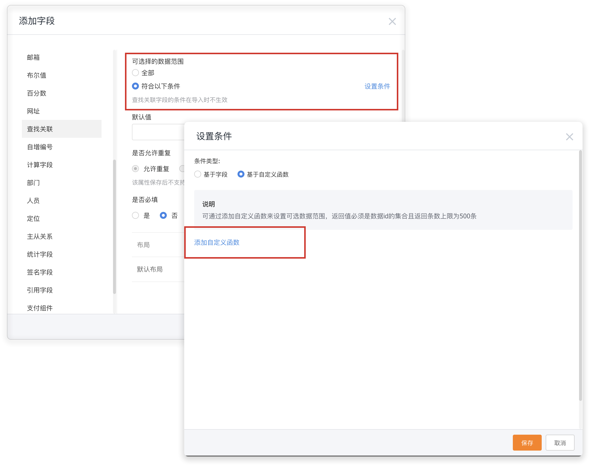

# 范围规则

&nbsp;&nbsp;&nbsp;&nbsp;&nbsp;用于在新建/编辑查找关联字段时，设置该字段可选择的范围

&nbsp;&nbsp;&nbsp;&nbsp;&nbsp;**配置方式**：在新建、编辑查找关联字段时，将可选择的数据范围设置为「符合以下条件」- 设置条件 - 基于自定义函数 - 添加自定义函数



**函数编写模板**：

```
//定义id List
List objectIds = []
...
//写函数逻辑，并将可选择数据Id添加到objectIds里
objectIds.add()

//最后返回的数据结果为 List<String>  里面包含满足条件的数据id
return objectIds
```

**实际场景**：报价单明细按产品分类限制可选择产品范围，不同业务类型的报价单明细选择不同分类的产品数据。

**根据以上实际场景的模板案例**：

```
//获取当前操作对象实例的字段值
String product = context.data.field_wPnHu__c
//根据条件查找数据,根据需要的业务逻辑查询出需要的数据
def ret = Fx.object.find("查找关联字段所对应的对象ApiName",[["field_1tG48__c":product]],100,0)
//如果查询错误直接return返回
if( ret[0] ){
  Fx.log.info("查询异常")
  return []
}
//定义id List
List objectIds = []
QueryResult result = ret[1] as QueryResult
//遍历查询结果，将所有Id添加到objectIds中
result.dataList.each{ item ->
  Map map = item as Map
  objectIds.add(map._id)
}
//最后返回objectIds
return objectIds
```