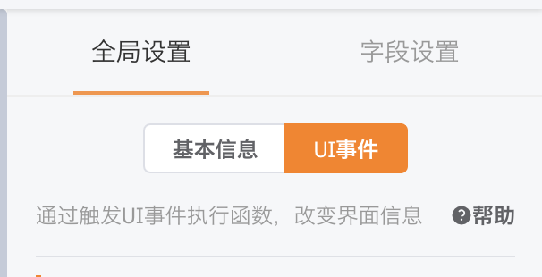
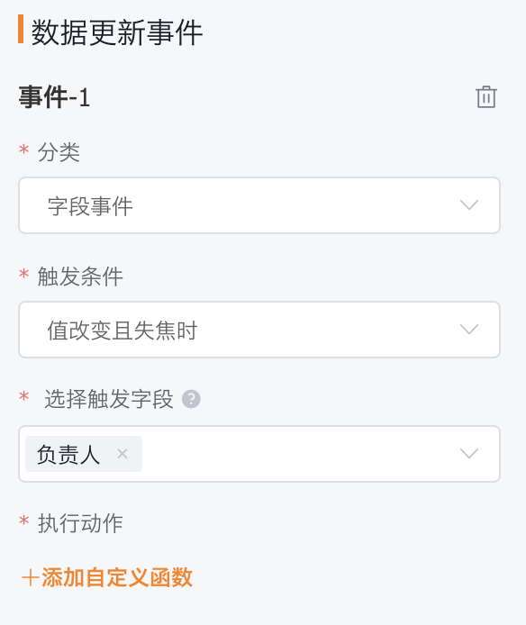
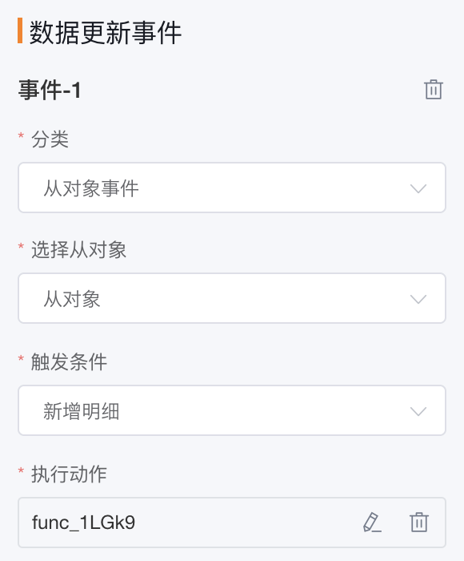
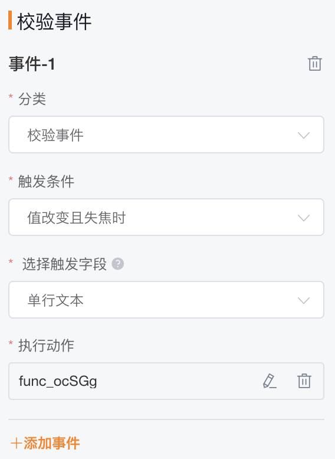

# UI事件

&nbsp;&nbsp;&nbsp;&nbsp;用于在新建/编辑页，当发生变更时进行数据更新/校验并反填回界面

&nbsp;&nbsp;&nbsp;&nbsp;**配置方式**：在对象管理的布局中，右侧全局设置中找到UI事件



&nbsp;&nbsp;&nbsp;&nbsp;&nbsp;注：1、从对象不支持触发UI事件

&nbsp;&nbsp;&nbsp;&nbsp;&nbsp;&nbsp;&nbsp;&nbsp;&nbsp;&nbsp;&nbsp;&nbsp;2、  UI事件的执行结果只作用在新建/编辑页，实际生效以是否保存为准

&nbsp;&nbsp;&nbsp;&nbsp;&nbsp;&nbsp;&nbsp;&nbsp;&nbsp;&nbsp;&nbsp; 3、自定义对象全部支持UI事件，预置对象部分支持（销售线索、客户、订单/订单产品、商机2.0/商机2.0明细）   

&nbsp;&nbsp;&nbsp;&nbsp;&nbsp;&nbsp;&nbsp;&nbsp;&nbsp;&nbsp;&nbsp;&nbsp;4、只有旗舰版和集团版支持该能力

### **数据更新事件**

1、在新建/编辑页，当某一字段修改（值改变且失焦）时，触发自定义函数来更新主对象或从对象的数据

**实际场景**：新建订单，当选择客户后，能够直接将客户的地址同步到到订单的送货地址字段上

**配置方式**：UI事件 — 添加数据更新事件 — 分类选择字段事件



**函数编写模板**：

```
//新建UIEvent事件
UIEvent event = UIEvent.build(context) { 
   //主对象修改数据
   editMaster(a: 1, b: 2) 
   
   //添加一条从对象,添加从对象,必须指定业务类型,而且是当前布局展示的业务类型 
   //如果业务类型不匹配.从对象无法添加
   addDetail "detailApiName" set(a: 1, b: 2)
   
   //根据条件删除 从对象, 删除为where中返回为true的从对象
   removeDetail "detailApiName" where { x -> (x["a"] as Integer) > 0 } 
   
   //根据条件编辑从对象 和上同理只会处理where 中返回为true的从对象数据
   editDetail "detailApiName" set(a: 1, b: 2) where { x -> (x["a"] as Integer) > 0 }
   
   //removeDetail和editDetail 都可以不添加where这样会直接作用于所有数据
   //set的内容和editMaster的内容要保证是map也就是key:valued的形式
   removeDetail "detailApiName"
   editDetail "detailApiName" set(a: 1, b: 2)
}
return event
```


2、在主从同时新建/编辑页，当新建/编辑/删除从对象时，触发自定义函数来更新主对象/从对象的数据（前提是该对象存在从对象，才会有从对象事件入口）

**实际场景**：每新增一条订单产品明细，根据客户的级别为该产品明细的优惠额度字段赋值

**配置方式**：UI事件 — 添加数据更新事件 — 分类选择从对象事件，触发条件可选新增明细/编辑明细/删除明细



**函数编写模板**：

```
UIEvent event = UIEvent.build(context) {
//主对象、从对象数据修改，详见上
} 
//获取当前操作的从对象数据
Map currentData = event.getCurrentDetail()
//修改当前操作的从对象数据（主要用于新建明细和编辑明细的场景下）
currentData.put("从对象字段的ApiName"，"该字段需要变更的值为")
currentData.put("从对象字段1的ApiName"，"该字段1需要变更的值为")
return event
```


### **校验事件：**

在新建/编辑页，当某一字段修改（值改变且失焦）时，触发自定义函数验证该字段值是否符合特定条件

**实际场景**：在填写手机号/邮箱格式错误时，能够立即给到前端提示

**配置方式**：UI事件 — 添加校验事件 



**函数编写模板**：

```
//红字提醒
Remind remind = Remind.Text("Text")
//弹窗提醒
Remind remind = Remind.Alert("Text")

return remind
```


