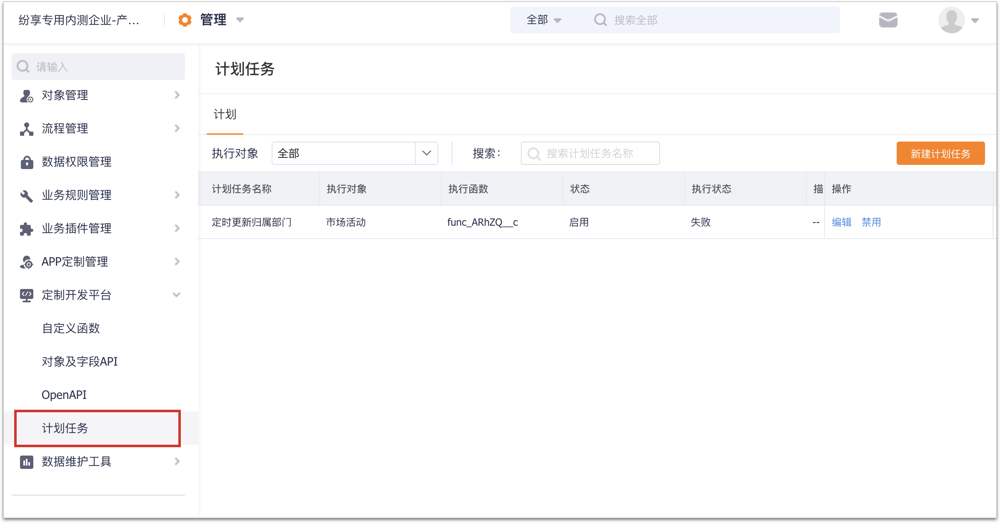
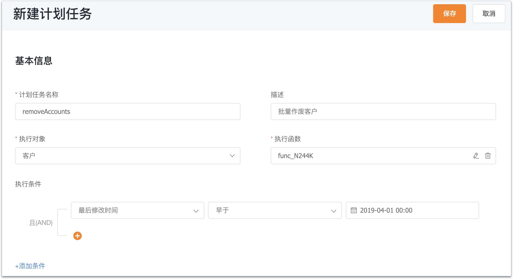

# 计划任务

&nbsp;&nbsp;&nbsp;&nbsp;用于执行定期计划的函数任务

&nbsp;&nbsp;&nbsp;&nbsp;**实际场景**：定期批量处理客户，最近跟进时间早于半年前的客户作废

&nbsp;&nbsp;&nbsp;&nbsp;**配置方式**：【管理】-【定制开发平台】-【计划任务】



&nbsp;**执行对象**：为需要批量处理的对象类型，每个计划任务只能绑定一个对象

&nbsp;**执行函数**：即需要执行的处理逻辑

&nbsp;**执行条件**：根据执行对象的字段，筛选出需要处理（执行函数）的对象实例



**编写函数模板**：

```
//获取需要执行计划任务的数据id list，即根据执行条件过滤后的满足条件的数据id List
List objectIds = context.objectIds
//遍历list
objectIds.each{ item ->
    //写处理逻辑，如作废客户
    def(error,result,errorMessage) Fx.object.remove("AccountObj",item as String) 
    if(error){
      Fx.log.info("作废异常 原因为: " errorMessage) 
    }
}


```

