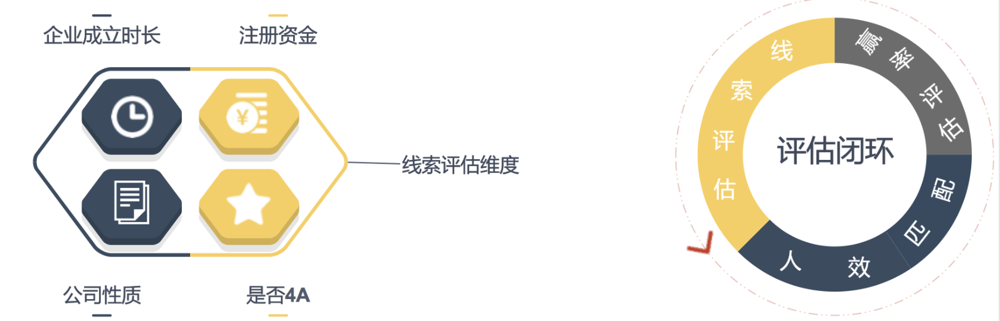

# 业务场景

##   场景一：打分评估线索质量

​    企业对线索管理存在的核心问题是：存在大量低质量的、无效的或者无法有效识别线索，影响销售人员的工作效率，丧失了对有效线索的跟进时机。销售人员为了区分有效线索，只能通过人为排序或者人工校验，十分低效。

​    而达芬奇就可以支持使用者按照企业规模/企业实力等维度综合评估线索质量，帮助销售人员能聚焦高质量线索而不会把时间浪费在那些不合适或没准备好的潜在客户身上，并将不同质量的线索分配给不同能力的销售人员，实现人效最大化及后期绘制成单客户的画像，准确评估商机赢率。

## 场景二：客户等级评定

​     达芬奇支持企业抽象出高成交客户的画像，按照画像维度设定评分规则，进行客户等级评定。比如关键客户（A类客户）、重要客户（B类客户）、普通客户（A类客户），方便差异化管理和跟进客户，实现客户价值最大化 。

例如：可通过表一所示维度：“客户行业”、“客户态度”、“信用评级对“、“合作时长”，对客户等级进行评定，将客户按照表二的评判标准分为“关键客户”“重要客户”和“普通客户”三个等级。

表一：指标规则表

表二：等级评判标准表

