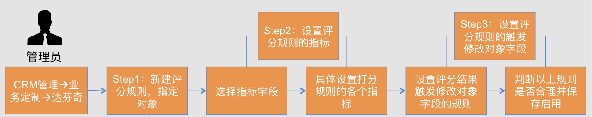
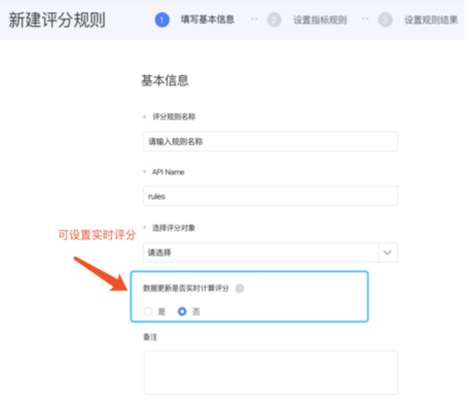
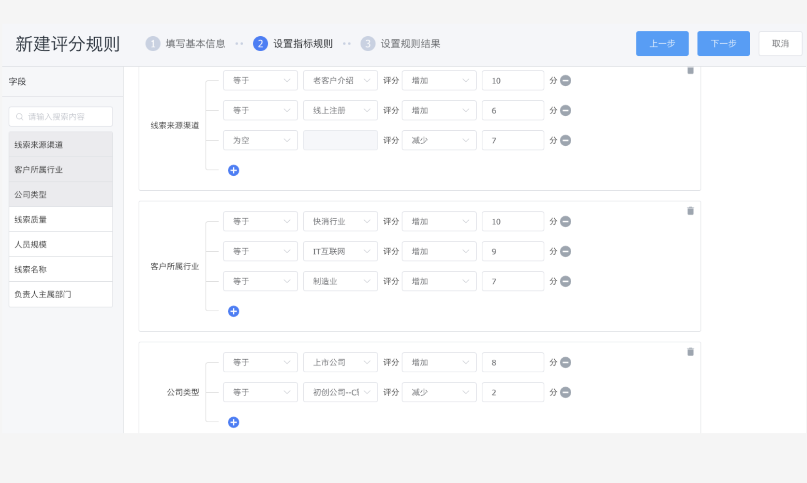
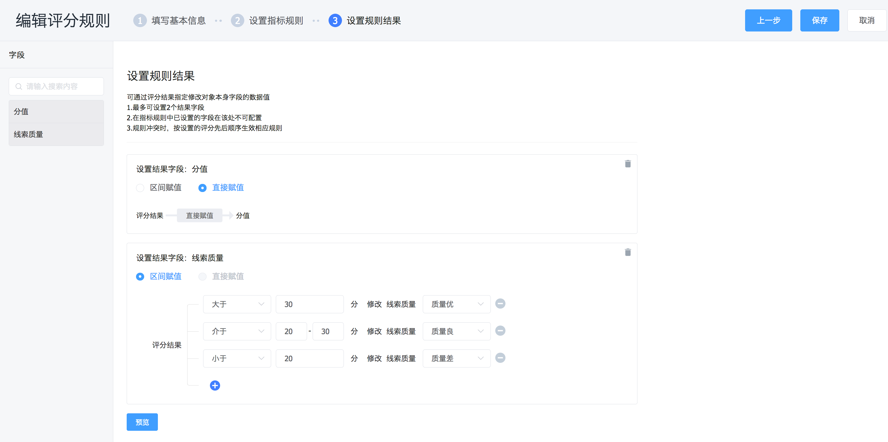
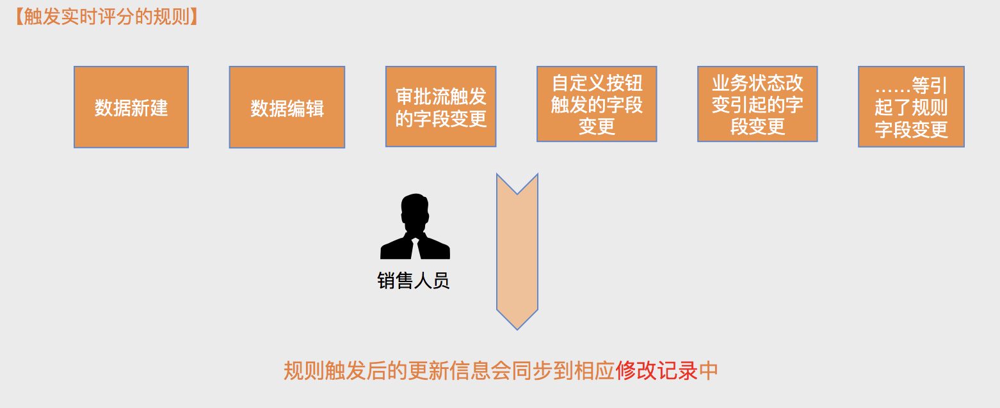
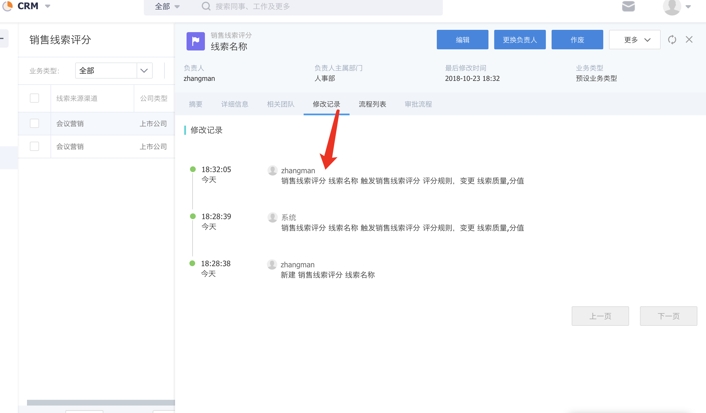
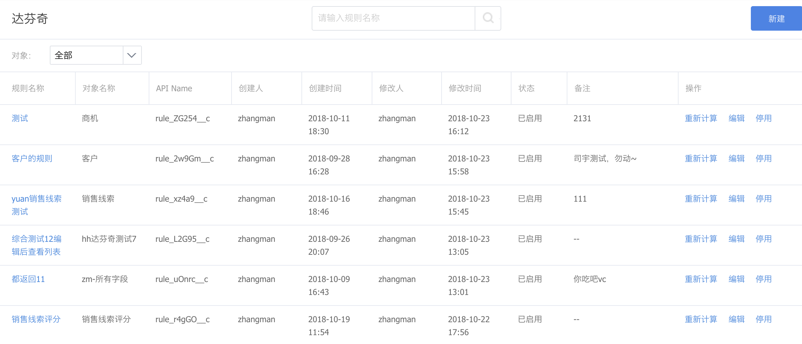
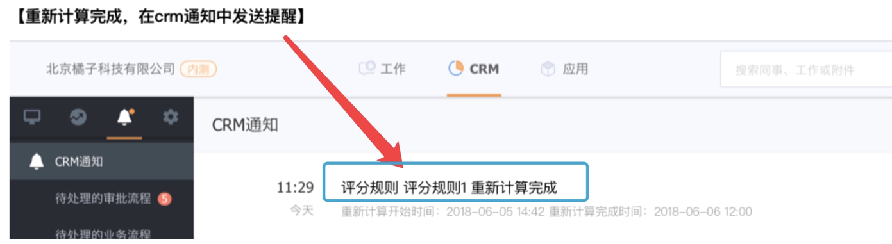
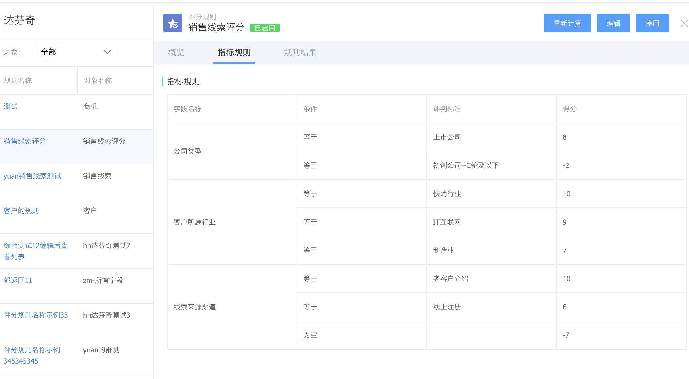

# 规则的创建及使用

## 功能入口

- CRM管理-->业务定制-->达芬奇 
- 支持的对象范围：线索、客户、商机以及自定义对象（注：预设自定义对象仅支持人员、商机2.0、商机2.0明细、商机联系人）

## 规则设置的流程

​	管理员可根据上述流程设置相应的规则，只需三步：基本信息、不同维度指标的评分规则设置、评分结果规则设置即可。 

###  Step1：设置基本信息

- 填写评分规则的基本信息：规则名称、评分对象、是否开启实时评分。

- 实时评分开关：

  - 打开状态：数据更新实时计算评分。

    每次数据的新增、编辑或者由于工作流触发引起的字段变更等更新操作都会触发该对象的评分规则（注：默认不会计算历史数据）。

  - 关闭状态：数据的更新不会触发评分规则。

### Step2：设置指标规则

- 可取对象本身字段作为指标，设定不同的分数规则。
  - 例如：对销售线索进行质量打分，这里通过对“线索来源渠道”、“客户所属行业”、“公司类型”三个维度，设定不同的评分规则。
- 支持的字段类型：单行文本、多行文本、数字、金额、单选、多选、布尔值、手机、邮箱。

### Step3：设置规则结果

- 最多允许设置2个结果字段

- 两种赋值方式：

  - 区间赋值：总分的不同区间设置字段的不同结果。

  例如：评分结果大于30分->线索质量优；评分结果介于20分-30分->线索质量良；评分结果小于20分->线索质量差。

  - 直接赋值：总分直接赋值给结果字段，用于将打分结果直接记录到对象数据下。

- 允许的字段类型：

​     单选、多选、数字、金额、百分数、布尔值

## 评分规则的触发

- 若开启了实时评分，当对象数据新建、编辑或者由于流程等引起了指标字段变更，评分规则即触发，变更相应字段。

- 评分规则触发变更结果字段后，相应的更新信息会同步到修改记录中。

## 规则信息

- 规则列表可展示创建的达芬奇规则的相关信息，可进行启用、停用、编辑、重新计算的操作。 

- 重新计算操作：即使没有开始实时评分开关，也可通过规则的【重新计算】操作触发批量计算所有历史数据。注意：此操作耗费大量资源，为保证工作时间的系统使用效率，建议在18：00后-次日3：00间操作。

- 触发重新计算后，不需要等待计算结束，相关结果会通过crm提醒发送给管理员。

- 规则详情支持查看相应规则的详细信息。

